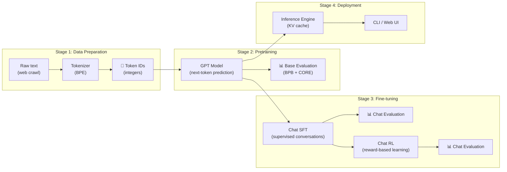
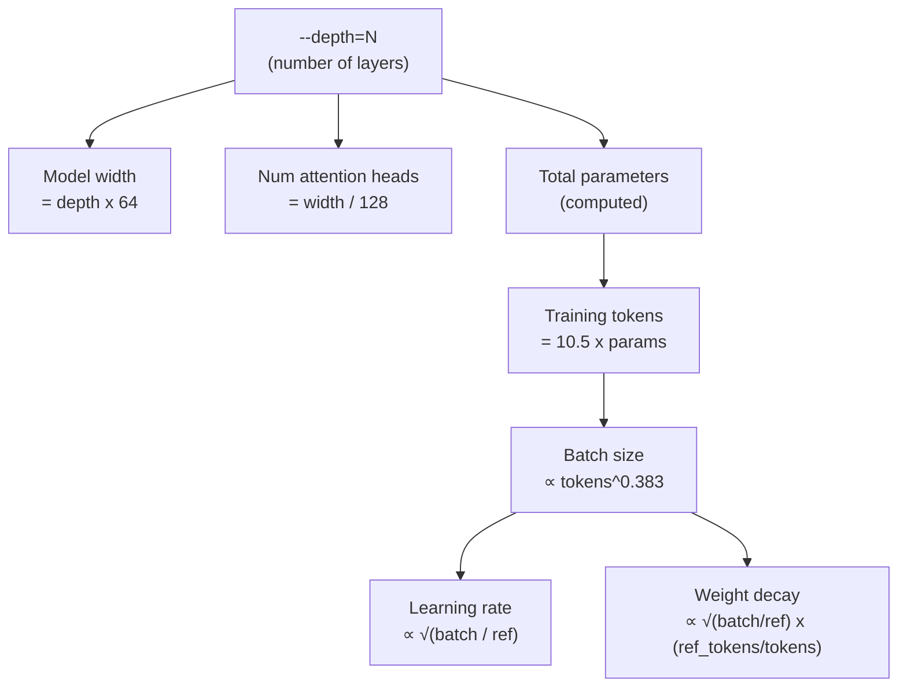
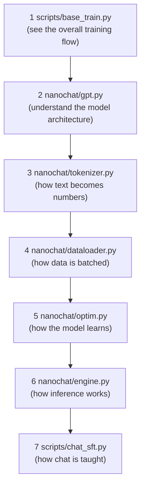

# Chapter 0 — The Big Picture

> **Goal:** Understand what nanochat is, what it does end-to-end, and how to navigate the codebase.

---

## What is nanochat?

nanochat is a complete, minimal, hackable codebase for training your own Large Language Model (LLM) from scratch — all the way from raw text to a ChatGPT-like web interface you can talk to. It was designed by Andrej Karpathy to be the simplest possible "experimental harness" for LLMs while still covering every major stage of the LLM pipeline.

**The key insight:** the entire model is configured by a single number — `--depth`, the number of Transformer layers. Everything else (model width, learning rates, training duration, batch size, weight decay) is computed automatically from scaling laws. Want a tiny toy model? Use `--depth=4`. Want GPT-2 capability? Use `--depth=26`. That's it.

### What can you do with nanochat?

| Capability | What it means | Cost (8×H100) |
|---|---|---|
| Train a tokenizer | Learn how to split text into subword tokens | Minutes |
| Pretrain a base model | Teach the model to predict next tokens on web text | ~3 hours for GPT-2 grade |
| Evaluate the model | Measure quality with BPB and CORE benchmarks | Minutes |
| Fine-tune for chat (SFT) | Teach the model to follow instructions and have conversations | ~10 minutes |
| Reinforce with RL | Improve math reasoning via policy gradient on GSM8K | ~20 minutes |
| Chat with your model | Talk to it via CLI or a web UI in your browser | Instant |

---

## The full pipeline

Here's the complete flow of how raw text becomes a chatbot you can talk to:

Let's unpack each stage briefly:

### Stage 1 — Data Preparation
The model can't read English. It reads numbers. So we first need a **tokenizer** — an algorithm that converts text like `"Hello world"` into a sequence of integer IDs like `[15496, 995]`. nanochat uses **Byte-Pair Encoding (BPE)**, the same algorithm family used by GPT-4. The tokenizer is trained once, then used everywhere.

### Stage 2 — Pretraining
This is the expensive part. The model sees billions of tokens from web text and learns to predict what comes next. Given `"The cat sat on the"`, it should learn that `"mat"` is more likely than `"quantum"`. This is called **autoregressive language modeling**.

### Stage 3 — Fine-tuning
A pretrained model can complete text, but it doesn't know how to have a conversation. Fine-tuning teaches it:
- **SFT (Supervised Fine-Tuning):** Show it examples of good conversations (user asks, assistant answers). The model learns the pattern.
- **RL (Reinforcement Learning):** Let the model try answering math problems. Reward correct answers, penalize wrong ones. The model gets better at reasoning.

### Stage 4 — Deployment
The **inference engine** makes generation fast by caching previous computations (the KV cache). You can talk to your model through a command-line interface or a web UI that looks like ChatGPT.

---

## The "one dial" philosophy

Most LLM codebases have dozens of hyperparameters you need to tune. nanochat has one: **depth**.

For example:
| Depth | Width | Heads | ~Params | ~Training tokens |
|-------|-------|-------|---------|-----------------|
| 4 | 256 | 2 | ~3M | ~30M |
| 12 | 768 | 6 | ~85M | ~900M |
| 20 | 1280 | 10 | ~280M | ~3B |
| 26 | 1664 | 13 | ~550M | ~6B |

---

## Repository map

### Entry-point scripts (in `scripts/`)

These are the commands you actually run. Each one orchestrates one stage of the pipeline:

| Script | Purpose | Example command |
|--------|---------|-----------------|
| `scripts/base_train.py` | Pretrain the base model | `python -m scripts.base_train --depth=12` |
| `scripts/base_eval.py` | Evaluate base model (BPB, CORE, samples) | `python -m scripts.base_eval --eval bpb` |
| `scripts/chat_sft.py` | Supervised fine-tuning for chat | `python -m scripts.chat_sft` |
| `scripts/chat_rl.py` | Reinforcement learning (GSM8K math) | `python -m scripts.chat_rl` |
| `scripts/chat_eval.py` | Evaluate chat model on tasks | `python -m scripts.chat_eval` |
| `scripts/chat_cli.py` | Talk to your model in the terminal | `python -m scripts.chat_cli` |
| `scripts/chat_web.py` | Launch the ChatGPT-like web UI | `python -m scripts.chat_web` |
| `scripts/tok_train.py` | Train a BPE tokenizer | `python -m scripts.tok_train` |
| `scripts/tok_eval.py` | Evaluate tokenizer compression | `python -m scripts.tok_eval` |

### Core modules (in `nanochat/`)

These are the building blocks that the scripts assemble:

| Module | Lines | What it does |
|--------|-------|-------------|
| `gpt.py` | ~455 | The GPT model: embeddings, attention, MLP, forward pass |
| `optim.py` | ~534 | MuonAdamW optimizer (Muon for matrices, AdamW for embeddings) |
| `dataloader.py` | ~166 | BOS-aligned best-fit document packing into fixed-length rows |
| `dataset.py` | ~100 | Download and manage parquet data shards |
| `tokenizer.py` | ~407 | BPE tokenizer (HuggingFace + RustBPE/tiktoken) |
| `engine.py` | ~357 | Fast inference with KV cache and tool-use state machine |
| `common.py` | ~259 | Utilities: DDP init, logging, file downloads |
| `flash_attention.py` | ~100 | Flash Attention 3 wrapper with SDPA fallback |
| `checkpoint_manager.py` | — | Save/load model checkpoints |
| `core_eval.py` | ~263 | DCLM CORE benchmark evaluation |
| `loss_eval.py` | — | BPB (bits per byte) evaluation |

### Task definitions (in `tasks/`)

Each file defines a dataset used during fine-tuning or evaluation:

| Task | Purpose |
|------|---------|
| `gsm8k.py` | Grade-school math word problems (used in SFT + RL) |
| `mmlu.py` | Multiple-choice knowledge questions |
| `smoltalk.py` | General conversation data |
| `spellingbee.py` | Spelling tasks (letter counting, etc.) |
| `humaneval.py` | Code generation evaluation |
| `arc.py` | ARC reasoning benchmark |
| `customjson.py` | Load your own JSON conversation data |

---

## How to read this repo

If you're new, follow this path through the code. Each step builds on the previous one:

> **Tip:** The total codebase is only ~3,500 lines of Python across all files. That's tiny for a complete LLM training framework. You can read it all in an afternoon.

---

## The math: what is the model actually learning?

At its core, the model is doing one thing: **predicting the next word** (technically, the next token).

Given a sequence of tokens $x_1, x_2, \ldots, x_T$, the training objective is to maximize the probability of each token given all previous tokens. Written as a loss to minimize:

$$
\mathcal{L} = -\frac{1}{T-1} \sum_{t=1}^{T-1} \log p_\theta(x_{t+1} \mid x_1, x_2, \ldots, x_t)
$$

Think of it like a fill-in-the-blank game:

| Input (context) | Model predicts | Correct answer |
|----------------|----------------|----------------|
| `The cat sat on the` | `mat` (95%), `dog` (2%), ... | `mat` ✓ |
| `Once upon a` | `time` (99%), `hill` (0.5%), ... | `time` ✓ |
| `import torch.nn as` | `nn` (98%), `torch` (1%), ... | `nn` ✓ |

Every token at every position is a training example. A single batch of 32 sequences of length 2048 gives the model **32 × 2047 = 65,504** prediction problems to learn from — in a single forward pass!

---

## What you'll learn in this book

| Chapter | Topic | You'll understand... |
|---------|-------|---------------------|
| 1 | Transformer Basics | Self-attention, residual connections, the GPT block |
| 2 | The GPT Model | The actual `nanochat/gpt.py` code, rotary embeddings, GQA |
| 3 | Tokenizer | BPE, special tokens, conversation rendering |
| 4 | Data Pipeline | Parquet shards, best-fit packing, batching |
| 5 | Training Loop | `base_train.py`, scaling laws, scheduling |
| 6 | Optimizer | MuonAdamW, why two optimizers, the Polar Express |
| 7 | Inference Engine | KV cache, sampling, tool use |
| 8 | Evaluation | BPB, CORE benchmark, how quality is measured |
| 9 | Chat SFT & RL | Fine-tuning for conversation, REINFORCE on math |
| 10 | Running & Modifying | Practical commands, where to edit, safety tips |
| 11 | End-to-End Walkthrough | Follow one token through the entire system |

---

**Next:** [Chapter 1](01_transformers.md) — Transformer and GPT basics, from the ground up.
