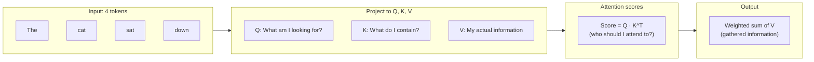
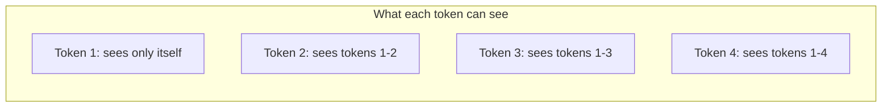
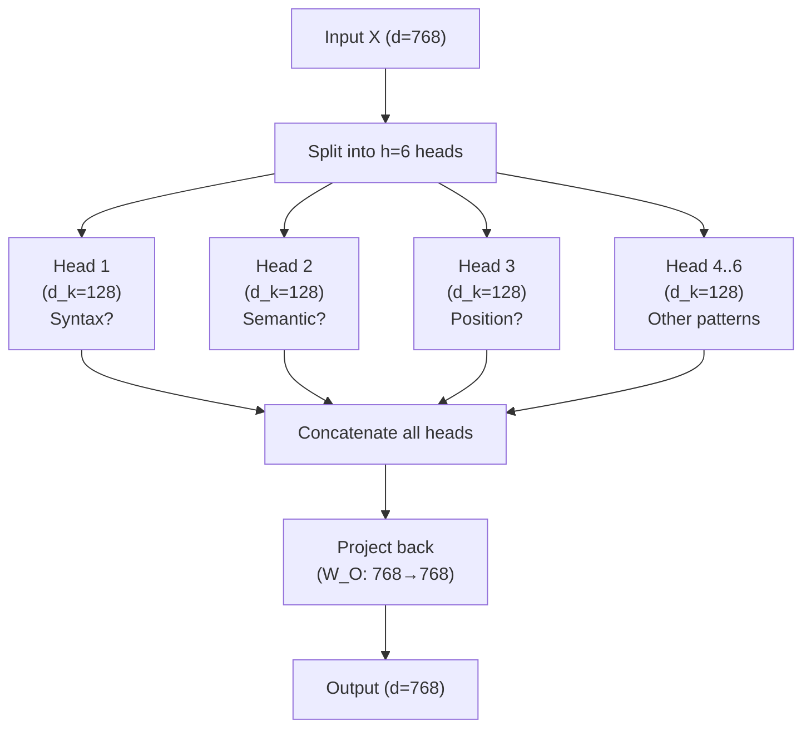
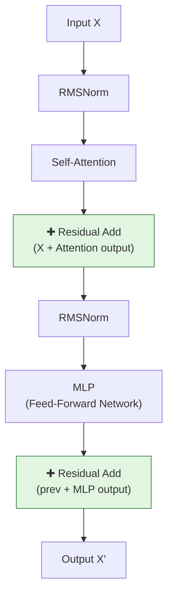
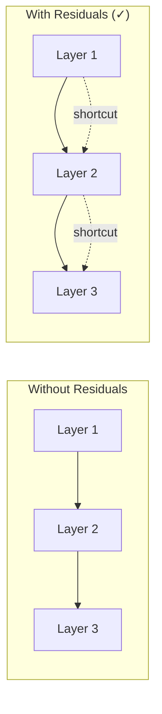
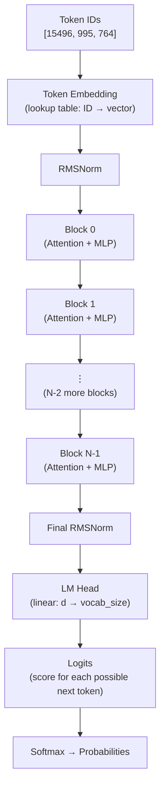

# Chapter 1 — Transformer and GPT Basics

> **Goal:** Build a solid mental model of self-attention, the Transformer block, and how GPT uses them — even if you've never seen a Transformer before.

---

## What problem does a Transformer solve?

Imagine you're reading a sentence: *"The animal didn't cross the street because **it** was too tired."*

What does "it" refer to? The animal, obviously. But how would a computer figure that out? It needs a mechanism to look at *every other word* in the sentence and decide which ones are relevant to understanding "it". That mechanism is called **self-attention**.

Before Transformers (introduced in the landmark 2017 paper ["Attention Is All You Need"](https://arxiv.org/abs/1706.03762)), models processed text one word at a time (RNNs/LSTMs). This was slow and the model would "forget" earlier words. The Transformer processes all words simultaneously and lets each word "attend to" every other word — figuring out what's relevant in parallel.

---

## Self-Attention: the core idea

### The intuition

Think of self-attention like a room full of people at a party. Each person (token) wants to gather information from everyone else. They do this in three steps:

1. **Query (Q):** "What am I looking for?" — each token describes what information it needs
2. **Key (K):** "What do I have to offer?" — each token advertises what information it contains
3. **Value (V):** "Here's my actual content" — the real information to share

The attention mechanism compares each Query against all Keys to decide who to pay attention to, then retrieves the corresponding Values.



### The math

Given an input sequence $X \in \mathbb{R}^{T \times d}$ (a matrix where each row is a token's embedding vector):

**Step 1:** Project into Queries, Keys, and Values using learned weight matrices:
$$
Q = XW_Q, \quad K = XW_K, \quad V = XW_V
$$

where $W_Q, W_K, W_V \in \mathbb{R}^{d \times d_k}$ are learned parameters.

**Step 2:** Compute attention scores (how much should token $i$ attend to token $j$?):
$$
\text{scores} = \frac{QK^T}{\sqrt{d_k}}
$$

The $\sqrt{d_k}$ is crucial — without it, the dot products grow large for high-dimensional vectors, pushing softmax into regions with tiny gradients (the model stops learning). This is called **scaled dot-product attention**.

**Step 3:** Convert scores to probabilities and gather information:
$$
\text{Attention}(Q, K, V) = \text{softmax}\!\left(\frac{QK^T}{\sqrt{d_k}} + M\right) V
$$

where $M$ is the **causal mask** (explained below).

### A concrete example

Suppose we have 4 tokens, each represented as a 3-dimensional vector. After computing $QK^T / \sqrt{d_k}$, we get a 4×4 score matrix showing how much each token attends to every other:

|  | The | cat | sat | down |
|---|---|---|---|---|
| **The** | 0.9 | 0.05 | 0.03 | 0.02 |
| **cat** | 0.3 | 0.5 | 0.1 | 0.1 |
| **sat** | 0.1 | 0.6 | 0.2 | 0.1 |
| **down** | 0.05 | 0.15 | 0.3 | 0.5 |

Each row sums to 1 (after softmax). "sat" pays the most attention to "cat" (0.6), which makes intuitive sense — "cat" is the subject of the verb "sat".

---

## The causal mask: no looking ahead!

In a language model, when predicting the next word, the model can only see *previous* words. It would be cheating to look ahead. The **causal mask** $M$ enforces this by setting future positions to $-\infty$ (which softmax converts to 0):

$$
M = \begin{pmatrix}
0 & -\infty & -\infty & -\infty \\
0 & 0 & -\infty & -\infty \\
0 & 0 & 0 & -\infty \\
0 & 0 & 0 & 0
\end{pmatrix}
$$



This triangular pattern is why GPT is called a **decoder-only** model — it decodes one token at a time, left to right.

---

## Multi-Head Attention: looking at different things

A single attention head might focus on one type of relationship (e.g., subject-verb agreement). But language has many types of relationships simultaneously. **Multi-head attention** runs several attention operations in parallel, each looking at different aspects:



If the model dimension is $d = 768$ and we use $h = 6$ heads, each head works with vectors of size $d_k = d/h = 128$.

Each head independently computes:
$$
\text{head}_i = \text{Attention}(XW_Q^{(i)}, XW_K^{(i)}, XW_V^{(i)})
$$

Then all heads are concatenated and projected:
$$
\text{MultiHead}(X) = \text{Concat}(\text{head}_1, \ldots, \text{head}_h) \cdot W_O
$$

In practice, different heads learn to specialize. Research has shown that some heads track syntax, others track coreference (what "it" refers to), and others track position information.

---

## The Transformer Block (GPT style)

A single Transformer block combines attention with a feedforward network (MLP), with **residual connections** and **normalization** to keep training stable:



In code (from `nanochat/gpt.py`), this is remarkably simple:

```python
class Block(nn.Module):
    def forward(self, x, ve, cos_sin, window_size, kv_cache):
        x = x + self.attn(norm(x), ve, cos_sin, window_size, kv_cache)  # attention + residual
        x = x + self.mlp(norm(x))                                        # MLP + residual
        return x
```

### Why residual connections?

Without residuals, signals must pass through every layer's transformations — information gets distorted and gradients vanish. Residual connections provide a **highway** that lets information (and gradients) flow directly through:



Mathematically: instead of $x' = f(x)$, we compute $x' = x + f(x)$. If the layer has nothing useful to add, it can learn $f(x) \approx 0$ and just pass the input through.

### Why RMSNorm?

Normalization prevents values from growing too large or too small as they pass through layers. **RMSNorm** (Root Mean Square Normalization) is simpler and faster than LayerNorm:

$$
\text{RMSNorm}(x) = \frac{x}{\sqrt{\frac{1}{d}\sum_{i=1}^d x_i^2}}
$$

nanochat uses a parameter-free version — no learned scale/bias, which saves memory and parameters:

```python
def norm(x):
    return F.rms_norm(x, (x.size(-1),))
```

### What does the MLP do?

The MLP (Multi-Layer Perceptron) is a two-layer feedforward network that processes each token independently. If attention is "gather information from other tokens", the MLP is "process what I gathered":

```python
class MLP(nn.Module):
    def forward(self, x):
        x = self.c_fc(x)        # expand: 768 → 3072 (4× wider)
        x = F.relu(x).square()  # activation: ReLU² (non-linearity)
        x = self.c_proj(x)      # compress: 3072 → 768
        return x
```

The expansion ratio of 4× is standard practice — the MLP needs more "room to think" in its hidden layer. The activation function (here, $\text{ReLU}^2(x) = \max(0, x)^2$) adds non-linearity, which is what lets neural networks learn complex patterns rather than just linear relationships.

---

## Stacking blocks: the full GPT model

A GPT model is just many Transformer blocks stacked on top of each other, with an embedding at the start and a classifier at the end:



The number of blocks ($N$) is the **depth** — the one dial that controls the whole model in nanochat.

---

## Decoder-only vs Encoder-Decoder

You may have heard of different Transformer variants. Here's how they compare:

| Architecture | Used by | Has encoder? | Has decoder? | Use case |
|---|---|---|---|---|
| **Encoder-only** | BERT | ✓ | ✗ | Understanding (classification, NER) |
| **Encoder-Decoder** | T5, original Transformer | ✓ | ✓ | Translation, summarization |
| **Decoder-only** | GPT, nanochat | ✗ | ✓ | Text generation, chat |

GPT (and nanochat) use **decoder-only**: just the causal self-attention stack. No encoder, no cross-attention. This simplicity is one reason the architecture has won — it turns out that a single decoder stack trained on enough data can learn to do everything.

---

## nanochat-specific innovations

nanochat's Transformer blocks include several modern improvements over the original GPT-2:

| Feature | Classic GPT-2 | nanochat | Why |
|---------|--------------|----------|-----|
| Position encoding | Learned absolute embeddings | **Rotary embeddings (RoPE)** | Better generalization to unseen lengths |
| Normalization | LayerNorm with learned params | **RMSNorm, no learned params** | Simpler, faster, fewer parameters |
| Attention | Standard multi-head | **Grouped-Query Attention (GQA)** | Faster inference, less memory |
| Activation | GELU | **ReLU²** | Sparse, efficient |
| Attention computation | Standard matmul | **Flash Attention 3** | 2-4× faster, uses less memory |
| Context window | Fixed 1024 | **Sliding window pattern (SSSL)** | Layers can mix local and global context |

We'll explore each of these in detail in [Chapter 2](02_gpt_model.md) when we read the actual code.

---

## Key vocabulary

| Term | Plain English |
|------|--------------|
| **Token** | A piece of text (word, subword, or character) represented as an integer |
| **Embedding** | Converting a token ID into a dense vector the model can work with |
| **Self-Attention** | A mechanism where each token looks at all other tokens to gather context |
| **Causal Mask** | Prevents tokens from seeing future tokens (no cheating!) |
| **Residual Connection** | A shortcut that adds the input directly to the output of a layer |
| **MLP** | A feedforward network that processes each token independently |
| **Head** | One of several parallel attention computations, each looking at different patterns |
| **Logits** | Raw scores (before softmax) for each possible next token |

---

**Next:** [Chapter 2](02_gpt_model.md) — Reading the actual GPT implementation in `nanochat/gpt.py`.
