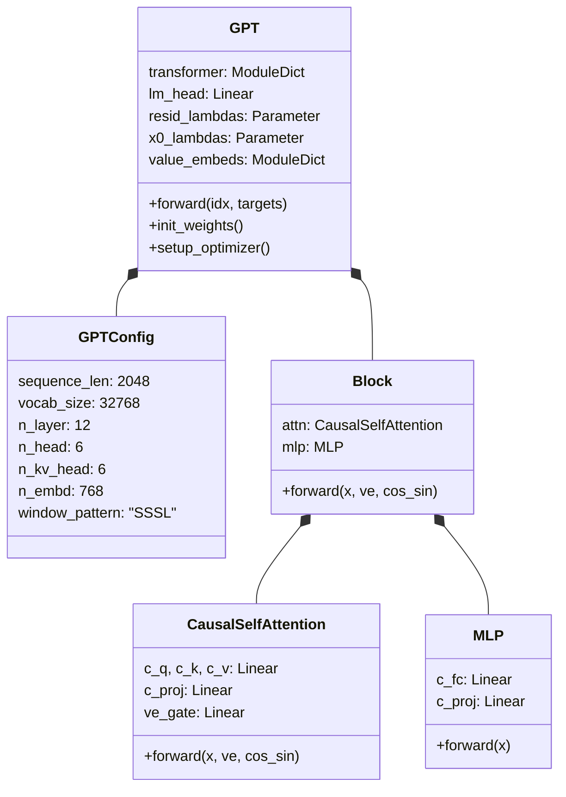
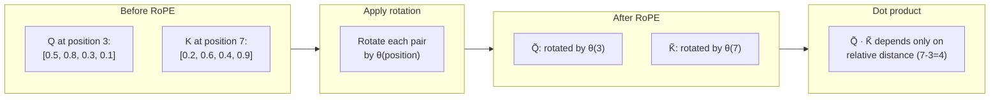
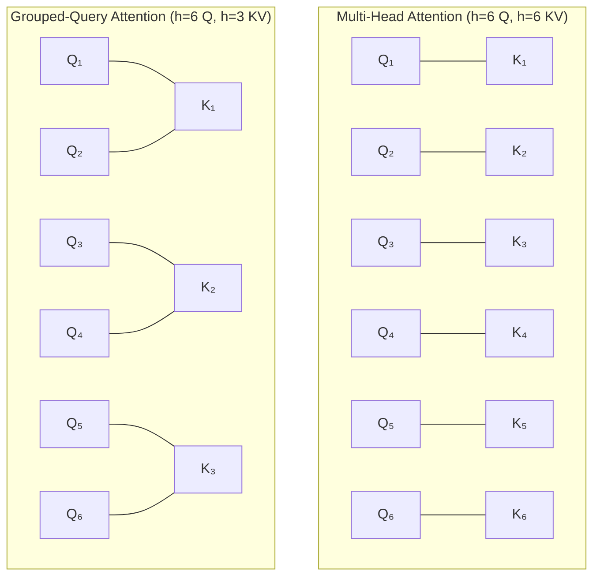
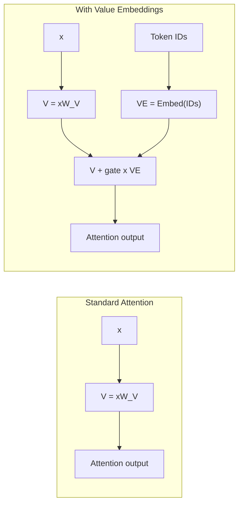
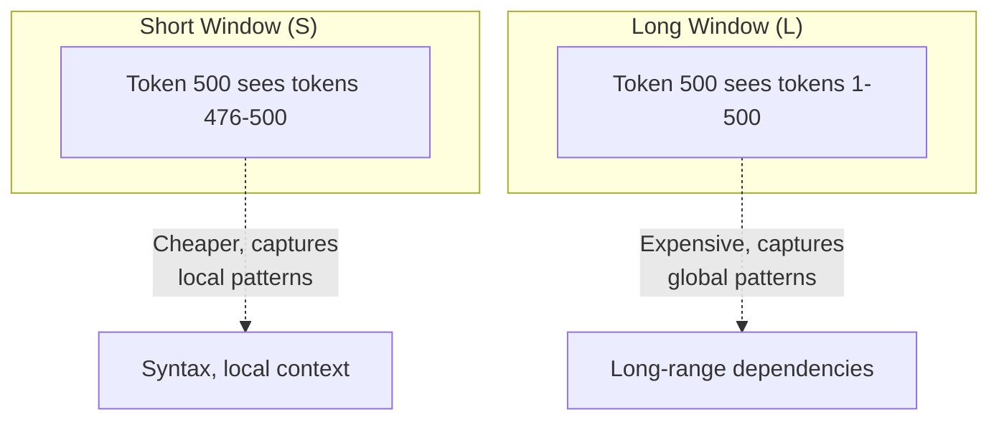
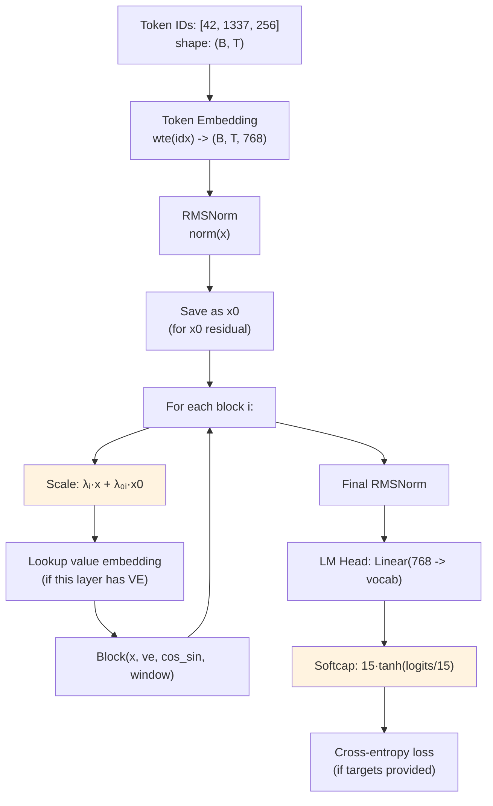
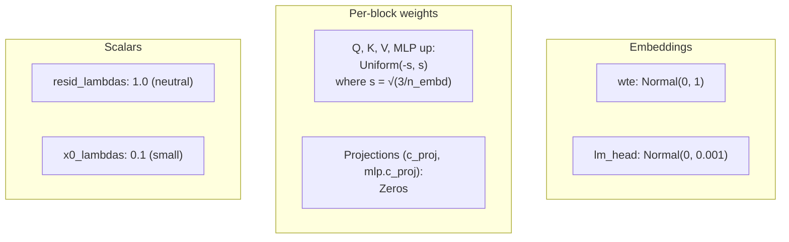
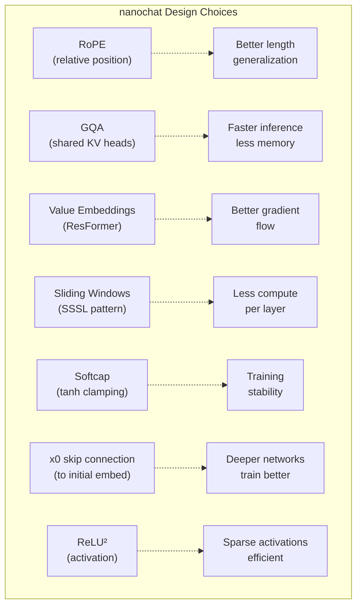

# Chapter 2 — The GPT Model in nanochat

> **Goal:** Read `nanochat/gpt.py` line by line and understand every architectural choice — rotary embeddings, GQA, value embeddings, sliding windows, and more.

---

## Overview of `nanochat/gpt.py`

The entire model is contained in **one file, ~455 lines**. There are four main classes:



---

## GPTConfig: the model's DNA

```python
@dataclass
class GPTConfig:
    sequence_len: int = 2048     # max context length (how far back the model can look)
    vocab_size: int = 32768      # number of unique tokens the model knows
    n_layer: int = 12            # depth: number of Transformer blocks
    n_head: int = 6              # number of query heads in attention
    n_kv_head: int = 6           # number of key/value heads (for GQA)
    n_embd: int = 768            # model dimension (width of the residual stream)
    window_pattern: str = "SSSL" # sliding window attention pattern
```

Think of these as the "genes" of the model. Everything else is computed from them:
- **Width** ($d$) = `n_embd` = `depth × 64` (by default)
- **Head dimension** = `n_embd / n_head` = 128 (fixed)
- Each **Block** gets its own attention window size based on `window_pattern`

---

## Rotary Positional Embeddings (RoPE)

### The problem

Self-attention is **permutation-equivariant** — it treats tokens like a bag, with no sense of order. "The cat sat" and "sat cat The" would produce the same attention scores. We need to inject position information.

### Classic approach (GPT-2)

GPT-2 learned a separate embedding vector for each position (position 0, position 1, ..., position 1023). Problems: the model can't handle sequences longer than it was trained on, and absolute positions don't capture *relative* distance well.

### Rotary embeddings (nanochat)

Instead of adding position vectors, RoPE **rotates** the query and key vectors based on their position. Two tokens at the same relative distance always have the same rotation angle between them, regardless of absolute position.

The idea is elegant: pair up the dimensions of each vector and rotate each pair by an angle that depends on the position:

$$
\begin{aligned}
\tilde{x}_1 &= x_1 \cos \theta - x_2 \sin \theta \\
\tilde{x}_2 &= x_1 \sin \theta + x_2 \cos \theta
\end{aligned}
$$

where $\theta$ depends on both the position $t$ and the dimension index $i$:
$$
\theta_{t,i} = t \cdot \frac{1}{10000^{2i/d}}
$$



In code:

```python
def apply_rotary_emb(x, cos, sin):
    d = x.shape[3] // 2
    x1, x2 = x[..., :d], x[..., d:]       # split into pairs
    y1 = x1 * cos + x2 * sin              # rotate first half
    y2 = x1 * (-sin) + x2 * cos           # rotate second half
    return torch.cat([y1, y2], 3)
```

The rotation frequencies are precomputed once at model init:

```python
def _precompute_rotary_embeddings(self, seq_len, head_dim, base=10000):
    channel_range = torch.arange(0, head_dim, 2)    # [0, 2, 4, ...]
    inv_freq = 1.0 / (base ** (channel_range / head_dim))  # decreasing freq per dim pair
    t = torch.arange(seq_len)                               # [0, 1, 2, ..., seq_len-1]
    freqs = torch.outer(t, inv_freq)                        # (seq_len, head_dim/2)
    cos, sin = freqs.cos(), freqs.sin()
    return cos, sin
```

Lower-frequency rotations encode coarse position; higher-frequency rotations encode fine position — similar to how clock hands at different speeds encode the time.

---

## QK Norm

After computing Q and K (and applying RoPE), nanochat normalizes them with RMSNorm:

```python
q, k = norm(q), norm(k)  # QK norm
```

This prevents the dot product $QK^T$ from growing too large, which stabilizes training. Without it, certain heads can develop very large attention scores that dominate all others.

---

## Grouped-Query Attention (GQA)

### The memory problem at inference time

During inference, the model stores all previous Keys and Values in a **KV cache**. With standard Multi-Head Attention, this cache grows as:
$$
\text{KV cache memory} = 2 \times B \times T \times h \times d_k \times \text{bytes}
$$

For a model with 32 heads and 128 head dimension, at sequence length 2048, this is a lot of memory.

### The GQA solution

GQA uses fewer key/value heads than query heads. Multiple query heads **share** the same key and value:



In nanochat, `n_head` is the number of query heads and `n_kv_head` is the number of key/value heads. When `n_kv_head < n_head`, groups of query heads share KV pairs — saving memory with minimal quality loss.

In the code:

```python
self.c_q = nn.Linear(n_embd, n_head * head_dim, bias=False)      # 6 query heads
self.c_k = nn.Linear(n_embd, n_kv_head * head_dim, bias=False)   # might be 3 KV heads
self.c_v = nn.Linear(n_embd, n_kv_head * head_dim, bias=False)   # same as K
```

---

## Value Embeddings (ResFormer style)

This is a unique feature. On alternating layers, the model looks up the token IDs again in a separate **value embedding table** and mixes that into the attention values:

```python
# Which layers get value embeddings? Alternating, last layer always included.
def has_ve(layer_idx, n_layer):
    return layer_idx % 2 == (n_layer - 1) % 2
```

During attention:

```python
if ve is not None:
    ve = ve.view(B, T, self.n_kv_head, self.head_dim)
    gate = 2 * torch.sigmoid(self.ve_gate(x[..., :32]))  # range (0, 2)
    v = v + gate.unsqueeze(-1) * ve                        # mix in
```

The **gate** is learned per-head and input-dependent, letting the model decide how much of the original token identity to blend back in. This helps with:
- **Identity preservation:** deep networks can "forget" what token they started with
- **Gradient flow:** provides another pathway for gradients to reach early layers



---

## Sliding Window Attention

Not every layer needs full-context attention. nanochat uses a **window pattern** that alternates between short (local) and long (global) attention:

```python
window_pattern: str = "SSSL"  # the default
# S = short context (half of sequence_len)
# L = long context (full sequence_len)
```

This pattern tiles across layers. For a 12-layer model with pattern `"SSSL"`:

| Layer | 0 | 1 | 2 | 3 | 4 | 5 | 6 | 7 | 8 | 9 | 10 | 11 |
|-------|---|---|---|---|---|---|---|---|---|---|----|----|
| Pattern | S | S | S | L | S | S | S | L | S | S | S | **L** |

The last layer always gets `L` (full context), regardless of the pattern.



**Why this works:** Most of language is local — the next word usually depends on the last few words. Only occasionally do we need to reference something far back. By using short windows for most layers, we save compute (Flash Attention is faster with smaller windows) while the periodic long-window layers ensure nothing important is lost.

---

## The Full Forward Pass

Let's trace through the complete `forward()` method step by step:



### Layer-by-layer scaling (resid_lambdas and x0_lambdas)

These are two learned scalar arrays — one value per layer:

```python
x = self.resid_lambdas[i] * x + self.x0_lambdas[i] * x0
```

- `resid_lambdas[i]` scales the residual stream (initialized to 1.0 — the normal residual)
- `x0_lambdas[i]` blends in the initial embedding (initialized to 0.1 — a small skip connection)

This creates a "highway" from the initial embedding to every layer, helping deep networks train by ensuring early layers receive strong gradients.

### Logit softcapping

```python
softcap = 15
logits = softcap * torch.tanh(logits / softcap)
```

This constrains logits to the range $[-15, 15]$, preventing the model from becoming too confident in any single prediction. The $\tanh$ acts as a smooth clamp — values near 0 pass through unchanged, while extreme values are squashed:

| Input logit | After softcap |
|-------------|---------------|
| 0 | 0 |
| 5 | 4.97 |
| 10 | 9.64 |
| 20 | 14.97 |
| 50 | 15.00 |

---

## Weight Initialization

How weights are initialized matters a lot for training stability. nanochat uses a careful scheme:



Key design choices:
- **Output projections start at zero:** Each block initially does nothing (outputs zero), so the model starts as "input → embedding → lm_head". Layers gradually learn to contribute.
- **Uniform over Normal:** Using Uniform initialization avoids outlier weights that can destabilize early training.
- **lm_head has tiny std (0.001):** The classifier starts nearly flat (uniform predictions), so the model begins with low confidence.

---

## Vocab Padding

A subtle optimization:

```python
padded_vocab_size = ((vocab_size + 64 - 1) // 64) * 64
```

The vocabulary size is padded to a multiple of 64. This helps:
- **Tensor cores:** GPUs compute in tiles of 8 or 16 — aligned dimensions are faster
- **DDP:** Distributed training works better with clean divisibility

The forward pass crops back to the real vocab size: `logits = logits[..., :self.config.vocab_size]`

---

## Key architectural decisions summarized



---

## Homework

Now that you understand the architecture, try these exercises:

1. **Trace the shapes:** For `depth=12, n_embd=768, n_head=6`, what are the shapes of Q, K, V, and the attention output?
2. **Count parameters:** How many parameters are in a single Block? (Hint: there are 4 Linear layers)
3. **Window pattern:** For a 20-layer model with pattern `"SSSL"`, which layers get full context?
4. **Value embeddings:** Which layers in a 12-layer model have value embeddings?

---

**Next:** [Chapter 3](03_tokenizer.md) — How text becomes token IDs, and how conversations are rendered for training.
