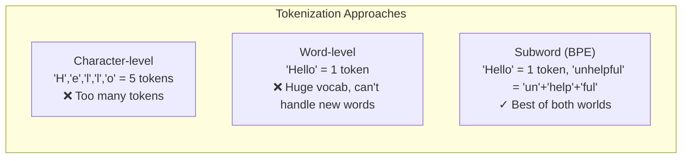
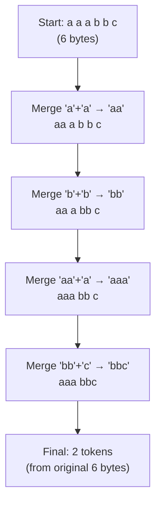
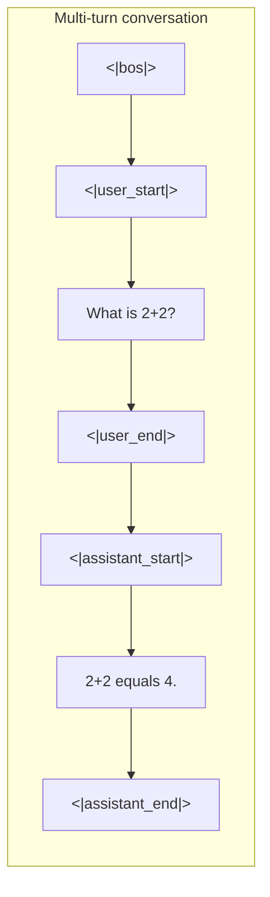
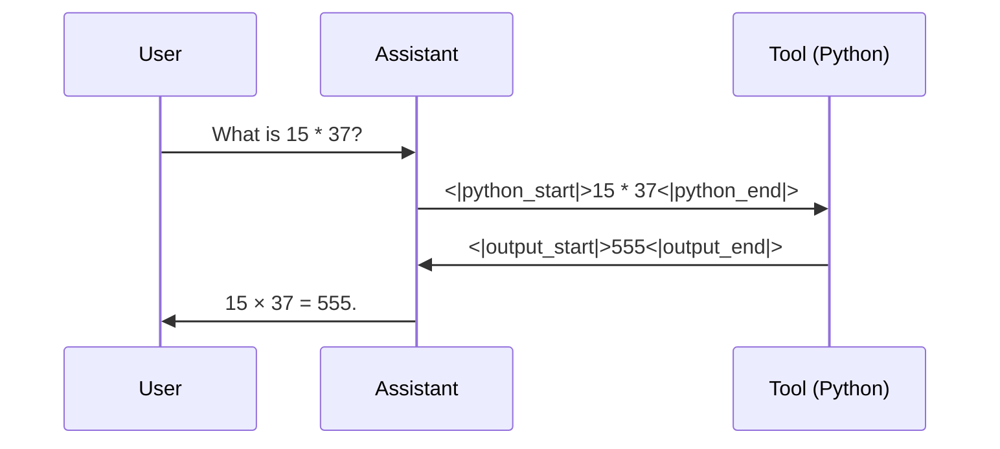
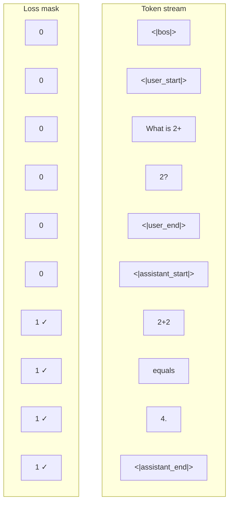

# Chapter 3 — Tokenizer and Conversation Rendering

> **Goal:** Understand how raw text is converted to numbers the model can process, how BPE works, and how multi-turn conversations are encoded for training.

---

## Why do we need a tokenizer?

Neural networks work with numbers, not text. We need a way to convert strings like `"Hello, world!"` into sequences of integers. The simplest approach would be one number per character, but that is very inefficient — the model would need many steps just to process a single word.

The sweet spot is **subword tokenization**: break text into chunks that are larger than characters but smaller than whole words. Common words stay whole (`"the"` → one token), while rare words get split (`"cryptocurrency"` → `"crypt"` + `"o"` + `"currency"`).



---

## BPE (Byte-Pair Encoding): how it works

BPE is the algorithm used by GPT-2, GPT-4, and nanochat. Here's how it trains:

### Step 1: Start with individual bytes

Every possible byte (0-255) is an initial "token". The text `"aaabbc"` starts as individual characters: `['a', 'a', 'a', 'b', 'b', 'c']`.

### Step 2: Find the most frequent pair

Look at all adjacent pairs and count them:
- `('a','a')` appears 2 times
- `('a','b')` appears 1 time
- `('b','b')` appears 1 time
- `('b','c')` appears 1 time

The most frequent pair is `('a','a')`.

### Step 3: Merge that pair into a new token

Create a new token `"aa"` and replace all occurrences:
`['aa', 'a', 'b', 'b', 'c']`

### Step 4: Repeat

Now count pairs again, find the most frequent, merge. Repeat until you reach the desired vocabulary size.



### Real-world example

Here's what BPE tokenization looks like in practice. Consider the text: `"The quick brown fox"`:

| Token | Token ID | Notes |
|-------|----------|-------|
| `"The"` | 1423 | Common word → single token |
| `" quick"` | 5765 | Space is part of the token! |
| `" brown"` | 8714 | Same — leading space included |
| `" fox"` | 2796 | 4 tokens for 4 words |

And a rare word like `"defenestration"`:

| Token | Token ID |
|-------|----------|
| `"def"` | 392 |
| `"en"` | 268 |
| `"est"` | 627 |
| `"ration"` | 1358 |

Common words get single tokens; rare words get split into common parts. This is why BPE is so effective — the vocabulary adapts to the data distribution.

---

## nanochat's tokenizer details

nanochat provides two tokenizer implementations:

| Implementation | Training | Inference | Speed |
|---|---|---|---|
| HuggingFace Tokenizer | ✓ | ✓ | Medium |
| RustBPE + tiktoken | ✓ | ✓ | Fast |

### The split pattern

Before BPE merges, text is first split by a regex into groups. This prevents merges across category boundaries (e.g., a letter shouldn't merge with a digit):

```python
SPLIT_PATTERN = r"""'(?i:[sdmt]|ll|ve|re)|[^\r\n\p{L}\p{N}]?+\p{L}+|\p{N}{1,2}| ?[^\s\p{L}\p{N}]++[\r\n]*|\s*[\r\n]|\s+(?!\S)|\s+"""
```

This splits text into:
- Contractions (`'s`, `'t`, `'ll`, etc.)
- Words (possibly with a leading non-letter/digit)
- Number groups (1-2 digits at a time — nanochat uses `{1,2}` instead of GPT-4's `{1,3}` to save vocab space at small vocab sizes)
- Punctuation groups
- Whitespace

### Vocabulary size

nanochat uses a vocabulary of **32,768 tokens** (32K). This is smaller than GPT-4's ~100K but appropriate for smaller models. Larger vocabularies cost more parameters in the embedding matrix.

---

## Special tokens

Beyond regular text tokens, nanochat defines **9 special tokens** for controlling the conversation structure:

```python
SPECIAL_TOKENS = [
    "<|bos|>",             # Beginning of Sequence — marks document boundaries
    "<|user_start|>",      # Start of a user message
    "<|user_end|>",        # End of a user message
    "<|assistant_start|>", # Start of an assistant message
    "<|assistant_end|>",   # End of an assistant message
    "<|python_start|>",    # Start of a Python code block (tool use)
    "<|python_end|>",      # End of a Python code block
    "<|output_start|>",    # Start of tool output
    "<|output_end|>",      # End of tool output
]
```

These tokens are never produced by BPE on regular text — they're reserved IDs that the model learns to use as structural markers.

---

## Conversation rendering

When fine-tuning for chat, conversations are structured like this:

```
<|bos|><|user_start|>What is 2+2?<|user_end|><|assistant_start|>2+2 equals 4.<|assistant_end|>
```



### Multi-turn with tool use

When the assistant needs to compute something, it uses the Python tool:

```
<|bos|><|user_start|>What is 15 * 37?<|user_end|><|assistant_start|>
Let me calculate that.
<|python_start|>15 * 37<|python_end|><|output_start|>555<|output_end|>
15 × 37 = 555.
<|assistant_end|>
```



---

## Loss masking: train only on assistant tokens

A critical detail: during fine-tuning, we **don't** train on user messages or tool outputs. We only compute the loss on tokens the assistant should learn to produce. This is done with a mask:



In the code, masked positions have `target == -1`, and PyTorch's `cross_entropy` with `ignore_index=-1` skips them:

```python
loss = F.cross_entropy(logits.view(-1, vocab_size), targets.view(-1), ignore_index=-1)
```

This is crucial because:
- We don't want the model to learn to generate user prompts
- We don't want the model to memorize tool outputs verbatim
- We only want the model to learn *how to respond*

---

## Training vs inference flow


---

## The BPE compression ratio

A great tokenizer compresses text more efficiently. nanochat's tokenizer at vocab size 32K achieves roughly **3.5-4 bytes per token** on English text. This means:
- A typical English word (5 characters) is ~1.2 tokens
- A 2048-token context window covers roughly 7,000-8,000 characters (~1,400 words)

You can evaluate tokenizer quality with:
```bash
python -m scripts.tok_eval
```

---

## Key file

- `nanochat/tokenizer.py` — the full tokenizer implementation (~407 lines)

---

**Next:** [Chapter 4](04_data_pipeline.md) — How tokenized text is loaded, packed, and batched for training.
