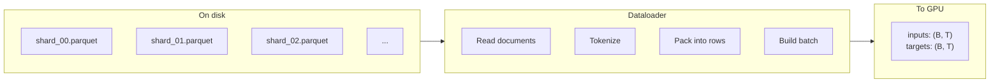
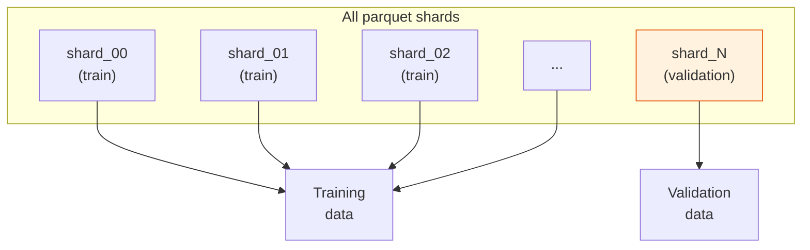
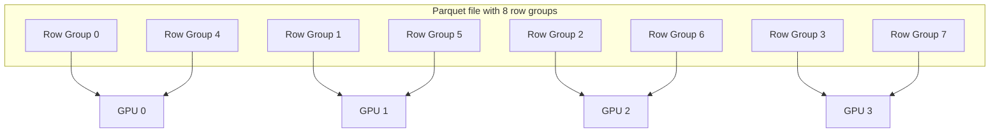
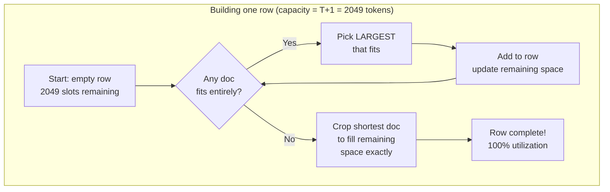
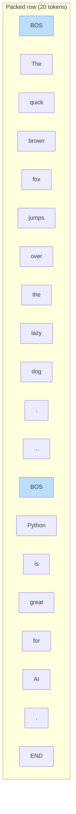
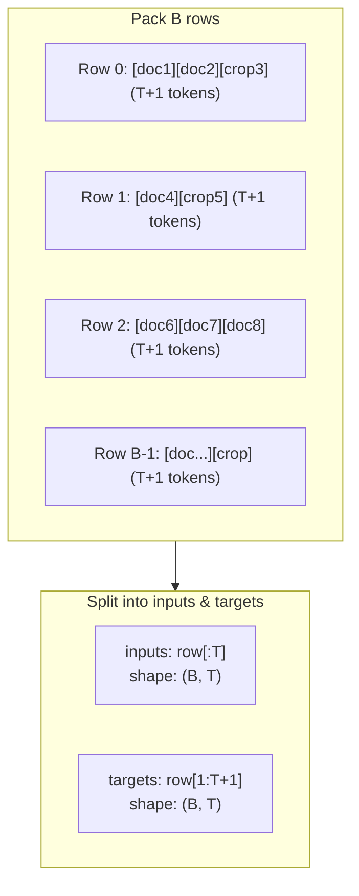

# Chapter 4 — Dataset and Dataloader

> **Goal:** Understand how raw text data flows from parquet files on disk into fixed-size training batches — including the clever best-fit packing strategy that minimizes wasted tokens.

---

## The big picture

The dataloader's job is to turn a stream of variable-length text documents into fixed-size rectangular tensors that can be fed to the GPU:



---

## Dataset: parquet shards

The training data lives in **parquet files** — a columnar format optimized for large datasets. Each file contains a `'text'` column with one document per row.

Key details from `nanochat/dataset.py`:

- Data is downloaded on demand (lazy loading)
- The **last shard** is reserved as the validation set; all others are training data
- Each shard is divided into **row groups** for efficient streaming



### Distributed data loading

When training with multiple GPUs (DDP), each GPU reads different row groups:



Each GPU with rank $r$ reads row groups $r, r + W, r + 2W, \ldots$ where $W$ is the world size (number of GPUs). This ensures no two GPUs see the same data.

---

## The packing problem

Here's the challenge: documents have variable lengths. Some are 50 tokens, others are 5,000. But the model expects fixed-length rows of exactly $T + 1$ tokens (e.g., 2049). We need to pack documents into these fixed rows efficiently.

### Why not just truncate?

You could truncate every document to $T$ tokens, but:
- Short documents waste space with padding (tokens the model trains on but learns nothing from)
- Long documents lose all content beyond $T$

### Why not just concatenate?

You could concatenate documents end-to-end and split every $T$ tokens, but:
- Some rows would start in the middle of a sentence — the model sees text without context
- BOS tokens (which mark document boundaries) wouldn't align to row starts

---

## BOS-aligned best-fit packing

nanochat's solution is elegant: **every row starts with a BOS token**, and documents are packed tightly using a best-fit algorithm.

### The algorithm

For each row:
1. **Find the largest document that fits** in the remaining space
2. **Add it** to the row
3. **Repeat** until no document fits entirely
4. **Crop** the shortest buffered document to fill the remaining space exactly



### Example

Suppose $T+1 = 20$ tokens and we have these documents in the buffer:

| Doc | Length | Content (simplified) |
|-----|--------|---------------------|
| A | 12 | `BOS The quick brown fox jumps over the lazy dog .` + more |
| B | 6 | `BOS Hello world ! EOS` |
| C | 8 | `BOS Python is great for AI .` |

**Row building:**
1. Capacity = 20. Largest fit: A (12 tokens). Add A. Remaining: 8.
2. Capacity = 8. Largest fit: C (8 tokens). Add C. Remaining: 0.
3. Row is full! → `[A's 12 tokens][C's 8 tokens]` = 20 tokens, 100% utilization.



The blue BOS tokens mark document boundaries within the row. The model knows each BOS starts a fresh document.

### The cost: ~35% cropping

When no document fits entirely, a document gets cropped to fill the gap. This means ~35% of total tokens are discarded (the remaining parts of cropped documents). However, the tradeoff is worth it:

| Strategy | Utilization | Padding waste | Quality |
|----------|-------------|---------------|---------|
| Simple truncation | ~60% | ~40% | Poor — lots of padding tokens |
| Concatenate + split | ~100% | 0% | OK — but mid-document starts confuse the model |
| **BOS-aligned best-fit** | **~100%** | **0%** | **Good — every row starts clean, no padding** |

The key insight: losing 35% of tokens to cropping is better than training on padding tokens (which teach the model nothing) or on context-less mid-document fragments.

---

## From rows to batches

Once $B$ rows are packed, they become the training batch:



The inputs and targets are offset by one position — the model looks at token $t$ and tries to predict token $t+1$. This is the autoregressive training setup.

### Memory transfers

The dataloader is carefully optimized for GPU training:

```python
# 1. Build rows in a CPU buffer
row_buffer = torch.empty((B, row_capacity), dtype=torch.long)

# 2. Copy to pinned CPU memory (fast transfer staging area)
cpu_inputs.copy_(row_buffer[:, :-1])
cpu_targets.copy_(row_buffer[:, 1:])

# 3. Single async transfer to GPU
gpu_buffer.copy_(cpu_buffer, non_blocking=True)
```

**Pinned memory** is CPU memory that the GPU can read directly via DMA, without an intermediate copy. This makes the host→device transfer much faster.

---

## Calculating tokens per step

The total number of tokens processed per optimization step:

$$
\text{tokens per step} = B_{\text{device}} \times T \times W \times \text{grad\_accum\_steps}
$$

where:
- $B_{\text{device}}$ = per-device batch size (e.g., 32)
- $T$ = sequence length (e.g., 2048)
- $W$ = number of GPUs/ranks (e.g., 8)
- $\text{grad\_accum\_steps}$ = number of forward/backward passes before one optimizer step

For a typical setup: $32 \times 2048 \times 8 = 524{,}288$ tokens per step (~half a million tokens).

---

## Resumption

The dataloader tracks its position so training can resume after interruption:

```python
state_dict = {"pq_idx": pq_idx, "rg_idx": rg_idx, "epoch": epoch}
```

This saves which parquet file and row group the loader was reading. On resume, it picks up from approximately where it left off (it may repeat a small amount of data, but this is negligible).

---

## Key files

| File | What it does |
|------|-------------|
| `nanochat/dataset.py` | Lists and downloads parquet shard files |
| `nanochat/dataloader.py` | BOS-aligned best-fit packing and batching (~166 lines) |

---

**Next:** [Chapter 5](05_training_loop.md) — The base training loop where all the pieces come together.
