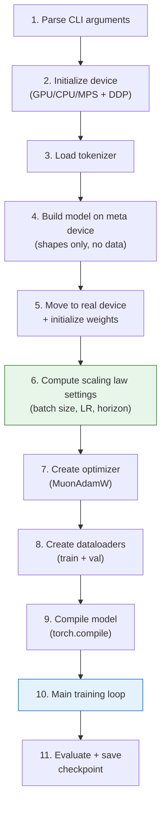
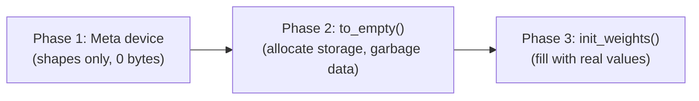
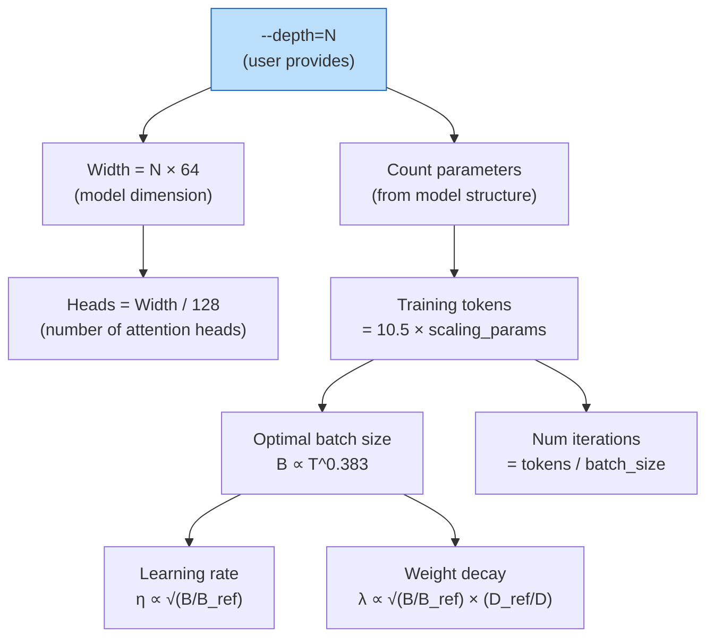
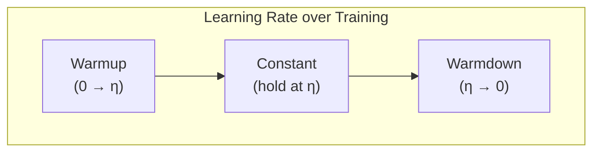
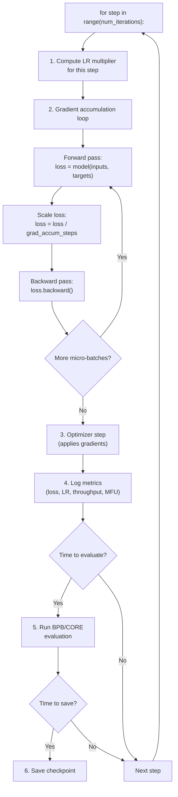
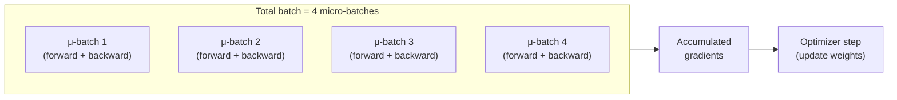

# Chapter 5 — The Base Training Loop

> **Goal:** Understand `scripts/base_train.py` — how the model, data, optimizer, and evaluation are orchestrated into a complete pretraining run, and how scaling laws automatically configure everything.

---

## What happens when you run `python -m scripts.base_train`?



Let's dive into each step.

---

## Step 4-5: Model build pattern (meta device)

Building a large model can use a lot of memory. nanochat uses a three-phase pattern:



```python
# Phase 1: Build on meta device (only shapes and dtypes, no actual data)
with torch.device("meta"):
    model = GPT(config)

# Phase 2: All tensors get storage on target device (garbage data)
model.to_empty(device=device)

# Phase 3: Initialize all weights with proper values
model.init_weights()
```

**Why not just `model = GPT(config).to(device)`?** Because:
- On meta device, tensors have shapes but consume zero memory
- This lets us inspect the model structure, count parameters, and compute FLOPs before committing GPU memory
- `to_empty` + `init_weights` is more memory-efficient than creating on CPU and copying to GPU

---

## Step 6: Scaling laws — the magic sauce

This is where nanochat really shines. Given just `--depth=N`, the code automatically computes the optimal training configuration using empirically-derived scaling laws.

### How it works

Everything is a chain of calculations starting from depth:



### Concrete formulas from the code

**1. Training horizon** (how long to train):

The code uses a target data:parameter ratio of 10.5 (Chinchilla used 20, but nanochat is tuned for smaller models):

$$
\text{target\_tokens} = 10.5 \times \text{scaling\_params}
$$

where `scaling_params = transformer_matrices + lm_head` parameters (excluding embeddings).

**2. Batch size** (from the [Power Lines paper](https://arxiv.org/abs/2505.13738)):

$$
B_{\text{opt}} = B_{\text{ref}} \times \left(\frac{D}{D_{\text{ref}}}\right)^{0.383}
$$

where $B_{\text{ref}} = 524{,}288$ tokens at the reference depth of 12. The result is rounded to the nearest power of 2 for efficiency.

**3. Learning rate scaling** (batch size → LR):

$$
\eta = \eta_{\text{base}} \times \sqrt{\frac{B}{B_{\text{ref}}}}
$$

Larger batches can tolerate higher learning rates because the gradient estimates are more accurate.

**4. Weight decay scaling** (from the [T_epoch framework](https://arxiv.org/abs/2405.13698)):

$$
\lambda = \lambda_{\text{ref}} \times \sqrt{\frac{B}{B_{\text{ref}}}} \times \frac{D_{\text{ref}}}{D}
$$

This keeps a quantity called $T_{\text{epoch}} = B / (\eta \cdot \lambda \cdot D)$ constant across model sizes, which has been found to give stable training.

### Example scaling for different depths

| Depth | Params | Tokens | Batch Size | Iterations |
|-------|--------|--------|------------|------------|
| 4 | ~3M | ~30M | ~64K | ~470 |
| 12 | ~85M | ~700M | ~512K | ~1,400 |
| 20 | ~280M | ~2.5B | ~700K | ~3,600 |
| 26 | ~550M | ~5.5B | ~1M | ~5,500 |

---

## The learning rate schedule

nanochat uses a three-phase learning rate schedule:



```
LR
 η |    _______________
   |   /               \
   |  /                  \
   | /                    \
 0 |/______________________\
   0    warmup   ...  warmdown
        (0%)          (50%)
```

The warmup and warmdown are linear. Default settings:
- **Warmup:** 0% of training (disabled by default — the model starts at full LR)
- **Warmdown:** 50% of training (the last half gradually reduces the LR to 0)

In code:

```python
def get_lr_multiplier(it):
    # Linear warmup
    if it < warmup_iters:
        return args.final_lr_frac + (1.0 - args.final_lr_frac) * (it / warmup_iters)
    # Linear warmdown
    elif it >= warmdown_start:
        progress = (it - warmdown_start) / (num_iterations - warmdown_start)
        return args.final_lr_frac + (1.0 - args.final_lr_frac) * (1.0 - progress)
    # Constant
    else:
        return 1.0
```

---

## The main training loop

The inner loop is surprisingly simple:



### Gradient accumulation

If the desired total batch size doesn't fit in GPU memory, the code breaks it into smaller **micro-batches**:

$$
\text{grad\_accum\_steps} = \frac{B_{\text{total}}}{B_{\text{device}} \times T \times W}
$$

Each micro-batch does a forward + backward pass, accumulating gradients. Only after all micro-batches are processed does the optimizer take a step. This is mathematically equivalent to using the full batch size:



### Autocast and mixed precision

On CUDA GPUs, the code wraps the forward pass in `torch.amp.autocast`:

```python
with autocast_ctx:     # Compute in bfloat16 for speed
    loss = model(x, y) # Forward pass
```

This uses **bfloat16** (16-bit floats) for most operations, which is 2× faster and uses 2× less memory than float32, while maintaining numerical stability.

### torch.compile

Before the training loop starts, the model is compiled:

```python
model = torch.compile(model, dynamic=False)
```

`torch.compile` traces the model's Python code and converts it to optimized GPU kernels. `dynamic=False` means the input shapes never change, allowing maximum optimization. This typically gives a 15-30% speedup.

---

## Monitoring metrics

During training, several metrics are logged:

| Metric | What it means | Good values |
|--------|-------------|-------------|
| `train/loss` | Cross-entropy loss on current batch | Decreasing over time |
| `train/lr` | Current learning rate | Follows the schedule |
| `train/tokens_per_sec` | Throughput | Higher = better |
| `train/mfu` | Model FLOPS Utilization | 30-60% is typical |
| `val/bpb` | Validation bits-per-byte | Lower = better |
| `val/core` | CORE benchmark score | Higher = better |

**MFU (Model FLOPS Utilization)** measures what fraction of the GPU's theoretical peak performance we're actually achieving. It's computed as:

$$
\text{MFU} = \frac{\text{actual FLOPS}}{\text{GPU peak FLOPS}} = \frac{\text{flops\_per\_token} \times \text{tokens\_per\_sec}}{\text{GPU peak BF16 FLOPS}}
$$

---

## FP8 training (H100+ only)

For Hopper GPUs (H100, H200), nanochat supports **FP8 training** — using 8-bit floats for linear layer computations:

```bash
python -m scripts.base_train --fp8
```

FP8 approximately doubles throughput over BF16 by utilizing the GPU's FP8 tensor cores. The conversion is selective — only large Linear layers (≥128 in each dimension, divisible by 16) are converted:

```python
def fp8_module_filter(mod, fqn):
    if not isinstance(mod, nn.Linear): return False
    if mod.in_features % 16 != 0 or mod.out_features % 16 != 0: return False
    if min(mod.in_features, mod.out_features) < 128: return False
    return True
```

---

## Checkpointing

Checkpoints are saved periodically and at the end of training:

```
~/.cache/nanochat/
  base_checkpoints/
    d12/
      model_step_1000.pt
      model_final.pt
      optimizer_step_1000.pt
```

A checkpoint contains:
- **Model weights** (`model_step_N.pt`)
- **Optimizer state** (`optimizer_step_N.pt`) — needed for resuming training
- **Metadata** — config, step number, dataloader position, user arguments

Resume training from a checkpoint:
```bash
python -m scripts.base_train --depth=12 --resume-from-step=1000
```

---

## Key files

| File | What it does |
|------|-------------|
| `scripts/base_train.py` | Main pretraining script (~601 lines) |
| `nanochat/gpt.py` | Model + optimizer setup |
| `nanochat/common.py` | DDP initialization, logging |
| `nanochat/checkpoint_manager.py` | Save/load checkpoints |

---

**Next:** [Chapter 6](06_optimizer.md) — The MuonAdamW optimizer: why we need two optimizers and how they work.
