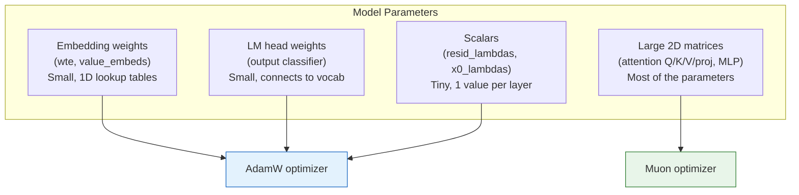
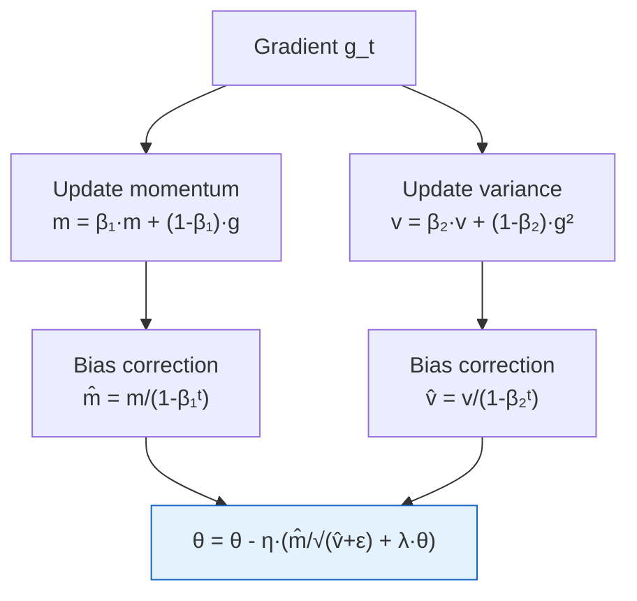
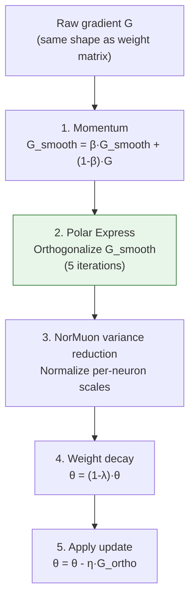
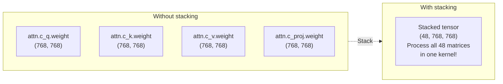
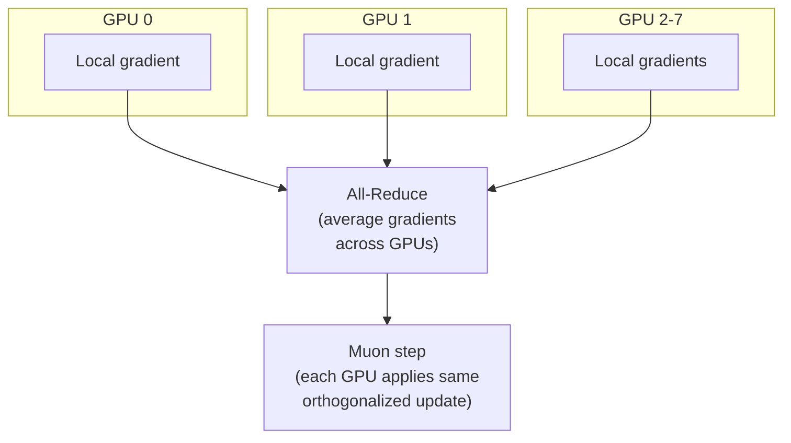

# Chapter 6 — The MuonAdamW Optimizer

> **Goal:** Understand why nanochat uses *two* different optimizers, how AdamW and Muon work, and how they're fused together for efficiency.

---

## Why two optimizers?

Neural networks have different types of parameters that benefit from different optimization strategies:



| Optimizer | Used for | Why |
|-----------|----------|-----|
| **AdamW** | Embeddings, LM head, scalars | Safe, well-understood, works everywhere |
| **Muon** | Large 2D weight matrices | Faster convergence for matrix params via orthogonalization |

---

## AdamW: the workhorse

AdamW is the standard optimizer for training neural networks. It maintains two running averages:

- **First moment** $m_t$ (like momentum — tracks the average direction of gradients)
- **Second moment** $v_t$ (tracks the average magnitude — adapts the step size per parameter)

### The algorithm step by step

Given gradient $g_t$ for parameter $\theta$:

**1. Update running averages:**
$$
m_t = \beta_1 \cdot m_{t-1} + (1 - \beta_1) \cdot g_t \quad \text{(smoothed gradient direction)}
$$
$$
v_t = \beta_2 \cdot v_{t-1} + (1 - \beta_2) \cdot g_t^2 \quad \text{(smoothed gradient magnitude)}
$$

**2. Correct bias** (the averages start at 0, so early estimates are too small):
$$
\hat{m}_t = \frac{m_t}{1 - \beta_1^t}, \quad \hat{v}_t = \frac{v_t}{1 - \beta_2^t}
$$

**3. Update parameter** (with weight decay):
$$
\theta_{t+1} = \theta_t - \eta \left(\frac{\hat{m}_t}{\sqrt{\hat{v}_t} + \epsilon} + \lambda \cdot \theta_t\right)
$$



### Intuition: why adaptive learning rates help

Consider two parameters:
- Parameter A gets large, consistent gradients → its $v_t$ is large → step size $\eta / \sqrt{v_t}$ is small (careful steps)
- Parameter B gets small, noisy gradients → its $v_t$ is small → step size is large (bolder steps)

This adaptive behavior is why Adam-family optimizers work so much better than plain SGD for language models.

### The "decoupled" weight decay

The "W" in AdamW stands for **decoupled weight decay**. Instead of adding a penalty to the loss function (L2 regularization), it directly shrinks the weights each step:

$$
\theta \leftarrow (1 - \eta \cdot \lambda) \cdot \theta \quad \text{then} \quad \theta \leftarrow \theta - \eta \cdot \text{adam\_update}
$$

This turns out to work much better with adaptive optimizers than the classical L2 approach.

### nanochat's fused implementation

The entire AdamW step is compiled into a single GPU kernel using `@torch.compile`:

```python
@torch.compile(dynamic=False, fullgraph=True)
def adamw_step_fused(p, grad, exp_avg, exp_avg_sq, step_t, lr_t, ...):
    p.mul_(1 - lr_t * wd_t)                            # weight decay
    exp_avg.lerp_(grad, 1 - beta1_t)                    # update m
    exp_avg_sq.lerp_(grad.square(), 1 - beta2_t)        # update v
    bias1 = 1 - beta1_t ** step_t                       # bias correction
    bias2 = 1 - beta2_t ** step_t
    denom = (exp_avg_sq / bias2).sqrt() + eps_t
    step_size = lr_t / bias1
    p.add_(exp_avg / denom, alpha=-step_size)            # parameter update
```

Fusing all these operations into one kernel eliminates the overhead of launching separate GPU operations for each line.

---

## Muon: the secret weapon for matrices

Muon (from [modded-nanogpt](https://github.com/KellerJordan/modded-nanogpt)) is specifically designed for large 2D weight matrices. The key idea: instead of just following the gradient direction, **orthogonalize the update**.

### Why orthogonalize?

Think of a weight matrix $W$ as performing a linear transformation in a high-dimensional space. When we update $W$ with a gradient $G$, the update might be "lopsided" — strongly pushing in some directions while ignoring others. Orthogonalization spreads the update more evenly across all directions.

Formally, given the gradient matrix $G$, Muon computes something close to:
$$
U S'^{-1} V^T \quad \text{where} \quad G = U S V^T
$$

This is related to the matrix polar decomposition, which projects $G$ onto the set of orthogonal matrices.

### The Muon pipeline



### Polar Express: fast orthogonalization

The orthogonalization step uses **Polar Express** — an iterative algorithm that converges to the polar factor of a matrix. It's faster and more numerically stable than computing a full SVD:

```python
# Polar Express coefficients (5 iterations)
polar_express_coeffs = [
    (8.156, -22.483, 15.879),
    (4.043, -2.809, 0.500),
    (3.892, -2.772, 0.506),
    (3.286, -2.368, 0.464),
    (2.347, -1.710, 0.423),
]
```

Each iteration applies a polynomial: $X \leftarrow a \cdot X + b \cdot X^3 + c \cdot X^5$ (conceptually), which pushes the singular values toward 1 — making the matrix closer to orthogonal.

### NorMuon variance reduction

After orthogonalization, different neurons (columns of the weight matrix) can have very different update scales. NorMuon normalizes these per-neuron, using a running second moment estimate:

```python
# Per-neuron normalization (adaptive scale per column)
second_momentum_buffer.lerp_(update_sq_mean, 1 - beta2_t)
scale = second_momentum_buffer.rsqrt()
```

This is analogous to Adam's per-parameter adaptive learning rate, but applied after orthogonalization.

---

## Parameter groups in detail

The `setup_optimizer` method in `nanochat/gpt.py` carefully assigns each parameter to the right group:

```python
param_groups = [
    # AdamW groups
    dict(kind='adamw', params=lm_head_params,     lr=0.004 * scale),
    dict(kind='adamw', params=embedding_params,    lr=0.2 * scale),
    dict(kind='adamw', params=value_embeds_params, lr=0.2 * scale),
    dict(kind='adamw', params=resid_params,        lr=0.005),
    dict(kind='adamw', params=x0_params,           lr=0.5),

    # Muon groups (one per unique shape, for efficient stacking)
    dict(kind='muon', params=[...768×3072 matrices...], lr=0.02),
    dict(kind='muon', params=[...768×768 matrices...],  lr=0.02),
]
```

### Why group by shape?

Muon stacks all matrices of the same shape into a 3D tensor and processes them in a single fused kernel. This is much more efficient than processing each matrix separately:



### dmodel LR scaling

The AdamW learning rates are scaled by $\propto 1/\sqrt{d_{\text{model}}}$:

```python
dmodel_lr_scale = (model_dim / 768) ** -0.5
```

This follows μP (maximal update parameterization) principles — wider models need lower learning rates for embeddings to maintain the same training dynamics.

---

## Hyperparameter summary

| Parameter | AdamW | Muon |
|-----------|-------|------|
| Learning rate | 0.004-0.5 (varies by group) | 0.02 |
| β₁ (momentum) | 0.8 | 0.95 |
| β₂ (variance) | 0.95 | 0.95 |
| Weight decay | 0.0 (embeddings) | 0.2 (scaled) |
| Epsilon | 1e-10 | — |
| NS iterations | — | 5 |

---

## Distributed training: DistMuonAdamW

When training with multiple GPUs, `DistMuonAdamW` handles gradient synchronization. The key optimization: Muon's orthogonalization step is done **after** the all-reduce, so communication and computation overlap efficiently.



---

## Key file

- `nanochat/optim.py` — Complete MuonAdamW implementation (~534 lines)

---

**Next:** [Chapter 7](07_inference_engine.md) — Fast inference with the KV cache and tool-use state machine.
