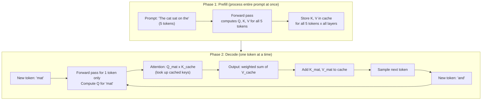
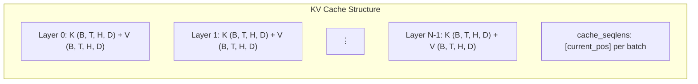
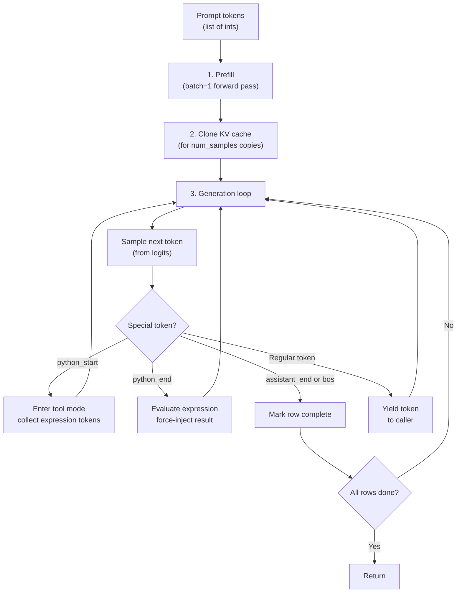
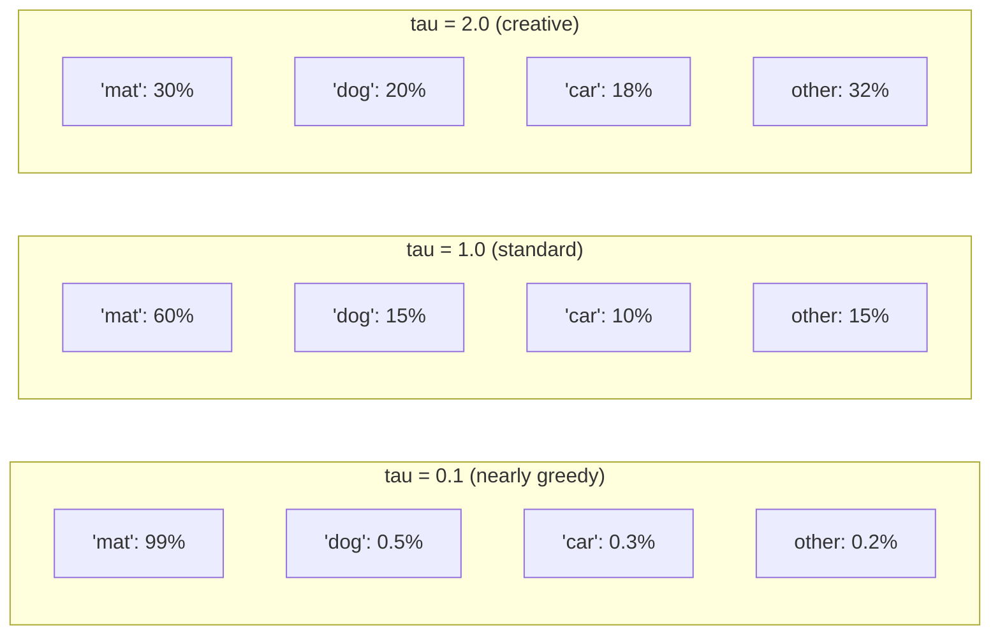
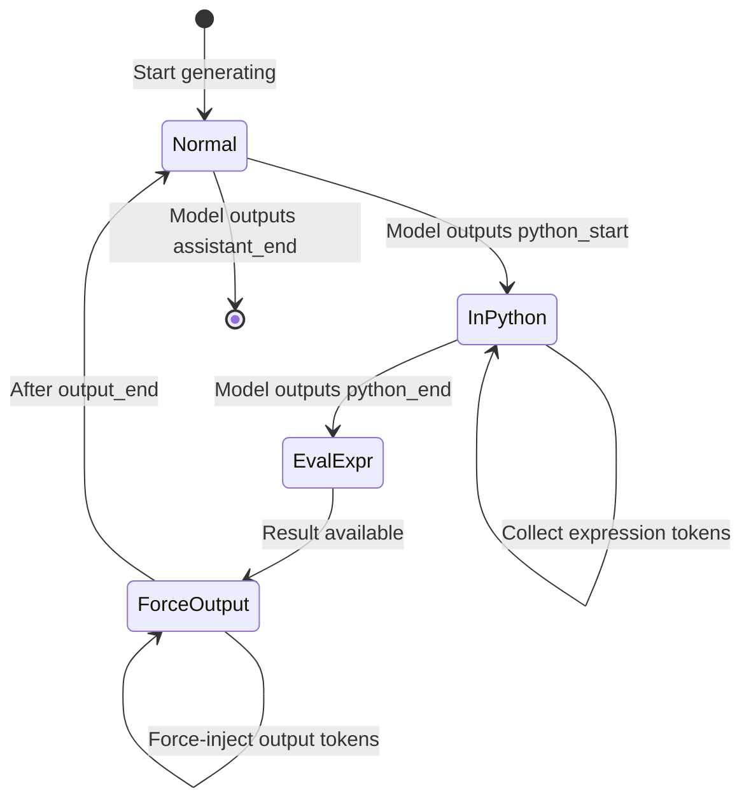

# Chapter 7 — Inference Engine and KV Cache

> **Goal:** Understand how `nanochat/engine.py` generates text efficiently using a KV cache, how tokens are sampled, and how the tool-use state machine lets the model run Python code.

---

## The inference problem

During training, the model processes entire sequences in parallel. But during inference (when generating text), we produce tokens **one at a time**: generate token 1, then use it to generate token 2, then use both to generate token 3, etc.

Naive approach: re-run the entire model for every new token. For a 500-token prompt + 100 generated tokens, that's 100 forward passes, each processing an increasingly long sequence.

**The KV cache** makes this dramatically faster.

---

## How the KV cache works

### The insight

In self-attention, each token computes Query, Key, and Value vectors. The attention output for the latest token depends on:
- Its own Query (what it's looking for)
- The Keys and Values of ALL previous tokens (what they offer)

The Keys and Values of previous tokens **never change** once computed. So we can cache them!



### Speed comparison

| Approach | Tokens processed per forward pass | Total compute for 100 tokens |
|----------|-----------------------------------|------------------------------|
| Naive (no cache) | Growing: 5, 6, 7, ..., 104 | ~5,450 token-passes |
| With KV cache | Always 1 (during decode) | 5 + 100 = 105 token-passes |

That's a **52× speedup** for this small example. The savings grow even larger for longer sequences.

---

## KV cache memory layout

nanochat uses Flash Attention 3's layout for the KV cache:

```python
class KVCache:
    def __init__(self, batch_size, num_heads, seq_len, head_dim, num_layers, ...):
        # Shape: (num_layers, batch_size, max_seq_len, num_heads, head_dim)
        self.k_cache = torch.zeros(num_layers, batch_size, seq_len, num_heads, head_dim)
        self.v_cache = torch.zeros(num_layers, batch_size, seq_len, num_heads, head_dim)
        # Track how many positions are filled per batch element
        self.cache_seqlens = torch.zeros(batch_size, dtype=torch.int32)
```



### Memory cost

For a model with depth=12, head_dim=128, 6 KV heads, at max seq_len=2048 in bfloat16:

$$
\text{KV cache memory} = 2 \times 12 \times 1 \times 2048 \times 6 \times 128 \times 2 \text{ bytes} \approx 72 \text{ MB}
$$

This is small compared to the model itself, which is why KV caching is so popular.

---

## The complete generation flow

The `Engine.generate()` method orchestrates the full generation pipeline:



### Multi-sample generation

A powerful feature: you can generate multiple completions from the same prompt with a single prefill. The KV cache is computed once for batch_size=1, then replicated:

```python
# 1) Prefill with batch_size=1
kv_cache_prefill = KVCache(batch_size=1, ...)
logits = model.forward(ids, kv_cache=kv_cache_prefill)

# 2) Clone to num_samples copies
kv_cache_decode = KVCache(batch_size=num_samples, ...)
kv_cache_decode.prefill(kv_cache_prefill)  # copy the cached KV

# 3) Generate in parallel for all samples
```

This is used during RL training (Chapter 9) to generate 16 candidate answers per question.

---

## Token sampling

Given the logits (raw scores for each possible next token), we need to choose which token to generate.

### Temperature

Temperature $\tau$ controls randomness:

$$
P(x = i) = \frac{\exp(z_i / \tau)}{\sum_j \exp(z_j / \tau)}
$$

| Temperature | Effect | Use case |
|-------------|--------|----------|
| $\tau = 0$ | Greedy (always pick highest score) | Factual answers |
| $\tau = 0.5$ | Slightly random | Creative but coherent |
| $\tau = 1.0$ | Standard | General conversation |
| $\tau > 1.0$ | Very random | Brainstorming, diversity |



### Top-k sampling

Top-k restricts the pool of candidates to only the $k$ highest-scoring tokens before applying softmax:

```python
def sample_next_token(logits, rng, temperature=1.0, top_k=None):
    if top_k is not None and top_k > 0:
        k = min(top_k, logits.size(-1))
        vals, idx = torch.topk(logits, k, dim=-1)  # keep top k
        vals = vals / temperature
        probs = F.softmax(vals, dim=-1)
        choice = torch.multinomial(probs, num_samples=1, generator=rng)
        return idx.gather(1, choice)
```

This prevents the model from ever selecting very unlikely tokens (which could derail the generation), while still allowing diversity among the top candidates.

---

## Tool use: the calculator state machine

nanochat's model can use a Python calculator. When it needs to compute something, it outputs special tokens that trigger code execution:



### How it works step by step

1. The model generates `<|python_start|>` — the engine enters "python mode"
2. Subsequent tokens are collected as a Python expression (e.g., `15 * 37`)
3. The model generates `<|python_end|>` — the engine exits python mode
4. The engine evaluates the expression in a sandbox
5. If successful, the engine **force-injects** `<|output_start|>`, result tokens, `<|output_end|>` into the generation stream
6. The model sees these injected tokens and continues generation normally

```python
# Simplified from engine.py
if next_token == python_start:
    state.in_python_block = True
    state.python_expr_tokens = []
elif next_token == python_end and state.in_python_block:
    state.in_python_block = False
    expr = tokenizer.decode(state.python_expr_tokens)
    result = use_calculator(expr)
    if result is not None:
        state.forced_tokens.append(output_start)
        state.forced_tokens.extend(tokenizer.encode(str(result)))
        state.forced_tokens.append(output_end)
```

### Safety sandbox

The calculator is heavily restricted:
- **Math expressions:** Only `+-*/().` and digits allowed
- **String operations:** Only `.count()` is permitted
- **Timeout:** 3-second maximum execution time
- **No builtins:** `eval()` runs with `{"__builtins__": {}}` (empty builtins)
- **Blocked patterns:** `import`, `exec`, `open`, `__`, etc.

```python
def use_calculator(expr):
    # Pure math: only digits and operators
    if all([x in "0123456789*+-/.() " for x in expr]):
        if "**" in expr:  return None  # no power operator (could hang)
        return eval_with_timeout(expr)
    # String: only .count() allowed
    if '.count(' not in expr: return None
    return eval_with_timeout(expr)
```

---

## The RowState tracker

When generating multiple samples in parallel, each sample has independent state:

```python
class RowState:
    current_tokens = []     # Token sequence so far
    forced_tokens = deque() # Tokens to force-inject (from tool results)
    in_python_block = False # Inside <python_start>...<python_end>?
    python_expr_tokens = [] # Expression being collected
    completed = False       # Has this row finished?
```

At each step, the engine checks: if there are forced tokens waiting, inject them instead of sampling. This ensures tool outputs appear in the correct place without the model "choosing" them.

---

## Streaming generation

The `generate()` method is a Python generator — it yields tokens as they're produced, enabling real-time streaming in the CLI and web UI:

```python
for token_column, token_masks in engine.generate(tokens, num_samples=1):
    # token_column: list of token IDs (one per sample)
    # token_masks: 1 if sampled, 0 if forced (tool output)
    text = tokenizer.decode(token_column)
    print(text, end="", flush=True)  # stream to terminal
```

The `token_masks` let the caller distinguish between model-generated and tool-injected tokens (important for RL training).

---

## Key files

| File | What it does |
|------|-------------|
| `nanochat/engine.py` | Engine class, KV cache, sampling, tool-use (~357 lines) |
| `nanochat/execution.py` | More general code sandbox (used in eval tasks) |

---

**Next:** [Chapter 8](08_evaluation.md) — How we measure model quality with BPB and CORE benchmarks.
