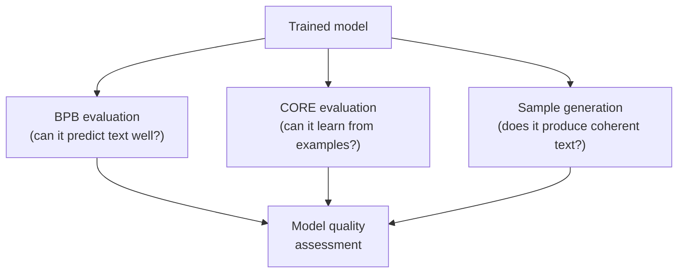
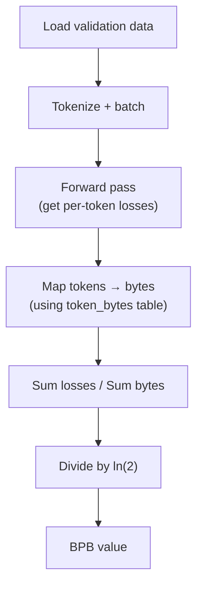
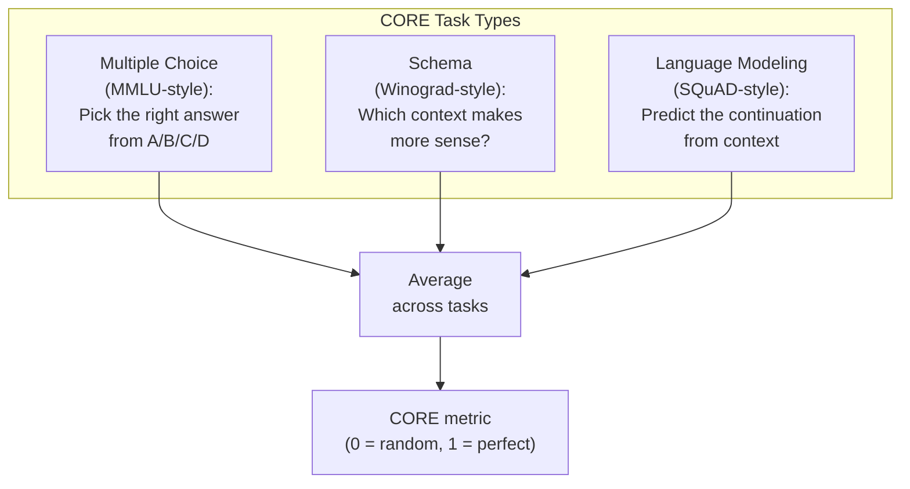
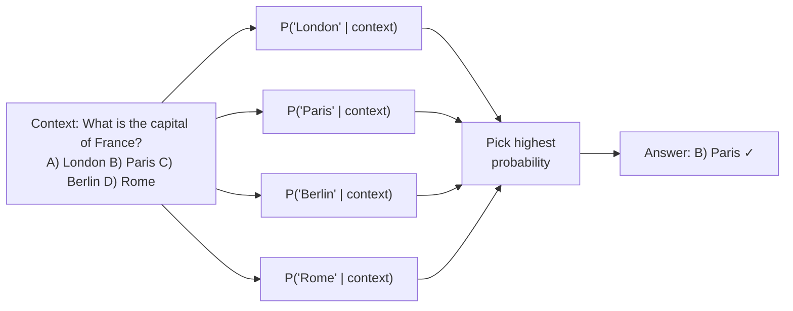

# Chapter 8 — Evaluation: BPB and CORE

> **Goal:** Understand how nanochat measures model quality — what BPB and CORE are, why they matter, and how the evaluation code works.

---

## Why evaluation matters

Training a model is like studying for an exam. But how do you know if the model actually learned anything useful? You need to test it on **data it has never seen before**. nanochat uses two complementary evaluation metrics:

| Metric | What it measures | Type | Better is... |
|--------|-----------------|------|-------------|
| **BPB** (Bits Per Byte) | How well the model predicts text | Perplexity-like | Lower |
| **CORE** | How well the model learns from examples | In-context learning accuracy | Higher |



---

## BPB: Bits Per Byte

### The idea

BPB measures how many **bits of information** the model needs, on average, to encode each byte of text. Lower BPB means the model is a better compressor of language — it understands patterns well enough to predict what comes next.

### Why not just use loss?

The standard cross-entropy loss has a problem: it depends on the **tokenizer**. A tokenizer with 100K tokens encodes text differently than one with 32K tokens. Comparing losses across tokenizers is meaningless.

BPB solves this by normalizing by **bytes instead of tokens**:

$$
\text{BPB} = \frac{N}{\ln(2) \cdot B}
$$

where:
- $N$ = total negative log-likelihood in nats (the sum of per-token losses)
- $B$ = total number of UTF-8 bytes in the evaluated text
- $\ln(2)$ converts from nats to bits

### A concrete example

Suppose the model evaluates on the text `"Hello world"` (11 bytes, UTF-8), and the tokenizer splits it into 2 tokens with total loss 3.0 nats. Then:

$$
\text{BPB} = \frac{3.0}{\ln(2) \times 11} = \frac{3.0}{7.624} \approx 0.394 \text{ bits/byte}
$$

### What BPB values mean

| BPB | What it means |
|-----|-------------|
| ~1.5 | Random-ish predictions (bad model) |
| ~1.0 | Basic patterns learned |
| ~0.8 | Good text prediction |
| ~0.75 | GPT-2 level |
| ~0.7 | Strong model |
| ~0.5 | State-of-the-art large models |

For reference, the entropy of English text is estimated at ~1.0-1.5 bits per character. A BPB below 1.0 means the model captures substantial structure in language.

### BPB evaluation in code



The `token_bytes` table tells us how many UTF-8 bytes each token represents. Special tokens (BOS, etc.) are excluded from the byte count since they're artificial markers, not real text.

---

## CORE: in-context learning accuracy

### What is in-context learning?

Large language models have a remarkable ability: you can teach them to do a new task just by showing examples in the prompt, without any training. This is called **in-context learning** (ICL).

For example, to teach "translate English to French":
```
dog -> chien
cat -> chat
house -> maison
car ->
```

A good model will predict `voiture`. CORE measures this ability.

### The DCLM CORE benchmark

CORE (from the [DCLM paper](https://arxiv.org/abs/2406.11794)) evaluates across multiple types of tasks:



### How CORE scores work

For each task, the raw accuracy is **centered** against a random baseline:

$$
\text{centered\_score} = \frac{\text{accuracy} - \text{random\_baseline}}{1 - \text{random\_baseline}}
$$

For a 4-choice multiple-choice task, random baseline = 0.25. If the model gets 50% accuracy:
$$
\text{centered\_score} = \frac{0.50 - 0.25}{1 - 0.25} = \frac{0.25}{0.75} = 0.333
$$

The final CORE score is the average of centered scores across all tasks. A CORE score:
- **0.0** = random guessing on all tasks
- **0.256** = GPT-2 level (the target for the speedrun leaderboard!)
- **1.0** = perfect on all tasks

### Multiple-choice evaluation (technical detail)

For multiple-choice tasks, the model doesn't "pick" an answer. Instead, the code computes the **log-probability** of each answer choice and selects the highest:



This is more reliable than generating text and parsing the output, because the model might express the same answer in different ways.

---

## Running evaluations

### Base model evaluation

```bash
# Evaluate BPB (validation loss)
python -m scripts.base_eval --eval bpb --model-tag d12

# Evaluate CORE (in-context learning)
python -m scripts.base_eval --eval core --model-tag d12

# Generate text samples
python -m scripts.base_eval --eval sample --model-tag d12

# All of the above
python -m scripts.base_eval --eval all --model-tag d12
```

### Chat model evaluation

After SFT, chat-specific evaluations test the model on:

| Task | What it tests | Type |
|------|-------------|------|
| GSM8K | Grade-school math | Generative (check final answer) |
| MMLU | Multiple-choice knowledge | Categorical |
| SpellingBee | Letter counting / spelling | Generative |
| HumanEval | Code generation | Execution-based |
| ARC | Science reasoning | Categorical |

```bash
python -m scripts.chat_eval --model-tag d12
```

---

## Evaluation during training

Evaluations run periodically during training (not just at the end):

| Setting | Default | What it does |
|---------|---------|-------------|
| `--eval-every 250` | Evaluate val BPB every 250 steps |  |
| `--core-metric-every 2000` | Evaluate CORE every 2000 steps |  |
| `--sample-every 2000` | Generate text samples every 2000 steps |  |

This creates a training curve showing how quality improves over time:

```
Step   0: val_bpb=1.500  core=0.000  (random init)
Step 250: val_bpb=1.100  core=0.050  (learning basic patterns)
Step 500: val_bpb=0.950  core=0.100  (getting better)
Step 1000: val_bpb=0.850 core=0.180  (reasonable)
Step 2000: val_bpb=0.780 core=0.230  (good)
Step 3000: val_bpb=0.750 core=0.256  (GPT-2 level!)
```

---

## The GPT-2 speedrun

The nanochat leaderboard tracks "time to GPT-2" — how fast can you train a model that exceeds GPT-2's CORE score of **0.256525**:

| Entry | Time | BPB | CORE | Notes |
|-------|------|-----|------|-------|
| GPT-2 original | 168 hours | — | 0.2565 | OpenAI, 2019 |
| nanochat d24 | 3.04 hours | 0.748 | 0.2585 | 8×H100 |
| nanochat d26 + FP8 | 2.91 hours | 0.745 | 0.2578 | 8×H100 |
| nanochat d26 + 1M batch | 2.76 hours | 0.746 | 0.2602 | 8×H100 |

Training GPT-2 originally cost ~$43,000. nanochat achieves the same capability for ~$72 (3 hours × $24/hour for 8×H100).

---

## Key files

| File | What it does |
|------|-------------|
| `scripts/base_eval.py` | Entry point for base model evaluation |
| `nanochat/core_eval.py` | CORE benchmark computation (~263 lines) |
| `nanochat/loss_eval.py` | BPB evaluation |
| `scripts/chat_eval.py` | Chat model evaluation on downstream tasks |

---

**Next:** [Chapter 9](09_chat_sft_rl.md) — Fine-tuning for chat with SFT and reinforcement learning.
