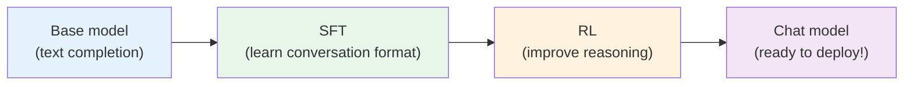
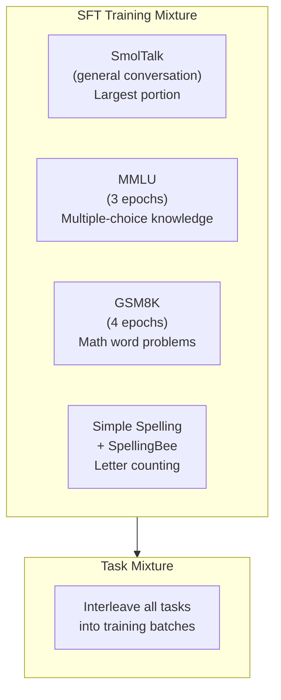
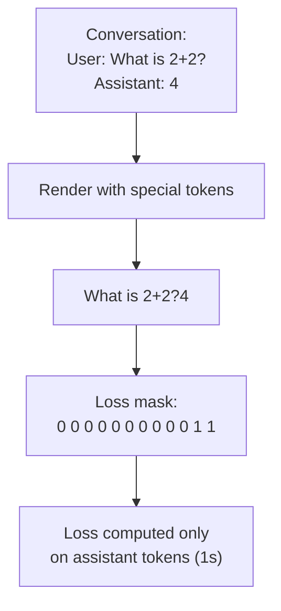
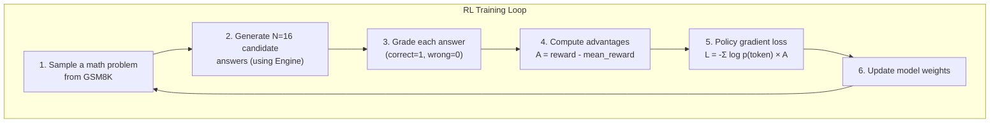
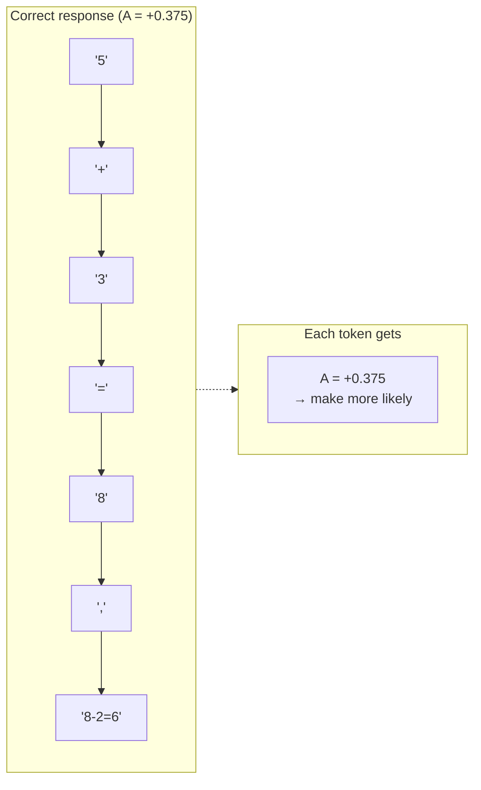
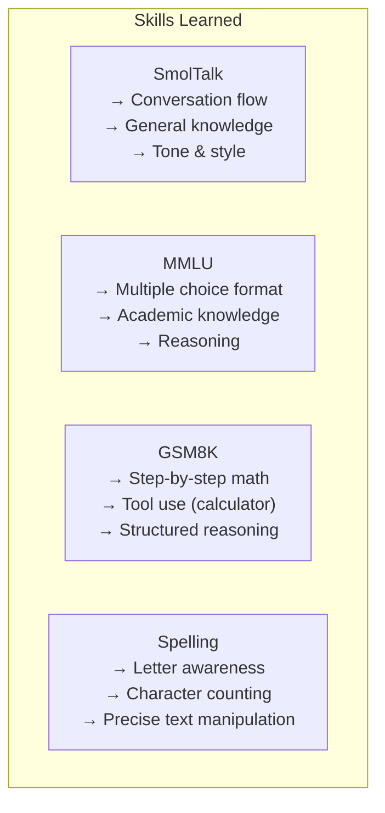

# Chapter 9 — Chat SFT and Reinforcement Learning

> **Goal:** Understand how a pretrained base model is transformed into a conversational assistant through supervised fine-tuning (SFT) and reinforcement learning (RL).

---

## The two stages: SFT then RL

A pretrained base model can predict the next token in internet text, but it doesn't know how to have a conversation. We need two more training stages:



| Stage | What the model learns | Data source | Duration |
|-------|----------------------|-------------|----------|
| **SFT** | How to format responses, follow instructions, use tools | Curated conversations | ~10 min (8×H100) |
| **RL** | Better math reasoning, more accurate answers | Self-generated attempts + rewards | ~20 min (8×H100) |

---

## Supervised Fine-Tuning (SFT)

### What is SFT?

SFT is conceptually simple: show the model thousands of example conversations and train it to produce the assistant's responses. It's just next-token prediction, but now the "text" is structured conversations instead of raw web text.

### The training mixture

nanochat's SFT uses multiple task datasets mixed together:



Each dataset provides conversations in a standard format:

```python
# A conversation is a list of messages
conversation = [
    {"role": "user", "content": "What is the capital of France?"},
    {"role": "assistant", "content": "The capital of France is Paris."},
]
```

### How conversations become training data

The conversation is rendered into a flat token stream with special tokens (as we saw in Chapter 3), and a **loss mask** ensures we only train on assistant tokens:



This is crucial: training on user tokens would teach the model to generate user questions instead of answers. Training on tool outputs would teach it to memorize calculator results instead of using the calculator.

### How SFT training works

SFT inherits almost everything from base training — same model, same optimizer (MuonAdamW), same mixed precision. The main differences:

1. **Data:** Conversation batches instead of web text
2. **Loss mask:** Only train on assistant tokens
3. **Shorter training:** Typically one pass through the data
4. **Learning rate:** Starts slightly lower (80% of base LR), then warms down

```python
# From scripts/chat_sft.py
# Load pretrained base model
model, tokenizer, meta = load_model("base", device, phase="train")

# Build task mixture
mixture = TaskMixture([
    SmolTalk(),
    MMLU(split="auxiliary_train", num_epochs=args.mmlu_epochs),
    GSM8K(subset="main", split="train", num_epochs=args.gsm8k_epochs),
    SimpleSpelling(),
    SpellingBee(),
])
```

### Why multiple epochs for some tasks?

SmolTalk is a large dataset, so one pass is enough. But MMLU (knowledge) and GSM8K (math) are smaller and more important — the model needs to see them multiple times to learn the patterns:

| Task | Size | Epochs | Why |
|------|------|--------|-----|
| SmolTalk | Large | 1 | Enough data for one pass |
| MMLU | Small | 3 | Need repetition for knowledge |
| GSM8K | Small | 4 | Math patterns need reinforcement |
| Spelling | Small | 1 | Simple patterns |

---

## Reinforcement Learning (RL)

### Why RL after SFT?

SFT teaches the model the *format* of good answers — how to structure a response, use tools, etc. But SFT is limited by imitation: the model can only be as good as the training examples.

RL goes further: the model generates its own answers, gets feedback (reward), and learns from its own successes and failures. This is especially powerful for math, where there's a clear right/wrong answer.

### Simple REINFORCE (not full GRPO)

nanochat's RL is much simpler than what's used at large labs. The code explains it best:

```python
"""
Reinforcement learning on GSM8K via "GRPO".

I put GRPO in quotes because we actually end up with something a lot
simpler and more similar to just REINFORCE:

1) Delete trust region, so there is no KL regularization to a reference model
2) We are on policy, so there's no need for PPO ratio+clip
3) We use DAPO style normalization that is token-level, not sequence-level
4) Instead of z-score normalization (r - mu)/sigma, only use (r - mu) as advantage
"""
```

### The RL loop



### Step by step

**Step 1: Sample a question**

```
Question: "Tom has 5 apples. He buys 3 more and gives 2 away. How many does he have?"
Answer: 6
```

**Step 2: Generate 16 candidate answers**

Using the inference engine with `num_samples=16`, the model produces 16 different responses. Some might be:

| Sample | Response | Correct? | Reward |
|--------|----------|----------|--------|
| 1 | "5 + 3 = 8, 8 - 2 = 6. Answer: 6" | ✓ | 1 |
| 2 | "5 + 3 = 8. Answer: 8" | ✗ | 0 |
| 3 | "Tom has 6 apples." | ✓ | 1 |
| ... | ... | ... | ... |
| 16 | "5 - 2 = 3, 3 + 3 = 6. Answer: 6" | ✓ | 1 |

**Step 3: Compute advantages**

If 10 out of 16 samples are correct, the mean reward is 0.625. Advantages:
- Correct answer: $A = 1 - 0.625 = +0.375$ (reinforce this behavior)
- Wrong answer: $A = 0 - 0.625 = -0.625$ (discourage this behavior)

**Step 4: Policy gradient update**

The loss pushes the model to generate more answers like the correct ones:

$$
\mathcal{L} = -\sum_{t} \log p_\theta(x_t) \cdot A
$$

For tokens in correct answers ($A > 0$), minimizing the loss means *increasing* $\log p_\theta$ — making those tokens more likely.

For tokens in wrong answers ($A < 0$), minimizing the loss means *decreasing* $\log p_\theta$ — making those tokens less likely.

### Token-level advantages (DAPO style)

A subtlety: the advantage is applied at the **token level**, not the sequence level. This means every token in a correct response gets the same positive advantage, rather than weighting by sequence length.



---

## What tasks teach the model

Each task in the SFT mixture teaches different skills:



### Adding your own task

You can create custom tasks by writing a simple Python class:

```python
# In tasks/customjson.py
class CustomJSON:
    """Load conversations from a JSON file"""
    def __init__(self, json_path):
        self.data = load_json(json_path)

    def __len__(self):
        return len(self.data)

    def __getitem__(self, idx):
        return self.data[idx]  # returns a list of messages
```

Then add it to the mixture in `scripts/chat_sft.py`.

---

## Chat evaluation after SFT/RL

After fine-tuning, `scripts/chat_eval.py` tests the model on multiple tasks:

```bash
python -m scripts.chat_eval --model-tag d12
```

Example output:
```
GSM8K (test): 45.2% (math accuracy)
MMLU: 38.1% (knowledge accuracy)
SpellingBee: 62.3% (letter counting)
```

RL on GSM8K typically improves math accuracy by 10-20 percentage points while maintaining performance on other tasks.

---

## The full pipeline timeline

For a GPT-2-grade model (depth=26) on 8×H100:

```mermaid
gantt
    title Training Timeline
    dateFormat HH:mm
    section Pretraining
    Base training           :base, 00:00, 3h
    section Fine-tuning
    SFT                     :sft, after base, 10m
    RL on GSM8K             :rl, after sft, 20m
    section Ready
    Chat evaluation         :eval, after rl, 5m
    Deploy web UI           :deploy, after eval, 1m
```



Total time: ~3.5 hours from zero to a working chatbot.

---

## Key files

| File | What it does |
|------|-------------|
| `scripts/chat_sft.py` | SFT training script (~496 lines) |
| `scripts/chat_rl.py` | RL training script (~341 lines) |
| `scripts/chat_eval.py` | Chat evaluation |
| `tasks/gsm8k.py` | GSM8K math task |
| `tasks/mmlu.py` | MMLU knowledge task |
| `tasks/smoltalk.py` | SmolTalk conversation data |
| `tasks/spellingbee.py` | Spelling/counting tasks |
| `tasks/common.py` | TaskMixture class |

---

**Next:** [Chapter 10](10_run_and_modify.md) — Practical guide to running and modifying nanochat.
