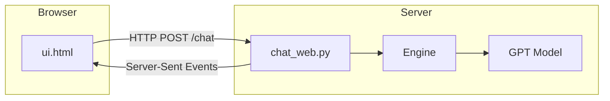
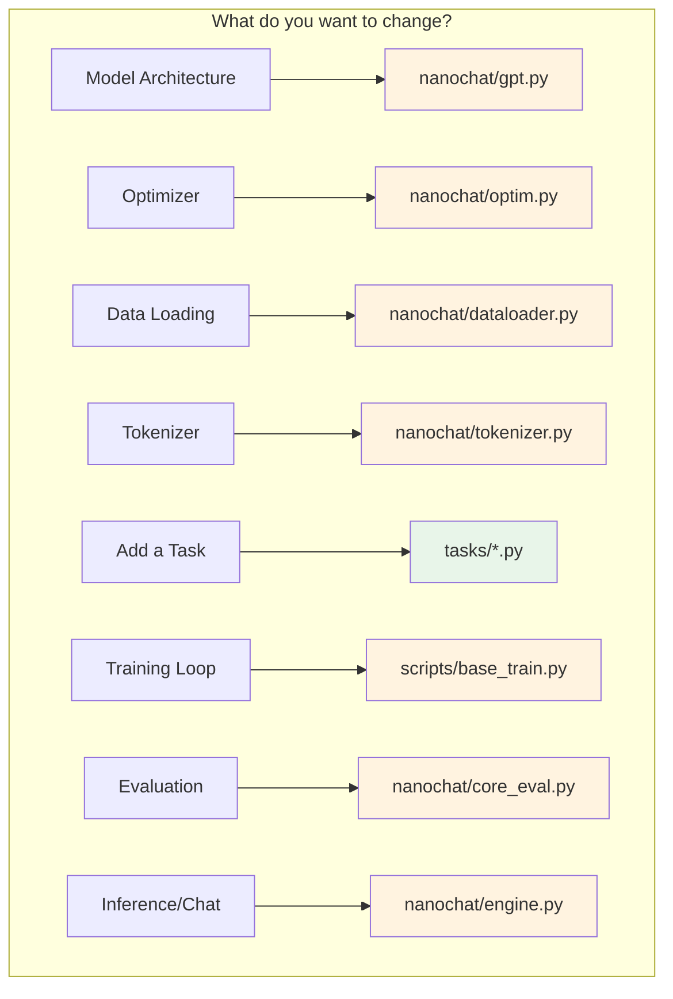

# Lesson 10 — Running and Modifying nanochat

**Goal:** Get nanochat running on your machine, understand every command-line flag, and learn how to safely modify the code for your own experiments.

---

## Environment Setup

Before running anything, you need a Python environment with the right dependencies. The recommended way uses **uv** (a fast Python package manager):

```bash
# Install uv if you don't have it
curl -LsSf https://astral.sh/uv/install.sh | sh
# Create a virtual environment
uv venv
# Install dependencies (use --extra gpu for CUDA support)
uv sync --extra gpu
# Activate
source .venv/bin/activate   # Linux/Mac
# .venv\Scripts\activate    # Windows
```

You can also set an environment variable to control where nanochat stores downloaded data, tokenizers, and checkpoints:

```bash
export NANOCHAT_BASE_DIR="$HOME/.cache/nanochat"
```

If unset, nanochat defaults to `~/.cache/nanochat/`. This is handled by `get_base_dir()` in `nanochat/common.py`.

---

## The Full Pipeline at a Glance

The **speedrun** script (`runs/speedrun.sh`) shows the complete training pipeline on 8×H100 GPUs, taking roughly 3 hours:


| Step | Command | Time (8×H100) |
|------|---------|---------------|
| Download data | `python -m nanochat.dataset -n 370` | ~5 min |
| Train tokenizer | `python -m scripts.tok_train` | ~2 min |
| Pretrain (d26) | `torchrun --nproc_per_node=8 -m scripts.base_train -- --depth=26` | ~2.5 hours |
| SFT | `torchrun --nproc_per_node=8 -m scripts.chat_sft` | ~15 min |
| RL (GSM8K) | `torchrun --nproc_per_node=8 -m scripts.chat_rl` | ~10 min |
| Evaluate | `torchrun --nproc_per_node=8 -m scripts.chat_eval` | ~5 min |

But you don't need 8 GPUs to learn! Let's start small.

---

## Running a Tiny CPU Test

This is the **best place to start** — it trains a tiny model on your laptop to verify everything works. No GPU required.

```bash
python -m scripts.base_train \
    --depth=4 \
    --max-seq-len=512 \
    --device-batch-size=1 \
    --eval-tokens=512 \
    --core-metric-every=-1 \
    --total-batch-size=512 \
    --num-iterations=20
```

**What each flag does:**

| Flag | Value | Meaning |
|------|-------|---------|
| `--depth` | 4 | Only 4 Transformer blocks (tiny model) |
| `--max-seq-len` | 512 | Short context window (saves memory) |
| `--device-batch-size` | 1 | Process 1 row at a time (minimal RAM) |
| `--eval-tokens` | 512 | Evaluate on just 512 tokens (fast) |
| `--core-metric-every` | -1 | Skip CORE evaluation (slow for CPU) |
| `--total-batch-size` | 512 | Small total batch for quick iterations |
| `--num-iterations` | 20 | Only 20 training steps |

With `--depth=4` and the default `--aspect-ratio=64`, the model dimension is $4 \times 64 = 256$ — a tiny model of roughly **5M parameters**. It won't produce good text, but it verifies your setup works end-to-end.

> **Tip:** The model quality scales with depth. The speedrun uses `--depth=26` (model dim = 1664, ~770M params). The relationship is: `model_dim = depth × aspect_ratio`.

---

## Complete Command-Line Reference

### Base Pretraining (`scripts/base_train.py`)

The pretraining script has many knobs. Here's a grouped reference:

#### Model Architecture

| Flag | Default | Description |
|------|---------|-------------|
| `--depth` | 20 | Number of Transformer layers |
| `--aspect-ratio` | 64 | `model_dim = depth × aspect_ratio` |
| `--head-dim` | 128 | Dimension per attention head |
| `--max-seq-len` | 2048 | Maximum context length |
| `--window-pattern` | "SSSL" | Sliding window pattern: S = half context, L = full context |

#### Training Horizon

Only one of these is used (in order of precedence):

| Flag | Default | Description |
|------|---------|-------------|
| `--num-iterations` | -1 | Explicit number of steps (-1 = disabled) |
| `--target-flops` | -1.0 | Train until this many FLOPs (-1 = disabled) |
| `--target-param-data-ratio` | 10.5 | Tokens-to-parameters ratio (Chinchilla optimal ≈ 20) |

#### Optimization

| Flag | Default | Description |
|------|---------|-------------|
| `--device-batch-size` | 32 | Per-GPU batch size (**reduce if OOM**: 16, 8, 4…) |
| `--total-batch-size` | -1 | Total batch in tokens (-1 = auto-compute optimal) |
| `--matrix-lr` | 0.02 | Learning rate for weight matrices (Muon optimizer) |
| `--embedding-lr` | 0.3 | Learning rate for token embeddings (Adam) |
| `--unembedding-lr` | 0.004 | Learning rate for the unembedding/LM-head (Adam) |
| `--scalar-lr` | 0.5 | Learning rate for scalar params (residual lambdas) |
| `--weight-decay` | 0.2 | Weight decay for Muon |
| `--warmup-ratio` | 0.0 | Fraction of training for LR warmup |
| `--warmdown-ratio` | 0.5 | Fraction of training for LR cooldown |

#### Evaluation & Logging

| Flag | Default | Description |
|------|---------|-------------|
| `--eval-every` | 250 | Validation BPB every N steps (-1 = disable) |
| `--core-metric-every` | 2000 | CORE benchmark every N steps (-1 = disable) |
| `--sample-every` | 2000 | Generate text samples every N steps |
| `--save-every` | -1 | Save intermediate checkpoints (-1 = only at end) |
| `--run` | "dummy" | Wandb run name ("dummy" disables wandb) |
| `--fp8` | false | Enable FP8 training (H100+ only) |

### SFT (`scripts/chat_sft.py`)

SFT inherits most settings from the pretrained checkpoint. Key additions:

```bash
torchrun --standalone --nproc_per_node=8 -m scripts.chat_sft -- \
    --device-batch-size=16 \
    --run=my_sft_run
```

| Flag | Default | Description |
|------|---------|-------------|
| `--model-tag` | auto | Which pretrained checkpoint to load |
| `--model-step` | auto | Which step's checkpoint to load |
| `--load-optimizer` | 1 | Warm-start optimizer (1=yes, 0=no) |
| `--init-lr-frac` | 0.8 | Start LR at 80% of base (avoids spike) |

### RL (`scripts/chat_rl.py`)

RL fine-tunes the SFT model on GSM8K math problems:

```bash
torchrun --standalone --nproc_per_node=8 -m scripts.chat_rl -- \
    --device-batch-size=8 \
    --run=my_rl_run
```

| Flag | Default | Description |
|------|---------|-------------|
| `--num-epochs` | 1 | Epochs over GSM8K training set |
| `--examples-per-step` | 16 | Questions per optimization step |
| `--num-samples` | 16 | Generations per question (for REINFORCE) |
| `--max-new-tokens` | 256 | Max tokens in each generated answer |
| `--temperature` | 1.0 | Sampling temperature |
| `--top-k` | 50 | Top-k sampling cutoff |

---

## Running Evaluations

### BPB (Bits Per Byte)

```bash
python -m scripts.base_eval --eval bpb --model-tag d4 --device-batch-size=1
```

This measures how well the model compresses unseen text. Lower is better (GPT-2 ≈ 0.94 BPB on FineWeb).

### CORE Benchmark

```bash
torchrun --standalone --nproc_per_node=8 -m scripts.base_eval -- --device-batch-size=16
```

CORE runs multiple-choice tasks (MMLU, ARC, etc.) using in-context learning. Values range from 0 (random on 4-choice questions = 25%) to 1 (perfect).

### Chat Evaluation (ChatCORE)

```bash
torchrun --standalone --nproc_per_node=8 -m scripts.chat_eval -- -i sft
```

The `-i` flag selects the checkpoint stage: `sft` or `rl`.

---

## Chatting with Your Model

### Command Line

```bash
# Interactive conversation
python -m scripts.chat_cli -i sft -g d26

# Single prompt (non-interactive)
python -m scripts.chat_cli -i sft -g d26 -p "Why is the sky blue?"
```

The flags `-i sft` and `-g d26` tell the CLI to load the SFT-finetuned checkpoint for the d26 model.

### Web UI

```bash
python -m scripts.chat_web --num-gpus 1
```

This launches a local web server with a ChatGPT-style interface. Open the URL printed in the terminal (usually `http://localhost:8000`). The web UI is defined in `nanochat/ui.html` and supports streaming responses.



---

## Where Checkpoints Live

All intermediate files are stored under the **base directory** (`~/.cache/nanochat/` by default):

```
~/.cache/nanochat/
├── tokenizer.model              # Trained BPE tokenizer
├── data/                        # Downloaded data shards
│   ├── shard_000000.parquet
│   ├── shard_000001.parquet
│   └── ...
├── base_checkpoints/
│   └── d26/                     # Pretrained model (depth=26)
│       ├── config.json          # Model config + training args
│       ├── model.pt             # Model weights
│       └── optimizer.pt         # Optimizer state
├── chatsft_checkpoints/
│   └── d26/                     # SFT fine-tuned model
│       ├── config.json
│       ├── model.pt
│       └── optimizer.pt
└── chatrl_checkpoints/
    └── d26/                     # RL fine-tuned model
        ├── config.json
        └── model.pt
```

The directory name (`d26`) comes from `--model-tag`, which defaults to `d{depth}`. You can override it:

```bash
python -m scripts.base_train --depth=20 --model-tag=my_experiment
# Saves to: base_checkpoints/my_experiment/
```

---

## Multi-GPU Training with DDP

For multi-GPU training, use `torchrun`:

```bash
# 4 GPUs on one machine
torchrun --standalone --nproc_per_node=4 -m scripts.base_train -- \
    --depth=20 --device-batch-size=16

# 8 GPUs on one machine (speedrun config)
torchrun --standalone --nproc_per_node=8 -m scripts.base_train -- \
    --depth=26 --device-batch-size=16 --fp8
```

**Important:** Notice the `--` separator. Arguments before `--` go to `torchrun`; arguments after go to the training script.

The total batch size is shared across GPUs. If `--total-batch-size=524288` and you have 4 GPUs each with `--device-batch-size=16` at `--max-seq-len=2048`, then:
- Tokens per device per step = $16 \times 2048 = 32768$
- Tokens per step across 4 GPUs = $4 \times 32768 = 131072$
- Gradient accumulation steps = $524288 / 131072 = 4$

---

## How to Modify the Code

### Modification Map



### Example 1: Change the Window Pattern

The sliding window attention pattern is controlled by `--window-pattern`. The default `"SSSL"` repeats across layers: S layers use half the context, L layers use the full context.

```bash
# Try all-long attention (more expensive, potentially better quality)
python -m scripts.base_train --depth=4 --window-pattern="L" \
    --max-seq-len=512 --device-batch-size=1 --total-batch-size=512 --num-iterations=20

# Try alternating short-long
python -m scripts.base_train --depth=4 --window-pattern="SL" \
    --max-seq-len=512 --device-batch-size=1 --total-batch-size=512 --num-iterations=20
```

Compare the validation BPB to see which pattern works better for your model size.

### Example 2: Add a New Task

Tasks live in `tasks/` and inherit from the `Task` base class in `tasks/common.py`. Here's the minimal skeleton:

```python
# tasks/my_task.py
from tasks.common import Task

class MyTask(Task):

    @property
    def eval_type(self):
        return 'categorical'  # or 'generative'

    def num_examples(self):
        return len(self.data)

    def get_example(self, index):
        # Return a conversation (list of dicts with "role" and "content")
        item = self.data[index]
        return [
            {"role": "user", "content": item["question"]},
            {"role": "assistant", "content": item["answer"]},
        ]

    def evaluate(self, problem, completion):
        # Return True/False for correctness (generative tasks)
        # Or return correct answer letter (categorical tasks)
        ...
```

Key points:
- **`eval_type = 'categorical'`**: For multiple-choice tasks. The evaluation compares log-probabilities of each answer choice.
- **`eval_type = 'generative'`**: For open-ended tasks. The model generates a response and `evaluate()` checks correctness.
- **`get_example()`** returns a conversation in the standard `[{"role": ..., "content": ...}]` format.

Look at `tasks/spellingbee.py` for a well-commented real example, or `tasks/mmlu.py` for a standard multiple-choice task.

### Example 3: Modify the Model Architecture

To experiment with the model, edit `nanochat/gpt.py`. For example, to change the MLP expansion ratio:

```python
# In the MLP class, change the hidden dimension
# Default: 4 * model_dim (rounded to nearest 128)
self.c_fc = nn.Linear(model_dim, 4 * model_dim, bias=False)
# Try 3x expansion:
self.c_fc = nn.Linear(model_dim, 3 * model_dim, bias=False)
```

> **Warning:** Architectural changes break checkpoint compatibility. You'll need to retrain from scratch.

---

## Troubleshooting

| Problem | Solution |
|---------|----------|
| **CUDA out of memory** | Reduce `--device-batch-size` (try 16 → 8 → 4 → 2 → 1) |
| **Flash Attention not found** | Install: `pip install flash-attn --no-build-isolation`. Falls back to PyTorch SDPA automatically. |
| **Slow training on CPU** | Expected. CPU is only for verification. Use `--num-iterations=5` for a quick smoke test. |
| **`torchrun` errors** | Make sure to use `--` separator between torchrun args and script args |
| **Bad model quality** | Check BPB — it should decrease during training. If flat, learning rate may be wrong. |
| **Tokenizer not found** | Run `python -m scripts.tok_train` first, or download via `python -m nanochat.dataset -n 8` |
| **wandb errors** | Use `--run=dummy` to disable wandb, or run `wandb login` first |

### Memory Estimation

A rough rule for GPU memory in BF16:

$$\text{Memory (GB)} \approx \frac{2 \times \text{params (B)} \times (1 + \text{optimizer multiplier})}{\text{1e9}}$$

For a d20 model (~400M params) with Muon + Adam:
- Model weights: ~0.8 GB
- Optimizer state: ~1.6 GB (2× for momentum buffers)
- Activations: depends on batch size and sequence length
- **Total:** roughly 4–8 GB for small batch sizes

---

## Safety Tips for Experiments

1. **Measure before and after.** Always compare BPB (or CORE) with and without your change.
2. **Change one thing at a time.** If you change the optimizer AND the architecture, you won't know which helped.
3. **Start small.** Test with `--depth=4 --num-iterations=20` on CPU before committing to a full GPU run.
4. **Use `--save-every=N`** to save intermediate checkpoints during long runs — you can resume if something crashes.
5. **Check logs for Flash Attention.** The training script prints whether FlashAttention or PyTorch SDPA is being used — FlashAttention is significantly faster.
6. **Use wandb for tracking.** Set `--run=my_experiment` to log metrics to Weights & Biases for easy comparison across runs.

---

## Resuming Training

If a training run is interrupted, you can resume from the last saved checkpoint:

```bash
python -m scripts.base_train --depth=20 --resume-from-step=5000
```

This reloads the model weights, optimizer state, and learning rate schedule from the checkpoint at step 5000. The data loader also resumes from the correct position so you don't re-process already-seen data.

---

## Quick Reference Card

```bash
# Setup
uv venv && uv sync --extra gpu && source .venv/bin/activate

# Data + Tokenizer
python -m nanochat.dataset -n 8
python -m scripts.tok_train

# Train (CPU smoke test)
python -m scripts.base_train --depth=4 --max-seq-len=512 \
    --device-batch-size=1 --total-batch-size=512 --num-iterations=20

# Train (single GPU)
python -m scripts.base_train --depth=20 --device-batch-size=16

# Train (multi-GPU)
torchrun --standalone --nproc_per_node=8 -m scripts.base_train -- \
    --depth=26 --device-batch-size=16 --fp8

# SFT
torchrun --standalone --nproc_per_node=8 -m scripts.chat_sft -- --device-batch-size=16

# RL
torchrun --standalone --nproc_per_node=8 -m scripts.chat_rl -- --device-batch-size=8

# Evaluate
python -m scripts.base_eval --eval bpb --model-tag d4 --device-batch-size=1
torchrun --standalone --nproc_per_node=8 -m scripts.chat_eval -- -i sft

# Chat
python -m scripts.chat_cli -i sft -g d26
python -m scripts.chat_web --num-gpus 1
```

---

**Next:** In the [final lesson](11_quick_walkthrough.md), we trace a single token through the entire system — from raw text all the way to a gradient update — building a concrete mental model of everything we've learned.
