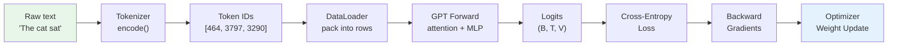
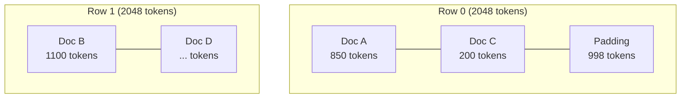
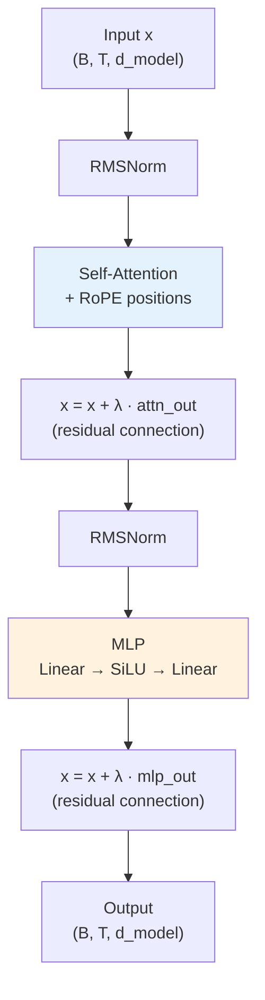
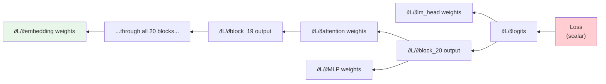
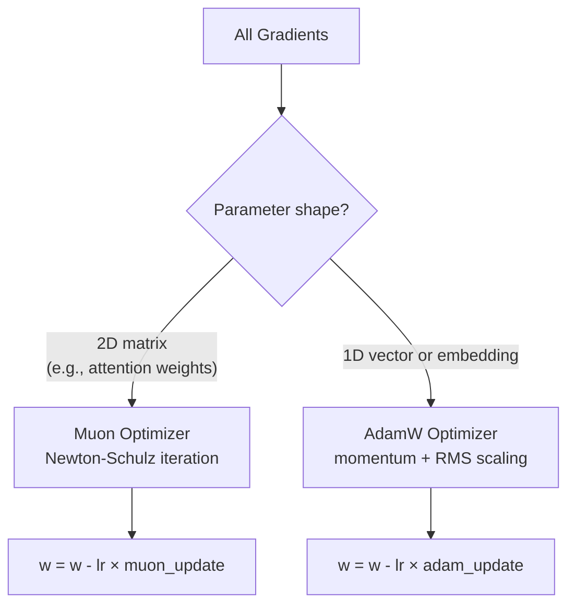

# Lesson 11 — Walkthrough: Follow One Token Through the Entire System

**Goal:** Build a concrete, end-to-end mental model by tracing a single piece of text from raw characters all the way through tokenization, data loading, the forward pass, loss computation, and the backward pass. By the end, you'll be able to point to the exact line of code responsible for each step.

---

## The Big Picture

Let's trace the sentence **"The cat sat"** through every stage of the nanochat system. We'll follow it from raw text to a gradient update on the model's weights.



Let's zoom into each stage.

---

## Stage 1: Tokenization — Text to Numbers

**File:** `nanochat/tokenizer.py`

Raw text is meaningless to a neural network — it only understands numbers. The tokenizer converts text into a sequence of integer **token IDs** using Byte-Pair Encoding (BPE).

### What Happens

```
Input:   "The cat sat"
Split:   ["The", " cat", " sat"]        ← regex splits on whitespace boundaries
BPE:     ["The", " cat", " sat"]        ← each piece is looked up in the vocabulary
Output:  [464, 3797, 3290]              ← integer token IDs
```

The BPE vocabulary (32,768 tokens for nanochat) maps common byte sequences to IDs. Frequent words like "The" get a single token; rare words are split into multiple tokens.

### In Code

```python
# nanochat/tokenizer.py
class Tokenizer:
    def encode(self, text: str) -> list[int]:
        # 1. Split text using regex pattern
        chunks = re.findall(self.compiled_pattern, text)
        # 2. For each chunk, apply BPE merges to get token IDs
        ids = []
        for chunk in chunks:
            chunk_bytes = chunk.encode("utf-8")
            chunk_ids = self._encode_chunk(chunk_bytes)
            ids.extend(chunk_ids)
        return ids
```

### Concrete Numbers

For a vocabulary of $V = 32{,}768$ tokens, each token ID is an integer in $[0, V)$. The tokenizer also defines special tokens:

| Token | ID | Purpose |
|-------|-----|---------|
| `<\|begin_of_text\|>` | 0 | Start of every sequence (BOS) |
| `<\|end_of_text\|>` | 1 | End of sequence (EOS) |
| `<\|user\|>` | 2 | Start of user turn |
| `<\|assistant\|>` | 3 | Start of assistant turn |
| `<\|tool_call\|>` | 4 | Tool call marker |
| `<\|tool_result\|>` | 5 | Tool result marker |

---

## Stage 2: Data Loading — Packing Tokens into Rows

**File:** `nanochat/dataloader.py`

The model trains on **fixed-length rows** of tokens (e.g., 2048 tokens per row). But most documents are shorter or longer than 2048 tokens. The dataloader **packs** multiple documents into each row to minimize wasted padding.

### What Happens

```
Documents (after tokenization):
  Doc A: [BOS, 464, 3797, 3290, ..., EOS]   (850 tokens)
  Doc B: [BOS, 1029, 5521, ..., EOS]         (1100 tokens)
  Doc C: [BOS, 732, ..., EOS]                (200 tokens)

Packing into rows of length 2048:
  Row 0: [Doc A (850) | Doc C (200) | padding... ]   ← best-fit bin packing
  Row 1: [Doc B (1100) | ...]
```



### Key Constraint: BOS Alignment

Every document in a row must **start at a position where BOS is the first token**. This ensures the model always sees proper document boundaries. The packing algorithm uses a best-fit approach: for each new document, it finds the row with the least remaining space that can still fit it.

### Tensor Shape

After packing, each training batch is a tensor of shape **(B, T)** where:
- **B** = batch size (e.g., 16 rows)
- **T** = sequence length (e.g., 2048 tokens)

```python
# Example: batch of 16 rows, each 2048 tokens
inputs  = tokens[:, :-1]   # shape (16, 2047) — everything except last token
targets = tokens[:, 1:]    # shape (16, 2047) — shifted by one position
```

The training objective is: **given `inputs[i, :t]`, predict `targets[i, t]`** — i.e., predict the next token at every position.

---

## Stage 3: Embedding — Numbers to Vectors

**File:** `nanochat/gpt.py` → `GPT.forward()`

The model can't work with raw integer IDs either — it needs continuous vectors. The **embedding layer** converts each token ID into a dense vector.

### What Happens

```
Token IDs:    [464,    3797,   3290  ]
               ↓        ↓       ↓
Embedding:  [v_464,  v_3797, v_3290]     ← each is a vector of size d_model
```

With `d_model = 1280` (for a depth-20 model), each token becomes a 1280-dimensional vector. The embedding table is a learned matrix of shape $(V, d_\text{model})$ — you can think of it as a lookup table with 32,768 rows and 1,280 columns.

### In Code

```python
# nanochat/gpt.py — GPT class
self.embed = nn.Embedding(vocab_size, model_dim)

def forward(self, input_ids):
    # input_ids shape: (B, T) — e.g., (16, 2047)
    x = self.embed(input_ids)
    # x shape: (B, T, d_model) — e.g., (16, 2047, 1280)
```

### Tensor Shapes at This Point

| Tensor | Shape | Example |
|--------|-------|---------|
| `input_ids` | (B, T) | (16, 2047) |
| `x` (after embedding) | (B, T, d_model) | (16, 2047, 1280) |

---

## Stage 4: The Transformer Blocks — Where the Magic Happens

**File:** `nanochat/gpt.py` → `TransformerBlock`

The embedded vectors now pass through a stack of **Transformer blocks**. Each block has two sub-layers: **self-attention** (letting tokens talk to each other) and an **MLP** (per-token nonlinear transformation).

### One Block in Detail



### Self-Attention: Tokens Look at Each Other

For each token position $t$, attention computes:

$$\text{Attention}(Q, K, V) = \text{softmax}\!\left(\frac{QK^\top}{\sqrt{d_k}}\right) V$$

Where:
- **Q** (query): "What am I looking for?"
- **K** (key): "What do I contain?"
- **V** (value): "What information do I provide?"

The crucial detail: a **causal mask** prevents token $t$ from attending to any token after position $t$. This is what makes the model autoregressive — it can only look backward.

```
Position:  0    1    2    3    4
Token:    "The" "cat" "sat" "on" "the"

Attention matrix (✓ = can attend, ✗ = masked):
          "The" "cat" "sat" "on" "the"
"The"      ✓     ✗     ✗    ✗    ✗
"cat"      ✓     ✓     ✗    ✗    ✗
"sat"      ✓     ✓     ✓    ✗    ✗
"on"       ✓     ✓     ✓    ✓    ✗
"the"      ✓     ✓     ✓    ✓    ✓
```

### Tensor Shapes Through a Block

| Operation | Input Shape | Output Shape |
|-----------|-------------|--------------|
| RMSNorm | (B, T, d_model) | (B, T, d_model) |
| Q, K, V projection | (B, T, d_model) | (B, n_heads, T, head_dim) |
| Attention output | (B, n_heads, T, head_dim) | (B, T, d_model) |
| MLP hidden | (B, T, d_model) | (B, T, 4×d_model) |
| MLP output | (B, T, 4×d_model) | (B, T, d_model) |

For a depth-20 model: $d_\text{model} = 1280$, $n_\text{heads} = 10$, $d_k = 128$, MLP hidden = 5120.

The input `x` passes through all 20 blocks sequentially. The **residual connections** (`x = x + λ · block_output`) are critical — they let gradients flow easily through the deep network, and the learned λ scalars control how much each block contributes.

---

## Stage 5: The LM Head — Vectors Back to Token Probabilities

**File:** `nanochat/gpt.py` → `GPT.forward()`

After all Transformer blocks, we have a refined vector for each position. The **LM head** (language model head) projects these vectors back to vocabulary-sized logits:

```python
# Final layer norm + linear projection
x = self.norm_f(x)            # (B, T, d_model)
logits = self.lm_head(x)      # (B, T, V) — one score per vocab token
```

### What the Logits Mean

For position $t$, `logits[b, t, :]` is a vector of $V = 32{,}768$ scores — one for every token in the vocabulary. Higher scores mean the model thinks that token is more likely to come next.

```
Position 2 (after "The cat"):
  logits[0, 2, :] = [..., -2.1, ..., 5.3, ..., 1.7, ...]
                            ↑              ↑          ↑
                         "dog"          "sat"      "ran"

The model assigns the highest score to "sat" — good prediction!
```

To convert logits to probabilities, apply softmax:

$$P(\text{token} = j \mid \text{context}) = \frac{\exp(z_j)}{\sum_{k=1}^{V} \exp(z_k)}$$

During training, we don't actually compute probabilities — we go straight to the loss function.

---

## Stage 6: Loss — How Wrong Was the Prediction?

**File:** `scripts/base_train.py`

The **cross-entropy loss** measures how far the model's predictions are from the actual next tokens:

$$\ell_t = -\log \frac{\exp(z_{t, y_t})}{\sum_{j=1}^{V} \exp(z_{t, j})}$$

Where:
- $z_{t, j}$ = logit for token $j$ at position $t$
- $y_t$ = the actual next token at position $t$

### Concrete Example

Suppose at position 2 (predicting what comes after "The cat"):
- Target token: "sat" (ID = 3290)
- Logit for "sat": $z_{2, 3290} = 5.3$
- Sum of exp of all logits: $\sum_j \exp(z_{2,j}) = 2841.7$

$$\ell_2 = -\log \frac{\exp(5.3)}{2841.7} = -\log \frac{200.3}{2841.7} = -\log(0.0705) = 2.65$$

A loss of 2.65 nats. As training progresses, the model gets better and this shrinks toward 0.

### From Loss to BPB

The **Bits Per Byte** metric converts the per-token loss to a per-character compression measure:

$$\text{BPB} = \frac{\text{mean loss (nats)}}{\ln(2) \times \text{bytes per token}}$$

This normalizes away the effect of tokenizer quality — a tokenizer that produces fewer tokens per byte still yields comparable BPB.

### In Code

```python
# scripts/base_train.py — training loop
loss = F.cross_entropy(
    logits.view(-1, logits.size(-1)),  # flatten to (B*T, V)
    targets.view(-1),                   # flatten to (B*T,)
    reduction='mean'
)
```

---

## Stage 7: Backward Pass — Computing Gradients

**File:** PyTorch autograd (automatic)

After computing the loss scalar, PyTorch traces backward through every operation to compute $\frac{\partial \text{loss}}{\partial w}$ for every weight $w$ in the model.



### Key Insight: The Chain Rule

The gradient flows backward through every layer via the **chain rule** of calculus. The residual connections are crucial here — they provide a "gradient highway" that lets gradients flow directly from the loss all the way to early layers without vanishing.

```python
# In the training loop:
loss.backward()  # This single call computes ALL gradients
```

After `loss.backward()`, every `param.grad` tensor is populated with the gradient of the loss with respect to that parameter.

---

## Stage 8: Optimizer — Updating the Weights

**File:** `nanochat/optim.py`

The optimizer uses the gradients to nudge each weight in the direction that reduces the loss.

### Two Optimizers Working Together

nanochat uses different optimizers for different parameter shapes:



For a typical parameter $w$ with gradient $g$:

**Adam** (for embeddings):
$$m_t = \beta_1 m_{t-1} + (1-\beta_1) g_t \quad \text{(momentum)}$$
$$v_t = \beta_2 v_{t-1} + (1-\beta_2) g_t^2 \quad \text{(RMS tracker)}$$
$$w_t = w_{t-1} - \text{lr} \cdot \frac{m_t}{\sqrt{v_t} + \epsilon}$$

**Muon** (for weight matrices):
1. Compute momentum from gradient
2. Apply Newton-Schulz iteration to orthogonalize the update
3. Scale and apply

### Learning Rate Schedule

The learning rate follows a warmup → steady → cooldown pattern:

```
LR
 ↑
 |    ┌──────────────────────────┐
 |   /                            \
 |  /                              \
 | /                                \
 |/                                  \___
 └────────────────────────────────────────→ steps
   warmup       steady         warmdown
```

After the optimizer step, all gradients are zeroed and we're ready for the next batch.

---

## The Complete Loop

Here's everything woven together, with file locations:

```mermaid
sequenceDiagram
    participant TXT as Raw Text
    participant TOK as Tokenizer<br/>(tokenizer.py)
    participant DL as DataLoader<br/>(dataloader.py)
    participant EMB as Embedding<br/>(gpt.py)
    participant BLK as 20× Transformer<br/>Blocks (gpt.py)
    participant LMH as LM Head<br/>(gpt.py)
    participant LOSS as Cross-Entropy<br/>(base_train.py)
    participant OPT as Optimizer<br/>(optim.py)

    TXT->>TOK: "The cat sat"
    TOK->>DL: [464, 3797, 3290]
    DL->>EMB: packed row (B, T)
    EMB->>BLK: vectors (B, T, 1280)
    BLK->>BLK: ×20 blocks: attn + MLP
    BLK->>LMH: refined vectors (B, T, 1280)
    LMH->>LOSS: logits (B, T, 32768)
    LOSS->>LOSS: compare with targets
    LOSS-->>OPT: loss.backward() → gradients
    OPT-->>EMB: update all weights
    Note over TXT,OPT: Repeat for every batch until training ends
```

### One Iteration by the Numbers (depth-20 model)

| Stage | Tensor Shape | Computation |
|-------|-------------|-------------|
| Input tokens | (16, 2047) | integer lookup |
| After embedding | (16, 2047, 1280) | table lookup: 42M values |
| After each block | (16, 2047, 1280) | attention + MLP |
| After 20 blocks | (16, 2047, 1280) | ~380M parameters touched |
| Logits | (16, 2047, 32768) | 1B output values |
| Loss | scalar | one number summarizing all predictions |

---

## Key Takeaways

1. **Everything is differentiable.** From embedding lookup through attention, MLP, and softmax — every operation supports gradient computation. This is how the model learns.

2. **The residual stream.** The vector `x` flows through all blocks, accumulating information. Each block *adds* its contribution rather than *replacing* the signal. Think of it like a river with tributaries.

3. **Next-token prediction is the only objective.** The entire system — billions of multiply-adds per batch — serves one purpose: predict the next token slightly better than before.

4. **Scale is the recipe.** Make the model deeper (more blocks), wider (larger d_model), feed it more data, and train longer. That's how you go from a toy d4 model to GPT-2 quality and beyond.

5. **The code is the spec.** Every concept in this book maps to a specific function in the codebase. When in doubt, read the code — it's the ground truth.

---

## Where to Read the Code

| Concept | File | Key Function/Class |
|---------|------|--------------------|
| Tokenization | `nanochat/tokenizer.py` | `Tokenizer.encode()` |
| Data packing | `nanochat/dataloader.py` | `PackedDataLoader` |
| Model definition | `nanochat/gpt.py` | `GPT`, `TransformerBlock` |
| Training loop | `scripts/base_train.py` | main loop starting at `for step in range(...)` |
| Optimizer | `nanochat/optim.py` | `Muon`, `get_optimizer_groups()` |
| Inference | `nanochat/engine.py` | `Engine.generate()` |
| Evaluation | `nanochat/core_eval.py` | `evaluate_core()` |
| SFT | `scripts/chat_sft.py` | main training loop |
| RL | `scripts/chat_rl.py` | REINFORCE loop |

---

**Congratulations!** You've traced a token from raw text through the entire nanochat system. You now understand the core loop that powers every large language model: tokenize → embed → attend → predict → compute loss → update weights → repeat. Go forth and build!
