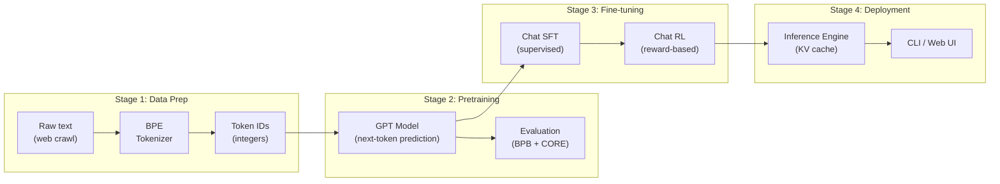
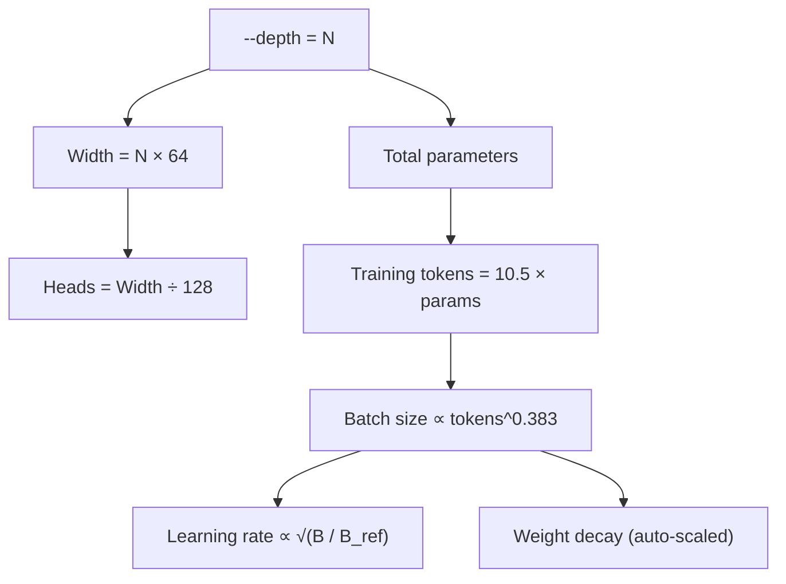
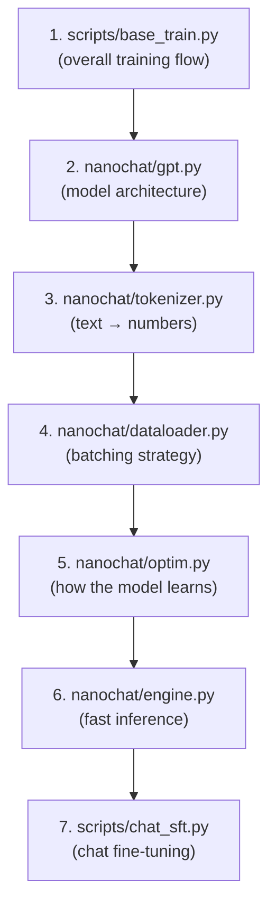

# Chapter 01 — The Big Picture

> **Learning objective:** After reading this chapter you will understand what nanochat is, what it does end-to-end, and how to navigate the entire codebase.

---

## What is nanochat?

nanochat is a complete, minimal, hackable codebase for training your own Large Language Model (LLM) from scratch — all the way from raw text to a ChatGPT-like web interface you can talk to. Designed by Andrej Karpathy, it is the simplest possible "experimental harness" for LLMs while still covering every major stage of the pipeline.

**The key insight:** the entire model is configured by a single number — `--depth`, the number of Transformer layers. Everything else (model width, learning rates, training duration, batch size, weight decay) is computed automatically from scaling laws. Want a tiny toy model? `--depth=4`. Want GPT-2 capability? `--depth=26`. That is it.

### What can you do with nanochat?

| Capability | What it means | Approximate cost (8×H100) |
|---|---|---|
| Train a tokenizer | Learn how to split text into subword tokens | Minutes |
| Pretrain a base model | Teach the model to predict next tokens on web text | ~3 hours for GPT-2 grade |
| Evaluate the model | Measure quality with BPB and CORE benchmarks | Minutes |
| Fine-tune for chat (SFT) | Teach the model to follow instructions and converse | ~15 minutes |
| Reinforce with RL | Improve math reasoning via policy gradient on GSM8K | ~10 minutes |
| Chat with your model | Talk to it via CLI or a web UI in your browser | Instant |

---

## The full pipeline

Here is the complete flow of how raw text becomes a chatbot you can talk to:

### Stage 1 — Data Preparation

The model cannot read English; it reads numbers. A **tokenizer** converts text like `"Hello world"` into a sequence of integer IDs like `[15496, 995]`. nanochat uses **Byte-Pair Encoding (BPE)**, the same algorithm family used by GPT-4. The tokenizer is trained once and reused everywhere.

### Stage 2 — Pretraining

This is the expensive part. The model sees billions of tokens from web text and learns to predict what comes next. Given `"The cat sat on the"`, it should learn that `"mat"` is more likely than `"quantum"`. This is **autoregressive language modeling**.

### Stage 3 — Fine-tuning

A pretrained model can complete text, but it does not know how to have a conversation. Fine-tuning teaches it:

- **SFT (Supervised Fine-Tuning):** show it examples of good conversations. The model learns to follow instructions.
- **RL (Reinforcement Learning):** let the model try answering math problems. Reward correct answers, penalize wrong ones. The model improves its reasoning.

### Stage 4 — Deployment

The **inference engine** makes generation fast by caching previous computations (the KV cache). You can talk to your model through a CLI or a web UI that looks like ChatGPT.

---

## The "one dial" philosophy

Most LLM codebases have dozens of hyperparameters you need to tune. nanochat has one: **depth**.

The depth-to-configuration mapping follows empirically-derived scaling laws. The total number of tokens the model trains on is proportional to its parameter count, and the optimal batch size follows a power-law relationship discovered in the Power Lines paper:

$$
B_{\text{opt}} = B_{\text{ref}} \times \left(\frac{D}{D_{\text{ref}}}\right)^{0.383}
$$

where $B_{\text{ref}} = 524{,}288$ tokens at depth $D_{\text{ref}} = 12$.

| Depth | Width | Heads | Approx. params | Approx. training tokens |
|-------|-------|-------|-----------------|------------------------|
| 4 | 256 | 2 | ~3M | ~30M |
| 12 | 768 | 6 | ~85M | ~900M |
| 20 | 1280 | 10 | ~280M | ~3B |
| 26 | 1664 | 13 | ~550M | ~6B |

---

## Repository map

### Entry-point scripts (`scripts/`)

These are the commands you run. Each orchestrates one stage of the pipeline:

| Script | Purpose | Example |
|--------|---------|---------|
| `scripts/base_train.py` | Pretrain the base model | `python -m scripts.base_train --depth=12` |
| `scripts/base_eval.py` | Evaluate base model (BPB, CORE) | `python -m scripts.base_eval --eval bpb` |
| `scripts/chat_sft.py` | Supervised fine-tuning for chat | `python -m scripts.chat_sft` |
| `scripts/chat_rl.py` | Reinforcement learning (GSM8K math) | `python -m scripts.chat_rl` |
| `scripts/chat_eval.py` | Evaluate chat model on tasks | `python -m scripts.chat_eval` |
| `scripts/chat_cli.py` | Talk to your model in the terminal | `python -m scripts.chat_cli` |
| `scripts/chat_web.py` | Launch the ChatGPT-like web UI | `python -m scripts.chat_web` |
| `scripts/tok_train.py` | Train a BPE tokenizer | `python -m scripts.tok_train` |
| `scripts/tok_eval.py` | Evaluate tokenizer compression | `python -m scripts.tok_eval` |

### Core modules (`nanochat/`)

| Module | Lines | What it does |
|--------|-------|-------------|
| `gpt.py` | ~455 | The GPT model: embeddings, attention, MLP, forward pass |
| `optim.py` | ~534 | MuonAdamW optimizer (Muon for matrices, AdamW for vectors) |
| `dataloader.py` | ~166 | BOS-aligned best-fit document packing |
| `dataset.py` | ~100 | Download and manage parquet data shards |
| `tokenizer.py` | ~407 | BPE tokenizer (RustBPE + tiktoken) |
| `engine.py` | ~357 | Fast inference with KV cache and tool-use state machine |
| `common.py` | ~259 | DDP init, logging, file downloads |
| `flash_attention.py` | ~100 | Flash Attention 3 wrapper with SDPA fallback |
| `checkpoint_manager.py` | — | Save/load model checkpoints |
| `core_eval.py` | ~263 | DCLM CORE benchmark evaluation |
| `loss_eval.py` | — | BPB (bits per byte) evaluation |

### Task definitions (`tasks/`)

| Task | Purpose |
|------|---------|
| `gsm8k.py` | Grade-school math word problems (SFT + RL) |
| `mmlu.py` | Multiple-choice knowledge questions |
| `smoltalk.py` | General conversation data |
| `spellingbee.py` | Spelling tasks and letter counting |
| `humaneval.py` | Code generation evaluation |
| `arc.py` | ARC reasoning benchmark |
| `customjson.py` | Load your own JSON conversation data |

---

## How to read this repo

If you are new, follow this path through the code. Each step builds on the previous one:

> The total codebase is only ~3,500 lines of Python across all files. That is tiny for a complete LLM training framework. You can read it all in an afternoon.

---

## The math: what is the model actually learning?

At its core, the model does one thing: **predict the next token**. Given a sequence of tokens $x_1, x_2, \ldots, x_T$, the training objective is to maximize the probability of each token given all previous ones. Written as a loss to minimize:

$$
\mathcal{L} = -\frac{1}{T-1} \sum_{t=1}^{T-1} \log p_\theta(x_{t+1} \mid x_1, \ldots, x_t)
$$

Think of it as a fill-in-the-blank game where every position is simultaneously a different question:

| Context | Model predicts | Correct answer |
|---------|----------------|----------------|
| `The cat sat on the` | `mat` (95%) | `mat` ✓ |
| `Once upon a` | `time` (99%) | `time` ✓ |
| `import torch.nn as` | `nn` (98%) | `nn` ✓ |

Every token at every position is a training example. A single batch of 32 sequences of length 2048 gives the model $32 \times 2047 = 65{,}504$ prediction problems in a single forward pass.

---

## What you will learn in this book

| Chapter | Topic | You will understand… |
|---------|-------|---------------------|
| 02 | Transformer Basics | Self-attention, residual connections, the GPT block |
| 03 | The GPT Model | The actual `nanochat/gpt.py` code, RoPE, GQA, value embeddings |
| 04 | Tokenizer | BPE algorithm, special tokens, conversation rendering |
| 05 | Data Pipeline | Parquet shards, best-fit packing, batching |
| 06 | Training Loop | `base_train.py`, scaling laws, scheduling |
| 07 | Optimizer | MuonAdamW, why two optimizers, the Polar Express |
| 08 | Inference Engine | KV cache, sampling, tool use |
| 09 | Evaluation | BPB, CORE benchmark, measuring quality |
| 10 | Chat SFT & RL | Fine-tuning for conversation, REINFORCE on math |
| 11 | Running & Modifying | Practical commands, where to edit, safety tips |
| 12 | End-to-End Walkthrough | Follow one token through the entire system |

---

Exercise: Clone the nanochat repository, run `find . -name '*.py' | xargs wc -l` (or the PowerShell equivalent `Get-ChildItem -Recurse -Filter *.py | ForEach-Object { (Get-Content $_.FullName | Measure-Object -Line).Lines } | Measure-Object -Sum`) and verify the codebase is roughly 3,500 lines. Then open `nanochat/gpt.py` and `scripts/base_train.py` side by side — identify where the model is created and where the training loop begins.
