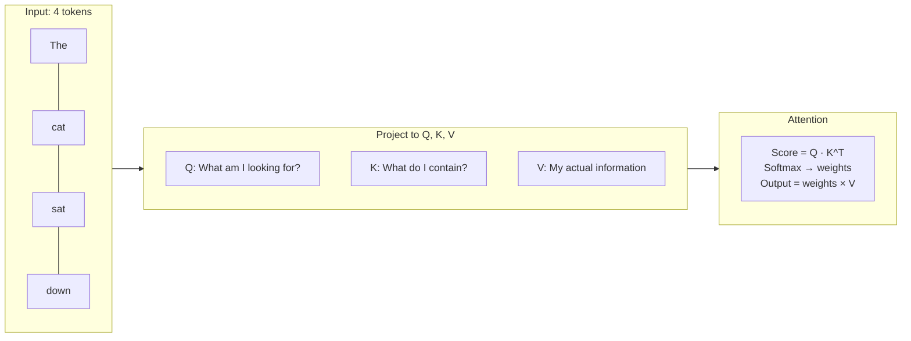
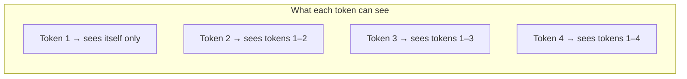
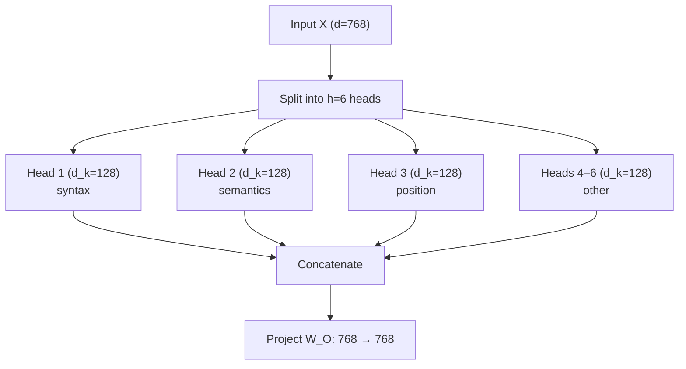
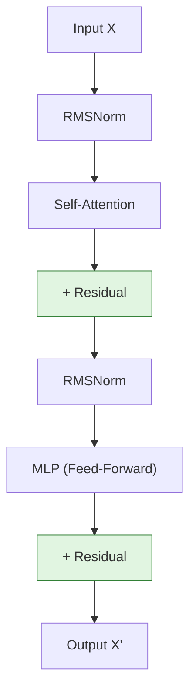
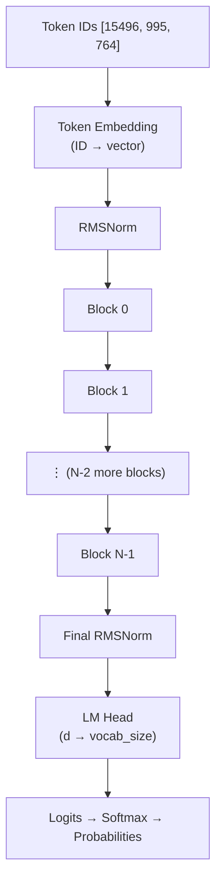

# Chapter 02 — Transformer and GPT Basics

> **Learning objective:** Build a solid mental model of self-attention, the Transformer block, and how GPT stacks them — even if you have never seen a Transformer before.

---

## What problem does a Transformer solve?

Imagine reading the sentence: *"The animal didn't cross the street because **it** was too tired."*

What does "it" refer to? The animal, obviously. But how would a computer figure that out? It needs a mechanism to look at *every other word* in the sentence and decide which ones are relevant to understanding "it". That mechanism is **self-attention**.

Before Transformers (introduced in the 2017 paper "Attention Is All You Need"), models processed text one word at a time (RNNs/LSTMs). This was slow and the model would "forget" earlier words. The Transformer processes all words simultaneously and lets each word "attend to" every other word in parallel.

---

## Self-Attention: the core idea

### The intuition

Think of self-attention like a room full of people at a party. Each person (token) wants to gather information from everyone else, using three roles:

1. **Query (Q):** "What am I looking for?" — each token describes what information it needs
2. **Key (K):** "What do I have to offer?" — each token advertises what it contains
3. **Value (V):** "Here's my actual content" — the real information to share



### The math

Given an input matrix $X \in \mathbb{R}^{T \times d}$ (each row is a token's embedding):

**Step 1 — Project** into Queries, Keys, Values using learned weight matrices:

$$
Q = XW_Q, \quad K = XW_K, \quad V = XW_V
$$

where $W_Q, W_K, W_V \in \mathbb{R}^{d \times d_k}$.

**Step 2 — Score.** How much should token $i$ attend to token $j$?

$$
\text{scores} = \frac{QK^T}{\sqrt{d_k}}
$$

The $\sqrt{d_k}$ scaling is crucial. Without it, dot products grow with dimension, pushing softmax into regions with near-zero gradients. This is called **scaled dot-product attention**.

**Step 3 — Attend and gather:**

$$
\text{Attention}(Q, K, V) = \text{softmax}\!\left(\frac{QK^T}{\sqrt{d_k}} + M\right) V
$$

where $M$ is a **causal mask** (explained below).

### A concrete example

After computing $QK^T / \sqrt{d_k}$ and applying softmax, each row gives the attention weights for one token:

|  | The | cat | sat | down |
|---|---|---|---|---|
| **The** | 0.9 | 0.05 | 0.03 | 0.02 |
| **cat** | 0.3 | 0.5 | 0.1 | 0.1 |
| **sat** | 0.1 | 0.6 | 0.2 | 0.1 |
| **down** | 0.05 | 0.15 | 0.3 | 0.5 |

Each row sums to 1. "sat" pays the most attention to "cat" (0.6), which makes intuitive sense — "cat" is the subject of "sat".

---

## The causal mask: no looking ahead

In a language model, when predicting the next word, the model must only see *previous* words. Looking ahead would be cheating. The causal mask $M$ enforces this by setting future positions to $-\infty$ (which softmax maps to zero):

$$
M = \begin{pmatrix}
0 & -\infty & -\infty & -\infty \\
0 & 0 & -\infty & -\infty \\
0 & 0 & 0 & -\infty \\
0 & 0 & 0 & 0
\end{pmatrix}
$$



This lower-triangular pattern is why GPT is called a **decoder-only** model — it decodes one token at a time, left to right.

---

## Multi-Head Attention: looking at different things

A single attention head might focus on one kind of relationship (e.g., subject-verb agreement). But language has many simultaneous relationships. **Multi-head attention** runs several attention computations in parallel, each specializing in different patterns:



If the model dimension is $d = 768$ and we use $h = 6$ heads, each head works with vectors of size $d_k = d/h = 128$.

Each head independently computes attention and the results are concatenated and projected:

$$
\text{MultiHead}(X) = \text{Concat}(\text{head}_1, \ldots, \text{head}_h) \cdot W_O
$$

Research has shown that different heads learn to specialize — some track syntax, others track coreference, others track positional information.

---

## The Transformer Block (GPT style)

A single Transformer block combines attention with a feedforward network (MLP), using **residual connections** and **normalization** for stability:



In nanochat's code (`nanochat/gpt.py`), each block is remarkably simple:

```python
class Block(nn.Module):
    def forward(self, x, ve, cos_sin, window_size, kv_cache):
        x = x + self.attn(norm(x), ve, cos_sin, window_size, kv_cache)
        x = x + self.mlp(norm(x))
        return x
```

### Why residual connections?

Without residuals, signals must pass through every layer's transformations — information gets lost and gradients vanish. Residual connections provide a **highway**: instead of $x' = f(x)$, we compute $x' = x + f(x)$. If a layer has nothing useful to add, it can learn $f(x) \approx 0$ and just pass the input through.

### Why RMSNorm?

Normalization prevents values from exploding or vanishing across layers. **RMSNorm** (Root Mean Square Normalization) is simpler and faster than LayerNorm:

$$
\text{RMSNorm}(x) = \frac{x}{\sqrt{\frac{1}{d}\sum_{i=1}^{d} x_i^2}}
$$

nanochat uses a parameter-free version — no learned scale or bias — saving memory and parameters:

```python
def norm(x):
    return F.rms_norm(x, (x.size(-1),))
```

### What does the MLP do?

The MLP is a two-layer feedforward network that processes each token independently. If attention is "gather information from other tokens", the MLP is "process what I gathered":

```python
class MLP(nn.Module):
    def forward(self, x):
        x = self.c_fc(x)        # expand: d → 4d
        x = F.relu(x).square()  # activation: ReLU²
        x = self.c_proj(x)      # compress: 4d → d
        return x
```

The 4× expansion gives the MLP more "room to think". The activation $\text{ReLU}^2(x) = \max(0, x)^2$ adds non-linearity while producing sparse activations (many zeros), which is both computationally efficient and helps the network learn sharper features.

---

## Stacking blocks: the full GPT model

A GPT model is many Transformer blocks stacked, with an embedding at the start and a classifier at the end:



The number of blocks ($N$) is the **depth** — the single dial that controls the entire model in nanochat.

---

## Decoder-only vs other architectures

| Architecture | Examples | Encoder? | Decoder? | Use case |
|---|---|---|---|---|
| **Encoder-only** | BERT | ✓ | ✗ | Classification, NER |
| **Encoder-Decoder** | T5, original Transformer | ✓ | ✓ | Translation |
| **Decoder-only** | GPT, nanochat | ✗ | ✓ | Text generation, chat |

GPT and nanochat use **decoder-only**: just the causal self-attention stack. This simplicity is one reason the architecture has won — a single decoder stack trained on enough data can learn to do everything.

---

## nanochat vs classic GPT-2

nanochat's Transformer includes several modern improvements:

| Feature | GPT-2 | nanochat | Benefit |
|---------|--------|----------|---------|
| Position encoding | Learned absolute | **Rotary (RoPE)** | Better length generalization |
| Normalization | LayerNorm | **RMSNorm, no params** | Simpler, faster |
| Attention | Multi-head | **Grouped-Query (GQA)** | Faster inference |
| Activation | GELU | **ReLU²** | Sparse, efficient |
| Attention kernel | Standard matmul | **Flash Attention 3** | 2–4× faster |
| Context | Fixed 1024 | **Sliding window (SSSL)** | Local + global mix |

Each of these is explored in detail in Chapter 03.

---

## Key vocabulary

| Term | Plain English |
|------|--------------|
| **Token** | A piece of text (word, subword, or character) represented as an integer |
| **Embedding** | Converting a token ID into a dense vector the model can work with |
| **Self-Attention** | A mechanism where each token looks at all others to gather context |
| **Causal Mask** | Prevents tokens from seeing future tokens |
| **Residual Connection** | A shortcut that adds the input directly to a layer's output |
| **MLP** | A feedforward network that processes each token independently |
| **Head** | One of several parallel attention computations |

---

Exercise: Open `nanochat/gpt.py` and locate the `Block` class. Identify the two sub-layers (attention and MLP) and the two residual additions. Then look at the `CausalSelfAttention` class — find where Q, K, and V are computed, where the dot product happens, and where the output projection is applied. Draw a diagram on paper showing the data flow.
