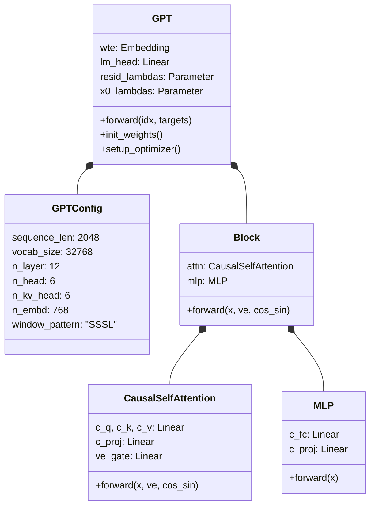
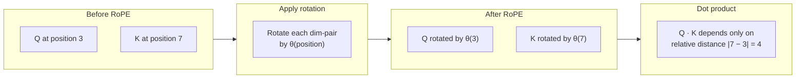
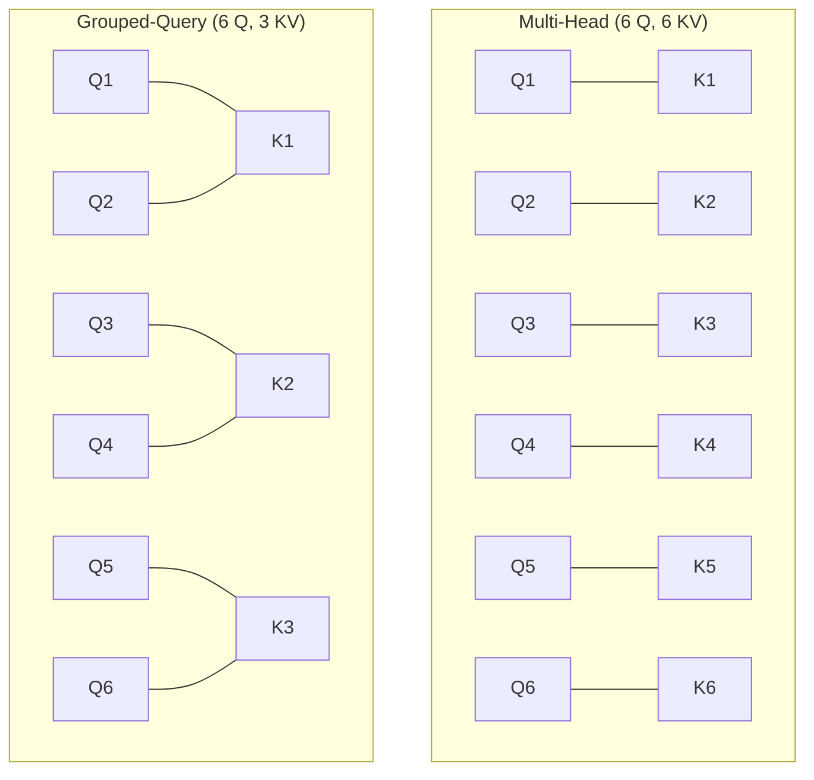
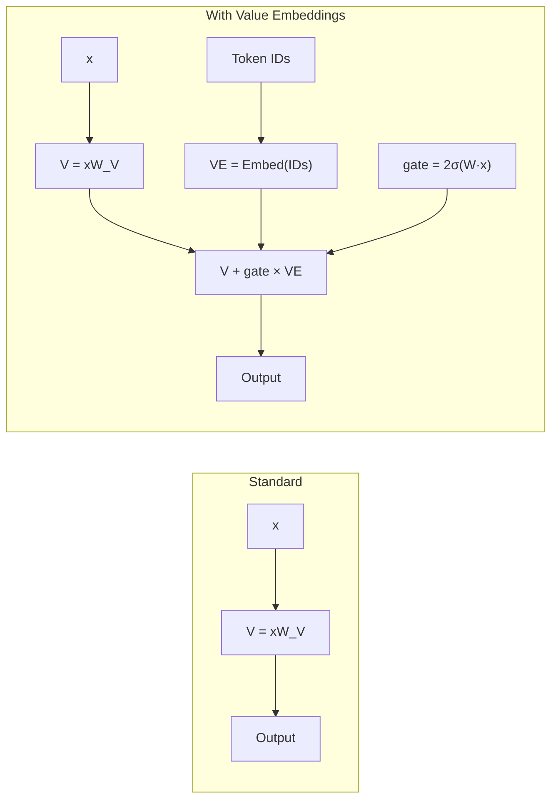
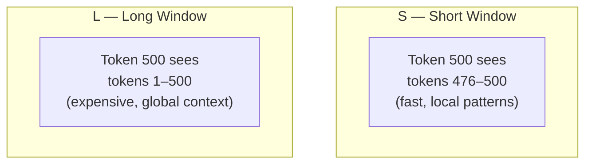
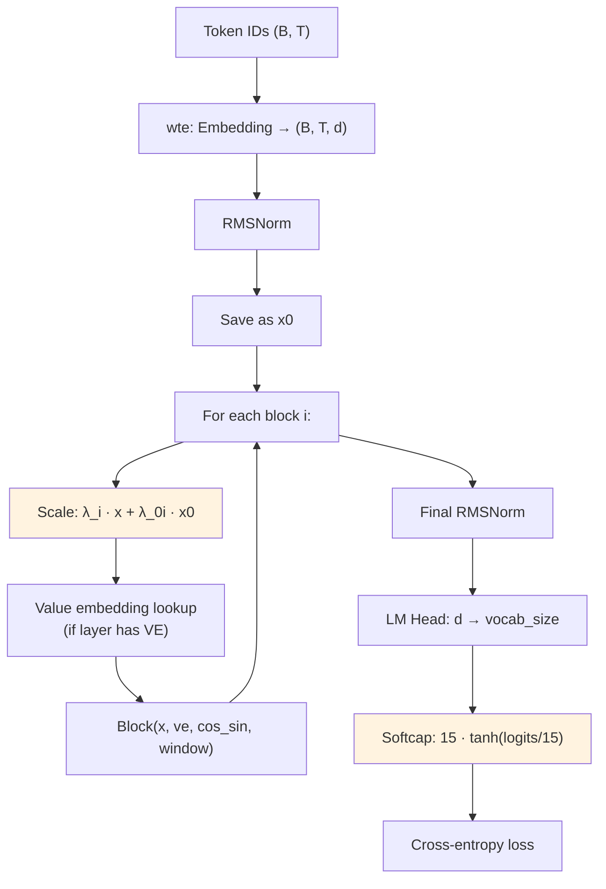
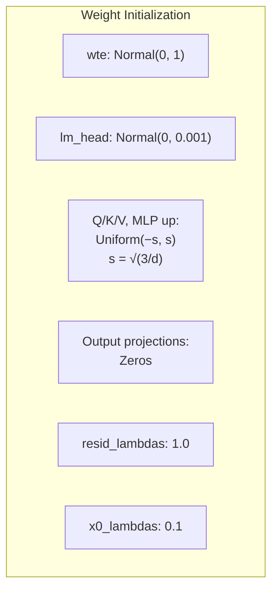

# Chapter 03 — The GPT Model in nanochat

> **Learning objective:** Read `nanochat/gpt.py` and understand every architectural choice — Rotary Positional Embeddings, Grouped-Query Attention, value embeddings, sliding windows, softcapping, and the complete forward pass.

---

## Overview of gpt.py

The entire model lives in **one file, ~455 lines**, built from four classes:



---

## GPTConfig: the model's DNA

```python
@dataclass
class GPTConfig:
    sequence_len: int = 2048
    vocab_size: int = 32768
    n_layer: int = 12
    n_head: int = 6
    n_kv_head: int = 6
    n_embd: int = 768
    window_pattern: str = "SSSL"
```

Everything is derived from these seven values:
- **Width** $d = $ `n_embd` $= $ `depth × 64` (by default)
- **Head dimension** $d_k = $ `n_embd / n_head` $= 128$ (fixed)
- **Window sizes** tiled from `window_pattern` across layers, with the last layer always using full context

---

## Rotary Positional Embeddings (RoPE)

### The problem

Self-attention is permutation-equivariant — it treats tokens as an unordered set. `"The cat sat"` and `"sat cat The"` would produce identical attention scores. We need to inject position information.

### Classic approach (GPT-2)

GPT-2 learned a separate embedding for each absolute position. This fails for sequences longer than training length and captures absolute rather than relative distance.

### Rotary embeddings (nanochat)

RoPE **rotates** the query and key vectors by an angle that depends on position. Two tokens at the same relative distance always have the same rotation angle between them:

$$
\begin{aligned}
\tilde{q}_1 &= q_1 \cos\theta - q_2 \sin\theta \\
\tilde{q}_2 &= q_1 \sin\theta + q_2 \cos\theta
\end{aligned}
$$

where the rotation frequency depends on both position $t$ and dimension index $i$:

$$
\theta_{t,i} = t \cdot \frac{1}{10000^{2i/d_k}}
$$



Lower-frequency rotations encode coarse position; higher-frequency rotations encode fine position — like clock hands at different speeds encoding the time.

In code:

```python
def apply_rotary_emb(x, cos, sin):
    d = x.shape[3] // 2
    x1, x2 = x[..., :d], x[..., d:]
    y1 = x1 * cos + x2 * sin
    y2 = x1 * (-sin) + x2 * cos
    return torch.cat([y1, y2], 3)
```

---

## QK Norm

After computing Q and K and applying RoPE, nanochat normalizes them:

```python
q, k = norm(q), norm(k)
```

This prevents the dot product $QK^T$ from growing too large, stabilizing training by keeping attention score magnitudes bounded.

---

## Grouped-Query Attention (GQA)

### The memory problem

During inference, all previous Keys and Values are stored in a **KV cache**. With standard multi-head attention, cache memory grows as:

$$
\text{KV cache} = 2 \times L \times B \times T \times h \times d_k \times \text{bytes}
$$

where $L$ is the number of layers, $h$ the number of heads, and $T$ the sequence length.

### The GQA solution

GQA uses fewer key/value heads than query heads. Multiple query heads **share** the same KV pair:



In nanochat, `n_head` is the number of query heads and `n_kv_head` is the number of KV heads:

```python
self.c_q = nn.Linear(n_embd, n_head * head_dim, bias=False)
self.c_k = nn.Linear(n_embd, n_kv_head * head_dim, bias=False)
self.c_v = nn.Linear(n_embd, n_kv_head * head_dim, bias=False)
```

> No bias is used in any linear layer throughout the model — a deliberate simplification.

---

## Value Embeddings (ResFormer style)

On alternating layers, the model looks up token IDs again in a separate **value embedding table** and mixes that signal into the attention values:

```python
def has_ve(layer_idx, n_layer):
    return layer_idx % 2 == (n_layer - 1) % 2
```

The mixing uses a learned, input-dependent gate:

```python
gate = 2 * torch.sigmoid(self.ve_gate(x[..., :32]))  # range (0, 2)
v = v + gate.unsqueeze(-1) * ve
```



**Why this helps:**
- **Identity preservation:** deep networks can "forget" what token they started with
- **Gradient flow:** provides another pathway for gradients to reach early layers
- **At initialization:** gate weights are zero → $\sigma(0) = 0.5$ → scale $2 \times 0.5 = 1.0$ (neutral start)

---

## Sliding Window Attention

Not every layer needs full-context attention. nanochat uses a **window pattern** that alternates between local and global attention:

```python
window_pattern: str = "SSSL"
# S = short context (half of sequence_len)
# L = long context (full sequence_len)
```

For a 12-layer model with pattern `"SSSL"`:

| Layer | 0 | 1 | 2 | 3 | 4 | 5 | 6 | 7 | 8 | 9 | 10 | 11 |
|-------|---|---|---|---|---|---|---|---|---|---|----|----|
| Window | S | S | S | L | S | S | S | L | S | S | S | **L** |

The last layer always gets **L** (full context).



**Why this works:** most language is local — the next word usually depends on the last few words. Only occasionally do we need to look far back. Short windows let Flash Attention run faster, while periodic long-window layers capture distant dependencies.

---

## The Full Forward Pass



### Layer-by-layer scaling

Two learned scalar arrays — one value per layer — control residual stream blending:

```python
x = self.resid_lambdas[i] * x + self.x0_lambdas[i] * x0
```

- `resid_lambdas[i]` → initialized to 1.0 (the normal residual)
- `x0_lambdas[i]` → initialized to 0.1 (a small skip from the initial embedding)

This creates a **highway** from the initial embedding to every layer, ensuring early layers receive strong gradients even in deep networks.

### Logit softcapping

$$
\hat{z} = 15 \cdot \tanh\!\left(\frac{z}{15}\right)
$$

This constrains logits to $[-15, 15]$, preventing the model from becoming overconfident. Values near zero pass through unchanged; extreme values are smoothly squashed.

---

## Weight Initialization

How weights start matters for stability:



- **Output projections start at zero:** each block initially does nothing (outputs zero), so the fresh model is effectively `embedding → lm_head`. Layers gradually learn to contribute.
- **lm_head has tiny std (0.001):** the classifier starts nearly flat — uniform predictions, low confidence.

---

## Vocab Padding

A subtle GPU optimization:

```python
padded_vocab_size = ((vocab_size + 64 - 1) // 64) * 64
```

The vocabulary is rounded up to a multiple of 64 for tensor-core alignment. The forward pass crops back: `logits = logits[..., :self.config.vocab_size]`.

---

## Summary of design choices

| Innovation | Why |
|-----------|-----|
| RoPE | Relative position → better length generalization |
| GQA | Fewer KV heads → less memory at inference |
| Value Embeddings | Extra gradient pathway → deeper nets train better |
| Sliding Windows (SSSL) | Local layers are cheaper → faster training |
| Softcap | Bounded logits → stable training |
| x0 skip connection | Highway to initial embed → strong gradients |
| ReLU² | Sparse activations → efficient and sharp features |

---

Exercise: For a model with `depth=12`, `n_embd=768`, and `n_head=6`:
1. What are the shapes of Q, K, and V after projection (before reshaping into heads)?
2. How many parameters does a single `Block` have? (Hint: count the four Linear layers — `c_q`, `c_k`, `c_v`, `c_proj`, `c_fc`, `c_proj` for MLP — and note there are no biases.)
3. Which layers get value embeddings in this 12-layer model?
4. Which layers get full context vs. half context with pattern `"SSSL"`?
