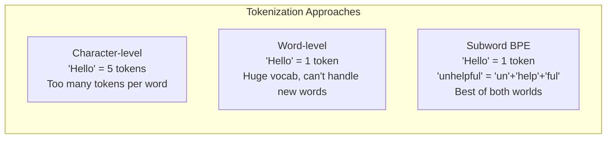
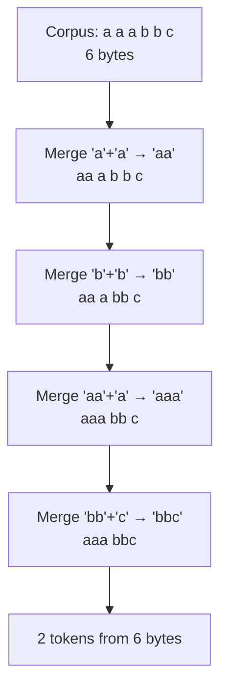
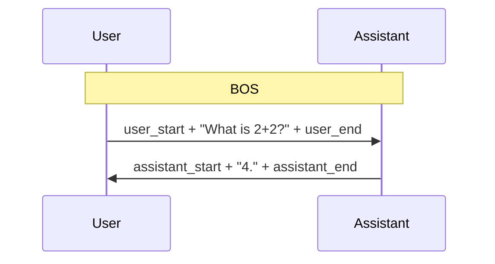
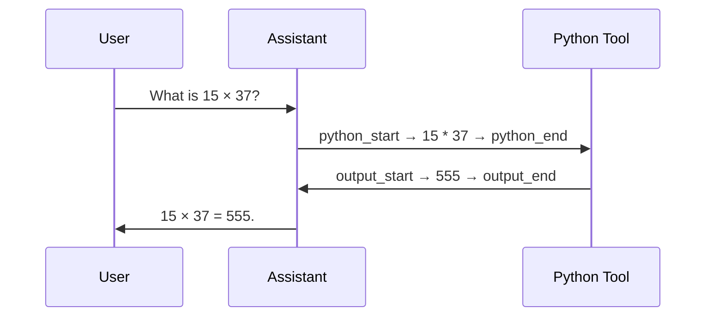
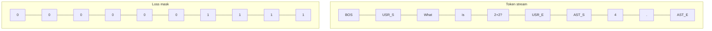

# Chapter 04 — Tokenizer and Conversation Rendering

> **Learning objective:** Understand how raw text is converted to integers the model can process, how BPE works, how special tokens structure conversations, and how loss masking ensures the model learns only to respond.

---

## Why do we need a tokenizer?

Neural networks work with numbers, not text. We need a mapping from strings to integers that balances vocabulary size against sequence length:



The sweet spot is **subword tokenization**: common words stay whole, rare words get split into reusable parts. The algorithm used by GPT-2, GPT-4, and nanochat is **Byte-Pair Encoding (BPE)**.

---

## BPE: how it works

### Training the tokenizer

Starting from individual bytes (256 base tokens), BPE iteratively discovers frequent pairs and merges them:

1. Start with all bytes as tokens
2. Count all adjacent pairs across the training corpus
3. Merge the most frequent pair into a new token
4. Repeat until the desired vocabulary size is reached



### Real-world tokenization

Common words get single tokens; rare words split into common subparts:

| Input | Tokens | Token count |
|-------|--------|-------------|
| `"The quick brown fox"` | `"The"`, `" quick"`, `" brown"`, `" fox"` | 4 |
| `"defenestration"` | `"def"`, `"en"`, `"est"`, `"ration"` | 4 |
| `"aaaaaaa"` | `"aaaaaaa"` | 1 (if frequent enough) |

Note that **spaces are part of the tokens** — `" quick"` includes the leading space.

---

## nanochat tokenizer details

### The split pattern

Before BPE merges, text is split by a regex into groups. This prevents merges across category boundaries:

```python
SPLIT_PATTERN = r"""'(?i:[sdmt]|ll|ve|re)|[^\r\n\p{L}\p{N}]?+\p{L}+|\p{N}{1,2}| ?[^\s\p{L}\p{N}]++[\r\n]*|\s*[\r\n]|\s+(?!\S)|\s+"""
```

The pattern separates contractions (`'s`, `'ll`), words, number groups (1–2 digits — nanochat uses `{1,2}` instead of GPT-4's `{1,3}` to save vocab space), punctuation, and whitespace.

### Vocabulary size

nanochat uses **32,768 tokens** (32K). Smaller than GPT-4's ~100K but appropriate for smaller models — larger vocabularies cost more embedding parameters.

### Two backend implementations

| Backend | Training | Inference | Speed |
|---------|----------|-----------|-------|
| HuggingFace Tokenizer | ✓ | ✓ | Medium |
| RustBPE + tiktoken | ✓ | ✓ | Fast |

The default `get_tokenizer()` function returns the RustBPE/tiktoken implementation.

---

## Special tokens

Beyond regular text tokens, nanochat defines **9 special tokens** for conversation structure:

```python
SPECIAL_TOKENS = [
    "<|bos|>",
    "<|user_start|>",    "<|user_end|>",
    "<|assistant_start|>", "<|assistant_end|>",
    "<|python_start|>",  "<|python_end|>",
    "<|output_start|>",  "<|output_end|>",
]
```

These are reserved IDs that BPE never produces on regular text. The model learns to use them as structural delimiters.

---

## Conversation rendering

When fine-tuning for chat, conversations are flattened into a token stream with special markers:

```
<|bos|><|user_start|>What is 2+2?<|user_end|><|assistant_start|>4.<|assistant_end|>
```



### Multi-turn with tool use

When the assistant needs to compute something:

```
<|bos|><|user_start|>What is 15 * 37?<|user_end|><|assistant_start|>
Let me calculate.<|python_start|>15 * 37<|python_end|><|output_start|>555<|output_end|>
15 × 37 = 555.<|assistant_end|>
```



---

## Loss masking: train only on assistant tokens

A critical detail: during SFT, we only compute the loss on tokens the assistant should produce. User messages and tool outputs are masked out:



In the `render_conversation()` function, masked positions are assigned `target = -1`. PyTorch's `cross_entropy` with `ignore_index=-1` skips them:

```python
loss = F.cross_entropy(logits.view(-1, V), targets.view(-1), ignore_index=-1)
```

This is crucial because:
- We do not want the model to learn to generate user prompts
- We do not want the model to memorize tool outputs
- We only want the model to learn how to **respond**

---

## The BPE compression ratio

A good tokenizer compresses more text per token. nanochat achieves roughly **3.5–4 bytes per token** on English text, meaning:

$$
\text{effective context} \approx T \times \frac{\text{bytes}}{\text{token}} \approx 2048 \times 3.75 \approx 7{,}680 \text{ characters}
$$

That is about 1,400 words of English in a single 2048-token context window.

You can measure tokenizer quality with:

```bash
python -m scripts.tok_eval
```

---

## Key file

- `nanochat/tokenizer.py` — the full tokenizer implementation (~407 lines)

---

Exercise: Run the tokenizer on a few sentences of your choice. In a Python REPL, use `from nanochat.tokenizer import get_tokenizer; tok = get_tokenizer()` and then `tok.encode("your text here")` to see the token IDs. Try a common English sentence, then a rare technical term — observe how the rare term gets split into more tokens. Compute the bytes-per-token ratio for each.
