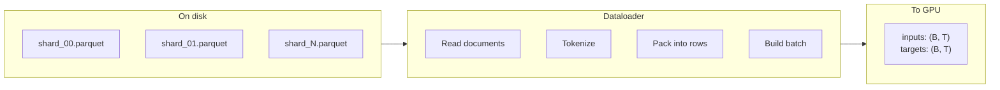
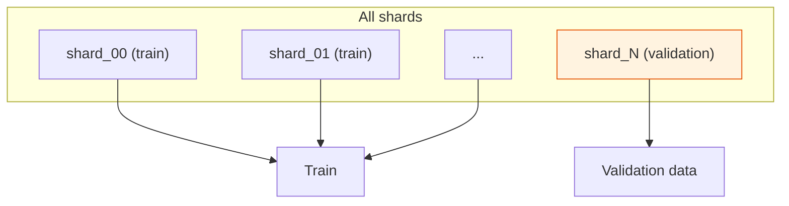
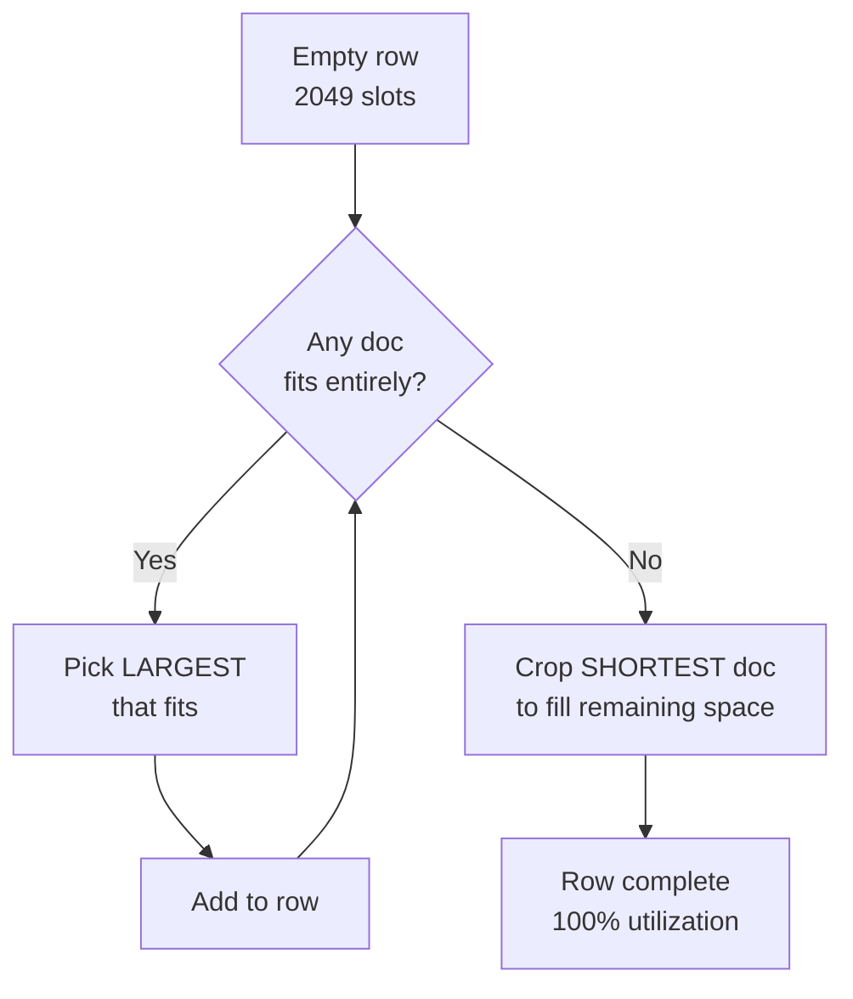
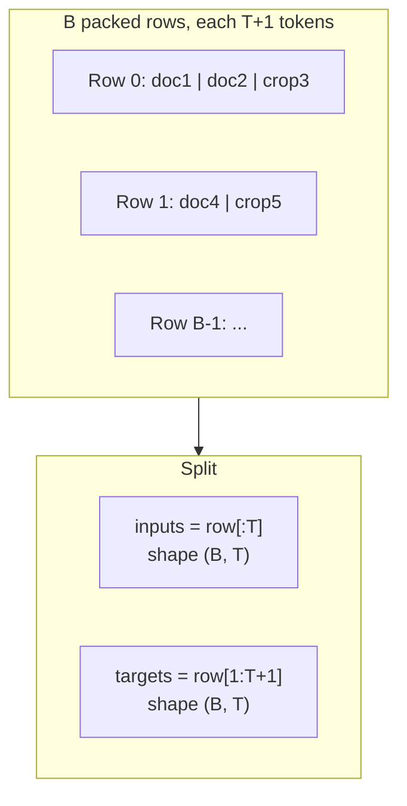

# Chapter 05 — Dataset and Dataloader

> **Learning objective:** Understand how raw text flows from parquet files on disk into fixed-size training batches, including the BOS-aligned best-fit packing strategy that achieves 100% token utilization with no padding.

---

## The big picture

The dataloader turns a stream of variable-length documents into fixed-size rectangular tensors for the GPU:



---

## Dataset: parquet shards

Training data lives in **parquet files** — a columnar format optimized for large datasets. Each file has a `'text'` column with one document per row.

Key details from `nanochat/dataset.py`:
- Data is downloaded on demand (lazy loading)
- The **last shard** is the validation set; all others are training data
- Each shard is subdivided into **row groups** for efficient streaming



### Distributed data loading

With multiple GPUs (DDP), each GPU reads different row groups. GPU with rank $r$ reads row groups $r, r+W, r+2W, \ldots$ where $W$ is the world size. No two GPUs see the same data.

---

## The packing problem

Documents have wildly varying lengths (50 to 50,000 tokens), but the model expects fixed-length rows of exactly $T + 1$ tokens. Three strategies:

| Strategy | Utilization | Quality |
|----------|-------------|---------|
| Truncate to $T$ | ~60% (padding waste) | Poor — lots of idle tokens |
| Concatenate and split | ~100% | OK — but rows start mid-sentence |
| **BOS-aligned best-fit** | **~100%** | **Good — every row starts clean** |

nanochat uses the third approach.

---

## BOS-aligned best-fit packing

Every row starts with a BOS token. Documents are packed tightly using a greedy algorithm:

### The algorithm

For each row (capacity $= T + 1 = 2049$ tokens):

1. Search the buffer for the **largest document that fits entirely**
2. Add it to the row
3. Repeat until nothing fits
4. **Crop the shortest buffered document** to fill the remaining space exactly



### Example

With row capacity = 20 tokens and three buffered documents:

| Doc | Length |
|-----|--------|
| A | 12 tokens |
| B | 6 tokens |
| C | 8 tokens |

**Row building:**
1. Capacity 20. Largest fit: A (12). Add A. Remaining: 8.
2. Capacity 8. Largest fit: C (8). Add C. Remaining: 0.
3. Row = `[A₁…A₁₂][C₁…C₈]` — 100% full, zero padding.

Both A and C begin with BOS, so the model sees clean document boundaries within the row.

### The cost: ~35% cropping

When nothing fits entirely, one document is cropped. About 35% of total tokens are discarded this way at $T = 2048$. But this trade-off is worthwhile: every remaining token can attend back to a proper BOS, and zero space is wasted on padding tokens that teach the model nothing.

---

## From rows to batches

Once $B$ rows are packed, they become inputs and targets:



The inputs and targets are **offset by one** — position $t$ of inputs predicts position $t$ of targets. This is the autoregressive setup.

---

## Memory optimization

The dataloader is carefully optimized for GPU training:

```python
# 1. Build rows in a pre-allocated CPU buffer
row_buffer = torch.empty((B, T+1), dtype=torch.long)

# 2. Copy to pinned memory (fast transfer staging)
cpu_inputs.copy_(row_buffer[:, :-1])
cpu_targets.copy_(row_buffer[:, 1:])

# 3. Single async transfer to GPU
gpu_buffer.copy_(cpu_buffer, non_blocking=True)
```

**Pinned memory** is CPU memory that the GPU can read directly via DMA, without an intermediate copy. Combined with `non_blocking=True`, this overlaps data transfer with computation.

---

## Tokens per step

The total tokens processed per optimization step:

$$
\text{tokens/step} = B_{\text{device}} \times T \times W \times G
$$

where $B_{\text{device}}$ is per-GPU batch size, $T$ is sequence length, $W$ is world size (number of GPUs), and $G$ is gradient accumulation steps.

For a typical setup: $32 \times 2048 \times 8 \times 1 = 524{,}288$ tokens per step — about half a million tokens.

---

## Resumption

The dataloader tracks its position so training can resume after interruption:

```python
state_dict = {"pq_idx": pq_idx, "rg_idx": rg_idx, "epoch": epoch}
```

This saves which parquet file and row group were being read. On resume, the loader picks up from approximately where it left off.

---

## Key files

| File | What it does |
|------|-------------|
| `nanochat/dataset.py` | Lists and downloads parquet shard files (~100 lines) |
| `nanochat/dataloader.py` | BOS-aligned best-fit packing and batching (~166 lines) |

---

Exercise: Open `nanochat/dataloader.py` and find the packing loop. Trace through the logic for building one row: where does it search for the largest fitting document? Where does it crop the shortest? Then calculate: if your model uses `sequence_len=2048`, `device_batch_size=16`, and you have 4 GPUs with `grad_accum_steps=2`, how many tokens are processed per optimizer step?
