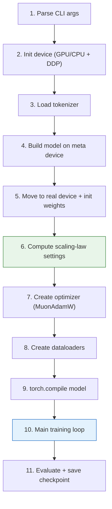
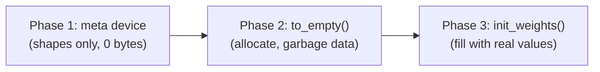
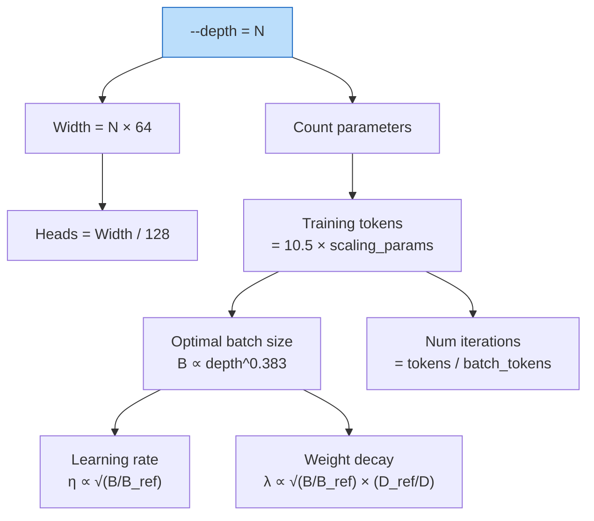
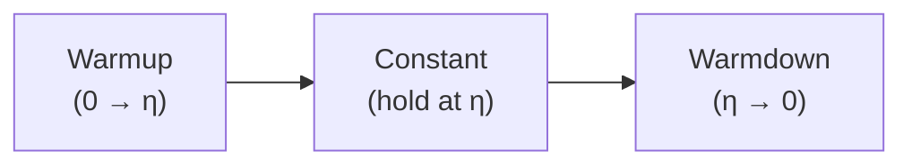
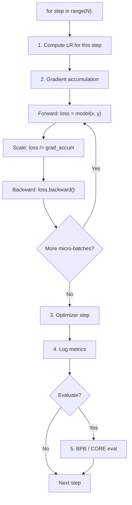

# Chapter 06 — The Base Training Loop

> **Learning objective:** Understand `scripts/base_train.py` — how the model, data, optimizer, and evaluation are orchestrated into a complete pretraining run, and how scaling laws automatically configure everything from a single `--depth` argument.

---

## What happens when you run base_train?



---

## Meta-device model building

Building a large model naively allocates memory twice (CPU then GPU). nanochat uses a three-phase pattern:



```python
with torch.device("meta"):
    model = GPT(config)       # shapes only, zero memory
model.to_empty(device=device) # allocate real storage
model.init_weights()          # fill with proper values
```

This lets us inspect the model, count parameters, and estimate FLOPs before committing any GPU memory.

---

## Scaling laws: the magic sauce

Given just `--depth=N`, the code computes the optimal training configuration. Everything is a chain of calculations:



### The formulas

**Training horizon** — how many tokens to train on:

$$
\text{target\_tokens} = 10.5 \times \text{scaling\_params}
$$

where `scaling_params` counts transformer matrices plus the LM head (excluding embeddings for a cleaner scaling fit). The ratio 10.5 is lower than Chinchilla's 20, tuned for smaller models.

**Optimal batch size** (from the Power Lines paper):

$$
B_{\text{opt}} = B_{\text{ref}} \times \left(\frac{D}{D_{\text{ref}}}\right)^{0.383}
$$

with $B_{\text{ref}} = 2^{19}$ tokens at $D_{\text{ref}} = 12$, rounded to the nearest power of 2.

**Learning rate** (sqrt scaling with batch size):

$$
\eta = \eta_{\text{base}} \times \sqrt{\frac{B}{B_{\text{ref}}}}
$$

Larger batches produce more accurate gradient estimates, allowing higher learning rates.

**Weight decay** (T-epoch framework):

$$
\lambda = \lambda_{\text{ref}} \times \sqrt{\frac{B}{B_{\text{ref}}}} \times \frac{D_{\text{ref}}}{D}
$$

This keeps the quantity $T_{\text{epoch}} = B / (\eta \cdot \lambda \cdot D)$ constant across model sizes, which empirically stabilizes training.

### Example configurations

| Depth | Params | Tokens | Batch Size | Iterations |
|-------|--------|--------|------------|------------|
| 4 | ~3M | ~30M | ~64K | ~470 |
| 12 | ~85M | ~700M | ~512K | ~1,400 |
| 20 | ~280M | ~2.5B | ~700K | ~3,600 |
| 26 | ~550M | ~5.5B | ~1M | ~5,500 |

---

## The learning rate schedule

nanochat uses a three-phase schedule:



Default settings: warmup = 0% (start at full LR), warmdown = 50% (last half of training ramps to zero). Muon momentum also warms from 0.85 to 0.95 over the first 300 steps.

Weight decay follows a separate schedule: it decays linearly from its scaled value to zero over training.

---

## The main loop



### Gradient accumulation

When the full batch does not fit in memory, it is split into micro-batches:

$$
G = \frac{B_{\text{total}}}{B_{\text{device}} \times T \times W}
$$

Each micro-batch does forward + backward, accumulating gradients. Only after all micro-batches does the optimizer step. Mathematically equivalent to the full batch.

### Mixed precision

The forward pass uses `torch.amp.autocast` with bfloat16 — 2× faster and 2× less memory than float32, with sufficient numerical range for stable training.

### torch.compile

```python
model = torch.compile(model, dynamic=False)
```

This traces the model's Python code into optimized GPU kernels. `dynamic=False` (fixed shapes) allows maximum optimization, typically yielding 15–30% speedup.

---

## Monitoring metrics

| Metric | What it means | Good values |
|--------|-------------|-------------|
| `train/loss` | Cross-entropy on current batch | Decreasing |
| `train/lr` | Current learning rate | Follows schedule |
| `train/tokens_per_sec` | Throughput | Higher = better |
| `train/mfu` | Model FLOPS Utilization | 30–60% typical |
| `val/bpb` | Validation bits per byte | Lower = better |
| `val/core` | CORE benchmark score | Higher = better |

**MFU** measures what fraction of the GPU's theoretical peak we actually achieve:

$$
\text{MFU} = \frac{\text{flops\_per\_token} \times \text{tokens\_per\_sec}}{\text{GPU peak BF16 FLOPS}}
$$

---

## FP8 training (H100+ only)

For Hopper GPUs, nanochat supports 8-bit training:

```bash
python -m scripts.base_train --fp8
```

FP8 roughly doubles throughput over BF16 by utilizing the GPU's FP8 tensor cores. Only large Linear layers (≥128 in each dimension, divisible by 16) are converted:

```python
def fp8_module_filter(mod, fqn):
    if not isinstance(mod, nn.Linear): return False
    if min(mod.in_features, mod.out_features) < 128: return False
    return True
```

---

## Checkpointing

Checkpoints are saved periodically and at the end of training:

```
~/.cache/nanochat/base_checkpoints/d12/
  model_final.pt        # model weights
  optimizer_final.pt    # optimizer state
  config.json           # model config + training args
```

Resume with `--resume-from-step=N`.

---

## Key files

| File | What it does |
|------|-------------|
| `scripts/base_train.py` | Main pretraining script (~601 lines) |
| `nanochat/gpt.py` | Model + optimizer group setup |
| `nanochat/common.py` | DDP initialization, logging |
| `nanochat/checkpoint_manager.py` | Save/load checkpoints |

---

Exercise: Run a tiny CPU training test: `python -m scripts.base_train --depth=4 --max-seq-len=512 --device-batch-size=1 --total-batch-size=512 --num-iterations=20 --core-metric-every=-1`. Watch the loss decrease over 20 steps. Then modify `--depth=8` and observe how the scaling laws automatically adjust batch size and training horizon.
