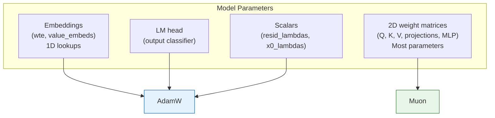
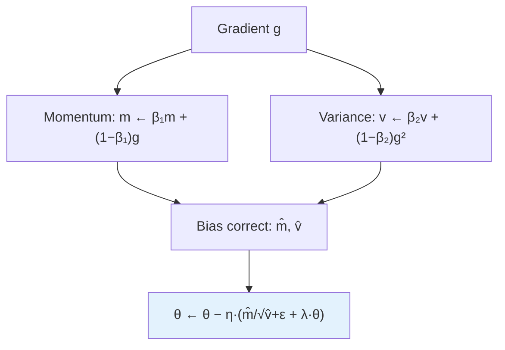
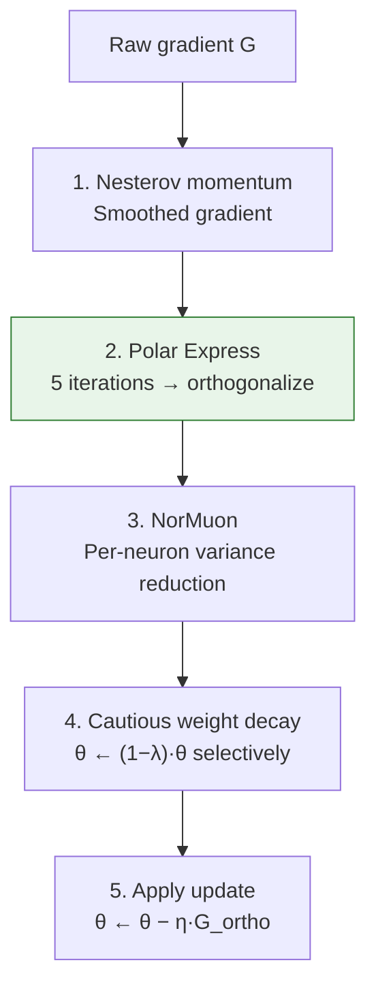
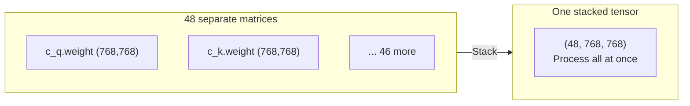
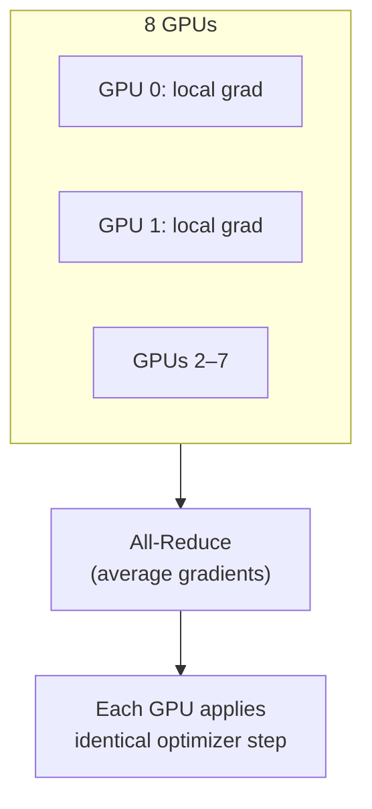

# Chapter 07 — The MuonAdamW Optimizer

> **Learning objective:** Understand why nanochat uses two different optimizers, how AdamW and Muon work, how the Polar Express orthogonalizes gradient updates, and how everything fuses into a single efficient step.

---

## Why two optimizers?

Different parameter shapes benefit from different optimization strategies:



| Optimizer | Used for | Why |
|-----------|----------|-----|
| **AdamW** | Embeddings, LM head, scalars | Safe, well-understood, works everywhere |
| **Muon** | Large 2D weight matrices | Faster convergence via orthogonalization |

---

## AdamW: the workhorse

AdamW maintains two running averages per parameter:
- **First moment** $m_t$: a smoothed gradient direction (momentum)
- **Second moment** $v_t$: a smoothed gradient magnitude (adaptive step size)

### The algorithm

Given gradient $g_t$ for parameter $\theta$:

$$
m_t = \beta_1 \cdot m_{t-1} + (1 - \beta_1) \cdot g_t
$$

$$
v_t = \beta_2 \cdot v_{t-1} + (1 - \beta_2) \cdot g_t^2
$$

With bias correction ($\hat{m}_t = m_t / (1-\beta_1^t)$, $\hat{v}_t = v_t / (1-\beta_2^t)$) and decoupled weight decay:

$$
\theta_{t+1} = \theta_t - \eta\left(\frac{\hat{m}_t}{\sqrt{\hat{v}_t} + \epsilon} + \lambda \cdot \theta_t\right)
$$



### Why adaptive rates help

Parameter A gets large, consistent gradients → large $v_t$ → small step (careful). Parameter B gets small, noisy gradients → small $v_t$ → large step (bolder). This automatic adaptation is why Adam-family optimizers dominate language model training.

### The "decoupled" weight decay

The "W" in AdamW means weight decay is applied directly to the weights rather than added to the loss (L2 regularization). This works significantly better with adaptive optimizers.

### Fused implementation

The entire AdamW step compiles into a single GPU kernel via `@torch.compile`:

```python
@torch.compile(dynamic=False, fullgraph=True)
def adamw_step_fused(p, grad, exp_avg, exp_avg_sq, step_t, lr_t, ...):
    p.mul_(1 - lr_t * wd_t)
    exp_avg.lerp_(grad, 1 - beta1_t)
    exp_avg_sq.lerp_(grad.square(), 1 - beta2_t)
    ...
```

---

## Muon: the optimizer for matrices

Muon (from modded-nanogpt) is specifically designed for large 2D weight matrices. Its key idea: **orthogonalize the gradient update** before applying it.

### Why orthogonalize?

A weight matrix $W$ defines a linear transformation. A raw gradient $G$ might push $W$ strongly in some directions while ignoring others. Orthogonalization spreads the update more evenly across all directions, which leads to faster, more stable convergence.

Formally, Muon pushes the gradient toward its nearest orthogonal matrix via polar decomposition.

### The Muon pipeline



### Polar Express: fast orthogonalization

Instead of computing a full SVD (expensive), the Polar Express uses an iterative polynomial that converges to the polar factor. Five iterations with precomputed coefficients:

```python
polar_express_coeffs = [
    (8.157, -22.483, 15.879),
    (4.043,  -2.809,  0.500),
    (3.892,  -2.772,  0.506),
    (3.286,  -2.368,  0.464),
    (2.347,  -1.710,  0.423),
]
```

Each iteration applies a polynomial that pushes the singular values of the gradient matrix toward 1.0 — making it closer to orthogonal. For a tall matrix $X$, the iteration is:

$$
A = X^T X, \quad B = bA + c(A \cdot A), \quad X \leftarrow aX + XB
$$

After five iterations, the gradient matrix is approximately orthogonal: all singular values are near 1.

### NorMuon: per-neuron adaptive scaling

After orthogonalization, different neurons (columns) can have different update magnitudes. NorMuon applies per-neuron normalization using a running second-moment estimate — analogous to Adam's per-parameter adaptive rate, but applied post-orthogonalization.

### Cautious weight decay

Muon uses "cautious" updates: weight decay is only applied where the gradient and parameter have the same sign, preventing decay from fighting against the gradient direction.

---

## Parameter groups in detail

The `setup_optimizer` method in `nanochat/gpt.py` assigns each parameter to the right group with its own learning rate:

| Group | Kind | Learning rate | Notes |
|-------|------|--------------|-------|
| LM head | AdamW | $0.004 \times s$ | Output classifier |
| Token embeddings | AdamW | $0.2 \times s$ | Lookup table |
| Value embeddings | AdamW | $0.2 \times s$ | ResFormer |
| resid_lambdas | AdamW | $0.005$ | Residual scalars |
| x0_lambdas | AdamW | $0.5$ | Skip-connection scalars |
| Weight matrices | Muon | $0.02$ | Grouped by shape |

where $s = (d_{\text{model}} / 768)^{-0.5}$ follows μP (maximal update parameterization) — wider models need lower embedding learning rates.

### Why group Muon by shape?

All matrices of the same shape are **stacked** into a single 3D tensor and processed in one fused kernel:



This batched processing is dramatically more efficient than updating each matrix individually.

---

## Hyperparameter summary

| Param | AdamW | Muon |
|-------|-------|------|
| β₁ (momentum) | 0.8 | 0.95 (Nesterov) |
| β₂ (variance) | 0.95 | 0.95 (NorMuon) |
| Weight decay | 0.0 (embeddings) | 0.2 (scaled, cautious) |
| Epsilon | 1e-10 | — |
| Polar Express iters | — | 5 |

---

## Distributed training: DistMuonAdamW

With multiple GPUs, `DistMuonAdamW` handles gradient synchronization using ZeRO-2 style sharding:



The implementation overlaps communication and computation: reduce operations launch asynchronously while gradient processing continues.

---

## Key file

- `nanochat/optim.py` — Complete MuonAdamW implementation (~534 lines)

---

Exercise: Open `nanochat/optim.py` and find the `polar_express_coeffs`. Then locate the `muon_step_fused` function and trace the five Polar Express iterations. On paper, convince yourself that if a gradient matrix has singular values $[3.0, 0.5, 1.0]$, the iterations push them toward $[1.0, 1.0, 1.0]$. Also: in `nanochat/gpt.py`, find `setup_optimizer()` and list all parameter groups with their learning rates.
