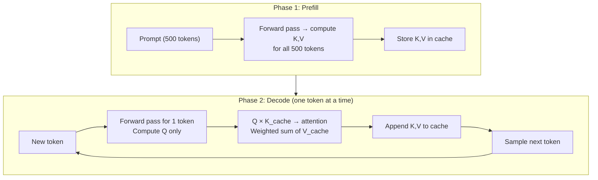
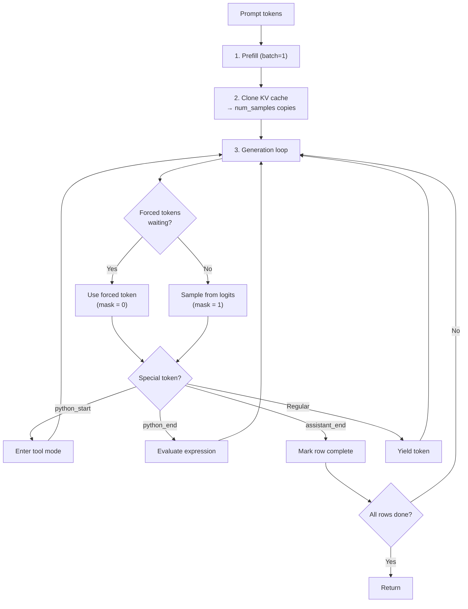
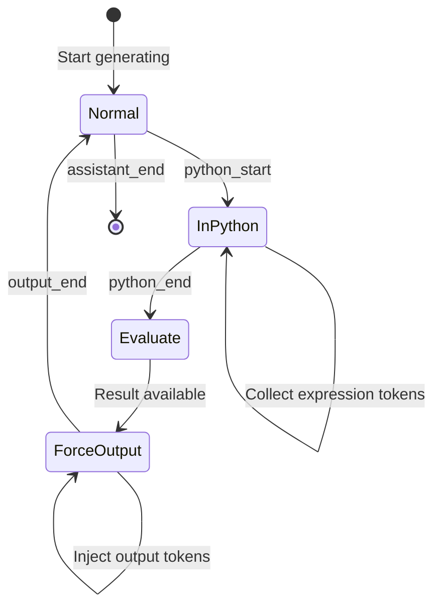

# Chapter 08 — Inference Engine and KV Cache

> **Learning objective:** Understand how `nanochat/engine.py` generates text efficiently using a KV cache, how tokens are sampled from probability distributions, and how the tool-use state machine lets the model run Python calculations.

---

## The inference problem

During training, the model processes entire sequences in parallel. During inference, tokens are produced **one at a time**: generate token 1, use it to generate token 2, and so on.

Naive approach: re-run the full model for every new token. For a 500-token prompt plus 100 generated tokens, that is 100 forward passes of increasing length — enormously wasteful.

**The KV cache** eliminates this waste.

---

## How the KV cache works

### The insight

In self-attention, the latest token needs its own Query but the Keys and Values of **all previous tokens**. Those previous K and V vectors never change once computed. So cache them:



### Speed comparison

| Approach | Tokens per forward pass | Compute for 100 new tokens |
|----------|------------------------|---------------------------|
| Naive | Grows: 500, 501, …, 599 | ~54,950 token-passes |
| With KV cache | Always 1 (decode phase) | 500 + 100 = 600 token-passes |

That is a **~92× reduction** in total computation.

---

## KV cache memory layout

nanochat pre-allocates the KV cache at maximum sequence length:

```python
class KVCache:
    def __init__(self, batch_size, num_heads, seq_len, head_dim, num_layers):
        self.k_cache = torch.zeros(num_layers, batch_size, seq_len, num_heads, head_dim)
        self.v_cache = torch.zeros(num_layers, batch_size, seq_len, num_heads, head_dim)
        self.cache_seqlens = torch.zeros(batch_size, dtype=torch.int32)
```

For depth=12, 6 KV heads, head_dim=128, max seq_len=2048, in bfloat16:

$$
\text{KV memory} = 2 \times 12 \times 1 \times 2048 \times 6 \times 128 \times 2 \approx 72\;\text{MB}
$$

Tiny compared to the model itself.

---

## The complete generation flow



### Multi-sample generation

You can generate multiple completions from the same prompt with a **single** prefill. The KV cache is computed once (batch_size=1), then replicated to `num_samples` copies. This is critical for RL training, where 16 candidate answers per question are generated in parallel.

---

## Token sampling

Given logits $z$ (raw scores for each vocabulary token), sampling picks the next token.

### Temperature

Temperature $\tau$ controls randomness by scaling logits before softmax:

$$
P(\text{token} = i) = \frac{\exp(z_i / \tau)}{\sum_j \exp(z_j / \tau)}
$$

| $\tau$ | Effect | Use case |
|--------|--------|----------|
| 0 | Greedy (always pick highest) | Factual answers |
| 0.5 | Slightly random | Creative but coherent |
| 1.0 | Standard | General conversation |
| > 1.0 | Very random | Brainstorming |

### Top-k sampling

Top-k restricts candidates to only the $k$ highest-scoring tokens before applying softmax:

```python
def sample_next_token(logits, rng, temperature=1.0, top_k=None):
    if top_k is not None:
        vals, idx = torch.topk(logits, min(top_k, logits.size(-1)))
        vals = vals / temperature
        probs = F.softmax(vals, dim=-1)
        choice = torch.multinomial(probs, 1, generator=rng)
        return idx.gather(1, choice)
```

This prevents selection of very unlikely tokens that could derail generation, while maintaining diversity among top candidates.

---

## Tool use: the calculator state machine

The model can use a Python calculator. Special tokens trigger a state machine:



### Step by step

1. Model generates `<|python_start|>` → engine enters python mode
2. Subsequent tokens collected as a Python expression (e.g., `15 * 37`)
3. Model generates `<|python_end|>` → engine exits python mode
4. Engine evaluates the expression in a sandbox
5. Engine **force-injects** `<|output_start|>` + result + `<|output_end|>` into the token stream
6. Model sees these injected tokens and continues

### Safety sandbox

The calculator is heavily restricted:
- **Math only:** characters `0-9`, `+-*/().` and spaces
- **No power operator:** `**` is blocked (could hang on huge exponents)
- **String ops:** only `.count()` allowed
- **Timeout:** 3-second maximum
- **No builtins:** `eval()` runs with empty `__builtins__`
- **Blocklist:** `import`, `exec`, `open`, `__` all blocked

---

## Streaming generation

`generate()` is a Python generator that yields tokens as they are produced:

```python
for token_column, token_masks in engine.generate(tokens, num_samples=1):
    text = tokenizer.decode(token_column)
    print(text, end="", flush=True)
```

The `token_masks` flag distinguishes model-generated tokens (mask=1) from tool-injected tokens (mask=0) — important for RL training where we only want gradients on the model's own decisions.

---

## Key files

| File | What it does |
|------|-------------|
| `nanochat/engine.py` | Engine class, KV cache, sampling, tool-use (~357 lines) |
| `nanochat/execution.py` | General code sandbox for evaluation tasks |

---

Exercise: Open `nanochat/engine.py` and locate the `RowState` class. Trace the code path when the model generates `<|python_start|>`, then `1`, `5`, `*`, `3`, `7`, then `<|python_end|>`. What happens to the `forced_tokens` deque? How does the engine decide whether to sample from the model or inject a forced token at each step?
