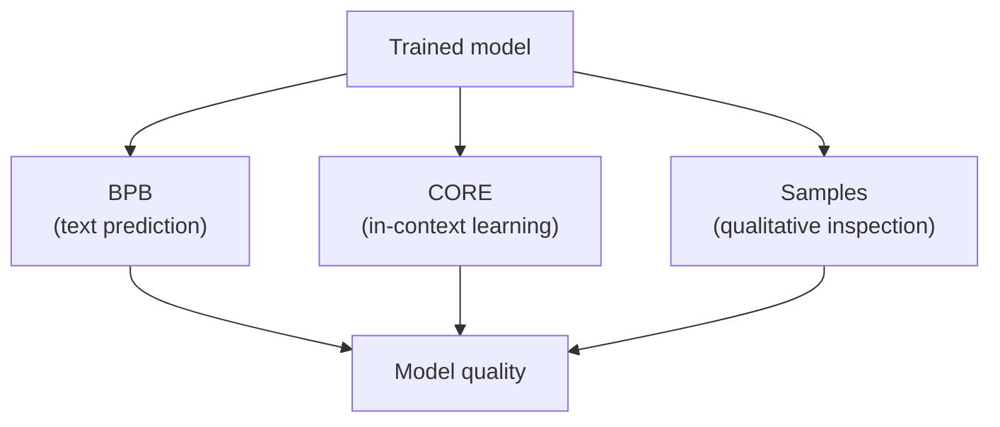
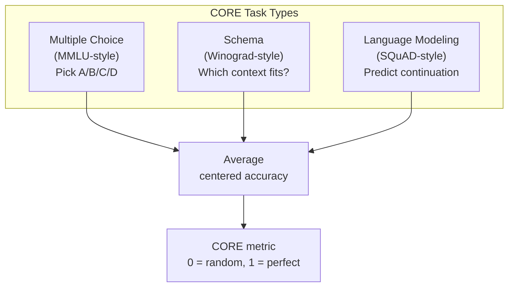
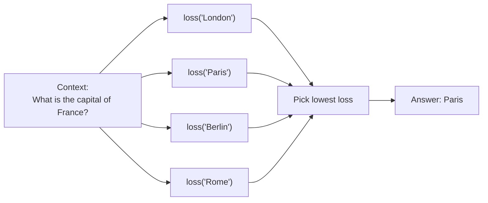

# Chapter 09 — Evaluation: BPB and CORE

> **Learning objective:** Understand how nanochat measures model quality — what Bits Per Byte (BPB) and CORE are, why they are complementary metrics, and how the evaluation code works.

---

## Why evaluation matters

Training is like studying for an exam: you need to test on **unseen data** to know if the model actually learned. nanochat uses two complementary metrics:

| Metric | What it measures | Type | Better is… |
|--------|-----------------|------|------------|
| **BPB** | How well the model predicts text | Compression quality | Lower |
| **CORE** | How well the model learns from in-context examples | Few-shot accuracy | Higher |



---

## BPB: Bits Per Byte

### The idea

BPB measures how many **bits of information** the model needs, on average, to encode each byte of text. A lower BPB means the model is a better compressor — it understands language patterns well enough to predict what comes next.

### Why not just use cross-entropy loss?

The standard loss depends on the **tokenizer**. A tokenizer with 100K tokens encodes text differently than one with 32K tokens. Comparing losses across tokenizers is meaningless.

BPB normalizes by **bytes instead of tokens**:

$$
\text{BPB} = \frac{\sum_t \ell_t}{\ln(2) \times \sum_t b_t}
$$

where $\ell_t$ is the cross-entropy loss (in nats) for token $t$, and $b_t$ is the number of UTF-8 bytes that token represents. Special tokens (BOS, etc.) have $b_t = 0$ and are excluded.

### What BPB values mean

| BPB | Meaning |
|-----|---------|
| ~1.5 | Poor — random-ish predictions |
| ~1.0 | Basic patterns learned |
| ~0.8 | Good text prediction |
| ~0.75 | GPT-2 level |
| ~0.7 | Strong model |
| ~0.5 | State-of-the-art large models |

For reference, the entropy of English text is estimated at ~1.0–1.5 bits per character.

### Implementation

The code precomputes a `token_bytes` tensor of shape $(V,)$ that maps each token ID to its byte length. During evaluation, losses are weighted by byte count and summed, then divided by $\ln(2) \times \text{total bytes}$.

---

## CORE: in-context learning accuracy

### What is in-context learning?

LLMs can learn new tasks from examples provided in the prompt, without any weight updates. Show a few input-output pairs, and the model generalizes:

```
dog -> chien
cat -> chat
house -> maison
car ->
```

A good model predicts `voiture`. CORE measures this ability across diverse tasks.

### The DCLM CORE benchmark

CORE evaluates three types of tasks:



### How scoring works

Each task's raw accuracy is **centered** against a random baseline:

$$
\text{centered} = \frac{\text{accuracy} - \text{baseline}}{1 - \text{baseline}}
$$

For a 4-choice task, baseline = 0.25. If the model gets 50%:

$$
\text{centered} = \frac{0.50 - 0.25}{0.75} = 0.333
$$

The final CORE score averages centered scores across all tasks.

### Multiple-choice evaluation

The model does not "pick" an answer by generating text. Instead, the code computes the **mean log-probability** of each answer choice given the context, and picks the one with the lowest loss:



---

## Reference benchmarks

| Entry | Time | BPB | CORE |
|-------|------|-----|------|
| GPT-2 original | 168 hours | — | 0.2565 |
| nanochat d24 | 3.04 hours | 0.748 | 0.2585 |
| nanochat d26 + FP8 | 2.91 hours | 0.745 | 0.2578 |

Training GPT-2 originally cost ~$43,000. nanochat matches it for ~$72 (3 hours × $24/hour for 8×H100).

---

## Running evaluations

```bash
# BPB (validation loss)
python -m scripts.base_eval --eval bpb --model-tag d12

# CORE (in-context learning)
python -m scripts.base_eval --eval core --model-tag d12

# Generate text samples
python -m scripts.base_eval --eval sample --model-tag d12

# All of the above
python -m scripts.base_eval --eval all --model-tag d12
```

### During training

Evaluations run periodically:

| Flag | Default | What it does |
|------|---------|-------------|
| `--eval-every 250` | BPB every 250 steps |
| `--core-metric-every 2000` | CORE every 2000 steps |
| `--sample-every 2000` | Text samples every 2000 steps |

---

## Chat evaluation (ChatCORE)

After SFT and RL, `scripts/chat_eval.py` tests on downstream tasks:

| Task | What it tests | Type |
|------|-------------|------|
| GSM8K | Grade-school math | Generative |
| MMLU | Multiple-choice knowledge | Categorical |
| SpellingBee | Letter counting | Generative |
| HumanEval | Code generation | Execution-based |
| ARC | Science reasoning | Categorical |

Results are reported as centered accuracy, with the final ChatCORE score being the mean.

```bash
python -m scripts.chat_eval --model-tag d12
```

---

## Key files

| File | What it does |
|------|-------------|
| `scripts/base_eval.py` | Entry point for base model evaluation |
| `nanochat/core_eval.py` | CORE benchmark computation (~263 lines) |
| `nanochat/loss_eval.py` | BPB evaluation |
| `scripts/chat_eval.py` | Chat model evaluation on downstream tasks |

---

Exercise: After training a small model (even `--depth=4` for 20 steps), run `python -m scripts.base_eval --eval bpb --model-tag d4 --device-batch-size=1`. What BPB do you get? How does it compare to the table above? Then open `nanochat/core_eval.py` and find where the centering formula is applied — verify it matches the equation $\text{centered} = (\text{acc} - \text{baseline}) / (1 - \text{baseline})$.
