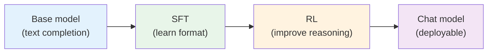
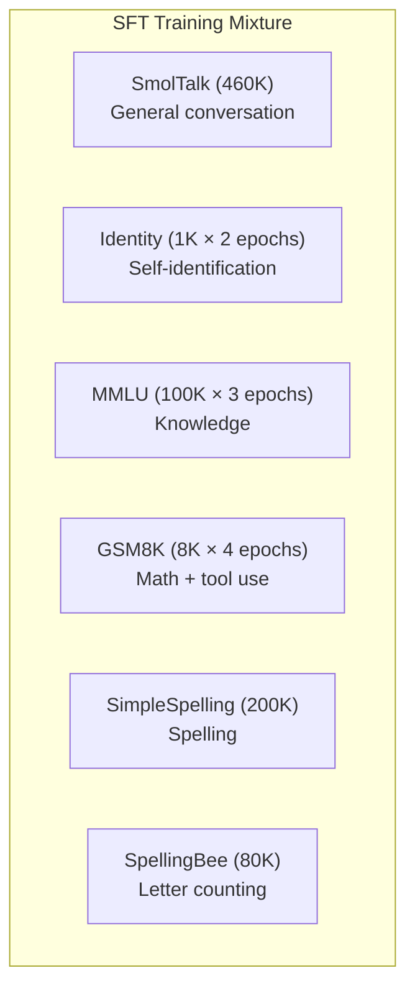
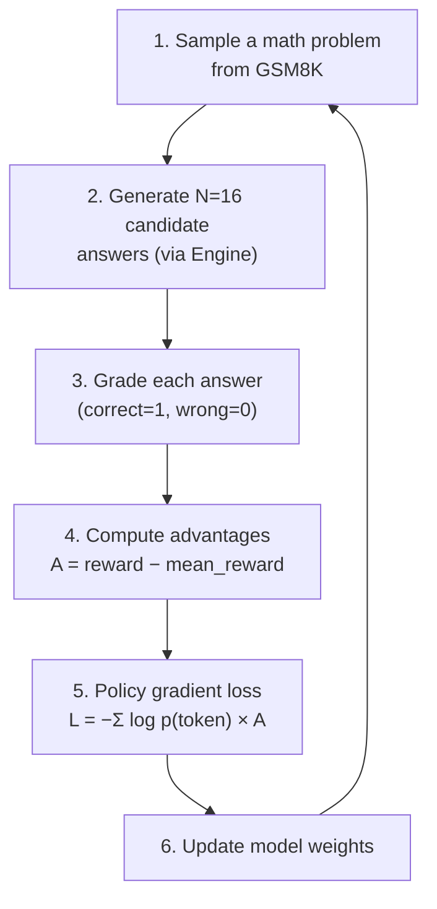
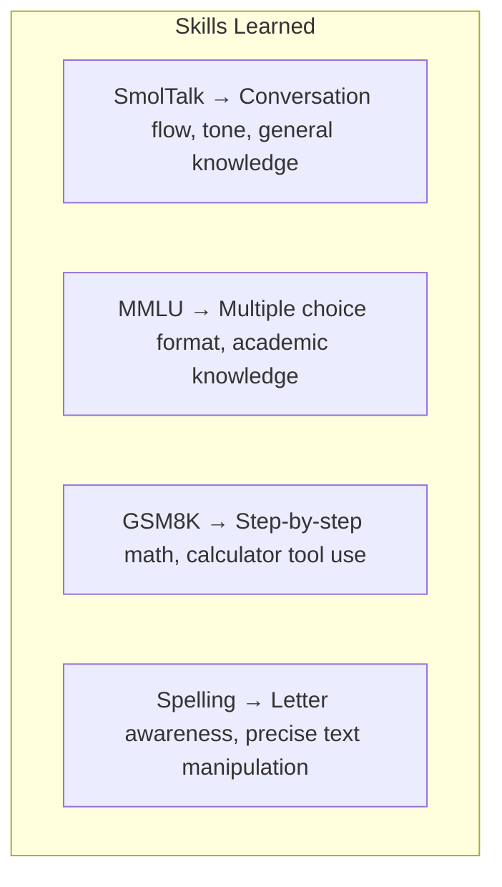

# Chapter 10 — Chat SFT and Reinforcement Learning

> **Learning objective:** Understand how a pretrained base model is transformed into a conversational assistant through supervised fine-tuning (SFT) and reinforcement learning (RL), and how REINFORCE with token-level advantages works.

---

## The two stages

A pretrained base model predicts internet text but cannot converse. Two more training stages fix this:



| Stage | What the model learns | Data | Duration (8×H100) |
|-------|----------------------|------|--------------------|
| **SFT** | Conversation format, tool use, instruction following | Curated conversations | ~15 min |
| **RL** | Better math reasoning | Self-generated attempts + rewards | ~10 min |

---

## Supervised Fine-Tuning (SFT)

### What is SFT?

Show the model thousands of example conversations and train it to produce the assistant's responses. Same next-token prediction objective, but now the "text" is structured conversations.

### The training mixture

nanochat mixes multiple task datasets:



Each dataset provides conversations as lists of messages:

```python
conversation = [
    {"role": "user", "content": "What is the capital of France?"},
    {"role": "assistant", "content": "The capital of France is Paris."},
]
```

### Why multiple epochs for some tasks?

SmolTalk is large (460K conversations), so one pass suffices. MMLU and GSM8K are small but important — the model needs repetition to learn knowledge and math patterns:

| Task | Size | Epochs | Why |
|------|------|--------|-----|
| SmolTalk | 460K | 1 | Enough data |
| Identity | 1K | 2 | Must learn self-identification |
| MMLU | 100K | 3 | Knowledge needs repetition |
| GSM8K | 8K | 4 | Math patterns need reinforcement |
| Spelling | 280K | 1 | Simple patterns |

### SFT packing

Like pretraining, conversations are packed into fixed-length rows. But SFT uses **padding** instead of cropping — no conversation is ever truncated. Padding positions get `target = -1` (ignored by the loss).

### SFT optimizer setup

SFT **warm-starts** from the pretrained checkpoint, loading both model weights and optimizer state (momentum buffers). Key differences from pretraining:
- Weight decay = 0 (pretraining already ramped it to zero)
- Initial LR = 80% of base LR (`init_lr_frac = 0.8`)
- Same warmdown schedule driven by progress (0→1)

---

## Reinforcement Learning (RL)

### Why RL after SFT?

SFT teaches format by imitation — the model can only be as good as the examples. RL goes further: the model generates its own answers, receives feedback, and learns from its successes and failures. Especially powerful for math, where there is unambiguous right/wrong.

### Simplified REINFORCE

nanochat uses a much simpler algorithm than what large labs deploy:

1. No trust region — no KL regularization to a reference model
2. On-policy — no need for PPO ratio + clipping
3. DAPO-style token-level normalization
4. Advantage = $r - \bar{r}$ (mean subtraction only, no division by σ)

### The RL loop



### Step by step

**Step 1:** Sample a question:
> *Tom has 5 apples. He buys 3 more and gives 2 away. How many does he have? Answer: 6*

**Step 2:** Generate 16 candidate answers using the inference engine (with tool use enabled).

**Step 3:** Grade each — does the final answer match?

| Sample | Response | Correct? | Reward |
|--------|----------|----------|--------|
| 1 | "5 + 3 = 8, 8 - 2 = 6. **6**" | ✓ | 1 |
| 2 | "5 + 3 = 8. **8**" | ✗ | 0 |
| … | … | … | … |

**Step 4:** If 10/16 are correct, mean reward = 0.625. Advantages:
- Correct ($A = 1 - 0.625 = +0.375$) → reinforce
- Wrong ($A = 0 - 0.625 = -0.625$) → discourage

**Step 5:** The policy gradient loss:

$$
\mathcal{L} = -\sum_t \log p_\theta(x_t) \cdot A
$$

For correct answers ($A > 0$): minimizing loss ↑ increases $\log p_\theta$ — makes those tokens more likely.

For wrong answers ($A < 0$): minimizing loss ↓ decreases $\log p_\theta$ — makes those tokens less likely.

### Token-level advantages

The advantage is applied at the **token level**: every token in a correct response gets the same positive advantage. This is DAPO-style normalization:

$$
\text{pg\_objective} = \frac{\sum_t \log p_\theta(x_t) \cdot A_t}{\text{num\_valid\_tokens}}
$$

The loss is $-\text{pg\_objective}$, normalized by the total number of valid (non-padding) tokens.

---

## What each task teaches



### Adding your own task

Create a class in `tasks/` that provides conversations:

```python
class MyTask(Task):
    @property
    def eval_type(self):
        return 'generative'  # or 'categorical'

    def get_example(self, index):
        return [
            {"role": "user", "content": self.data[index]["question"]},
            {"role": "assistant", "content": self.data[index]["answer"]},
        ]

    def evaluate(self, problem, completion):
        return expected_answer in completion
```

Then add it to the SFT mixture in `scripts/chat_sft.py`.

---

## The full pipeline timeline

For a GPT-2-grade model (depth=26) on 8×H100:

```mermaid
gantt
    title Full Training Pipeline
    dateFormat HH:mm
    section Pipeline
    Pretraining :base, 00:00, 3h
    SFT :sft, after base, 15m
    RL on GSM8K :rl, after sft, 10m
    Evaluation :eval, after rl, 5m
```



Total: ~3.5 hours from zero to a working chatbot.

---

## Key files

| File | What it does |
|------|-------------|
| `scripts/chat_sft.py` | SFT training script |
| `scripts/chat_rl.py` | RL training script |
| `scripts/chat_eval.py` | Chat evaluation |
| `tasks/gsm8k.py` | GSM8K math task |
| `tasks/mmlu.py` | MMLU knowledge task |
| `tasks/smoltalk.py` | General conversation data |
| `tasks/spellingbee.py` | Spelling/counting tasks |
| `tasks/common.py` | TaskMixture class |

---

Exercise: Open `scripts/chat_rl.py` and find where the 16 candidate answers are generated per question. Then locate where the reward is computed (checking if the model's answer matches the gold answer). Finally, trace where the advantage $A = r - \bar{r}$ is calculated and applied to the token-level log-probabilities.
