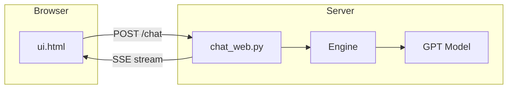
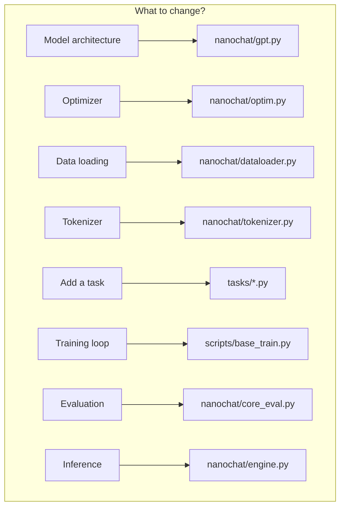

# Chapter 11 — Running and Modifying nanochat

> **Learning objective:** Get nanochat running on your machine, understand every important CLI flag, know where to edit for common experiments, and follow safety practices for reproducible research.

---

## Environment setup

```bash
# Install uv (fast Python package manager)
curl -LsSf https://astral.sh/uv/install.sh | sh
# Create environment and install
uv venv && uv sync --extra gpu
# Activate
source .venv/bin/activate   # Linux/Mac
# .venv\Scripts\activate    # Windows
```

Set the data/checkpoint directory (default: `~/.cache/nanochat/`):

```bash
export NANOCHAT_BASE_DIR="$HOME/.cache/nanochat"
```

---

## The full pipeline at a glance


| Step | Command | Time (8×H100) |
|------|---------|---------------|
| Download data | `python -m nanochat.dataset -n 370` | ~5 min |
| Train tokenizer | `python -m scripts.tok_train` | ~2 min |
| Pretrain (d26) | `torchrun --nproc_per_node=8 -m scripts.base_train -- --depth=26` | ~2.5 hrs |
| SFT | `torchrun --nproc_per_node=8 -m scripts.chat_sft` | ~15 min |
| RL | `torchrun --nproc_per_node=8 -m scripts.chat_rl` | ~10 min |
| Evaluate | `torchrun --nproc_per_node=8 -m scripts.chat_eval` | ~5 min |

---

## Quick CPU smoke test

No GPU required — verify everything works with a tiny model:

```bash
python -m scripts.base_train \
    --depth=4 --max-seq-len=512 \
    --device-batch-size=1 --total-batch-size=512 \
    --eval-tokens=512 --core-metric-every=-1 \
    --num-iterations=20
```

With `--depth=4`, the model has only $4 \times 64 = 256$ model dimension and ~5M parameters. It will not produce good text, but it verifies your setup end-to-end.

---

## CLI reference

### Base pretraining flags

**Model architecture:**

| Flag | Default | Description |
|------|---------|-------------|
| `--depth` | 20 | Number of Transformer layers |
| `--aspect-ratio` | 64 | `model_dim = depth × aspect_ratio` |
| `--head-dim` | 128 | Dimension per attention head |
| `--max-seq-len` | 2048 | Maximum context length |
| `--window-pattern` | `"SSSL"` | Sliding window pattern |

**Training horizon** (precedence order):

| Flag | Default | Description |
|------|---------|-------------|
| `--num-iterations` | -1 | Explicit step count |
| `--target-flops` | -1 | Train until this many FLOPs |
| `--target-param-data-ratio` | 10.5 | Tokens/params ratio |

**Optimization:**

| Flag | Default | Description |
|------|---------|-------------|
| `--device-batch-size` | 32 | Per-GPU batch size (**reduce if OOM**) |
| `--total-batch-size` | -1 | Total batch in tokens (-1 = auto) |
| `--matrix-lr` | 0.02 | LR for weight matrices (Muon) |
| `--weight-decay` | 0.2 | Weight decay for Muon |
| `--warmdown-ratio` | 0.5 | Fraction of training for LR cooldown |
| `--fp8` | false | FP8 training (H100+ only) |

---

## Multi-GPU training

```bash
# 4 GPUs
torchrun --standalone --nproc_per_node=4 -m scripts.base_train -- \
    --depth=20 --device-batch-size=16

# 8 GPUs with FP8
torchrun --standalone --nproc_per_node=8 -m scripts.base_train -- \
    --depth=26 --device-batch-size=16 --fp8
```

> **Important:** the `--` separator is required. Arguments before `--` go to torchrun; arguments after go to the training script.

Gradient accumulation is computed automatically:

$$
G = \frac{B_{\text{total}}}{B_{\text{device}} \times T \times W}
$$

---

## Chatting with your model

### CLI

```bash
python -m scripts.chat_cli -i sft -g d26
python -m scripts.chat_cli -i sft -g d26 -p "Why is the sky blue?"
```

### Web UI

```bash
python -m scripts.chat_web --num-gpus 1
```



---

## Where checkpoints live

```
~/.cache/nanochat/
├── tokenizer.model
├── data/
│   └── shard_*.parquet
├── base_checkpoints/d26/
│   ├── config.json
│   ├── model.pt
│   └── optimizer.pt
├── chatsft_checkpoints/d26/
│   └── ...
└── chatrl_checkpoints/d26/
    └── ...
```

---

## How to modify the code



### Adding a new task

```python
# tasks/my_task.py
from tasks.common import Task

class MyTask(Task):
    @property
    def eval_type(self):
        return 'categorical'  # or 'generative'

    def num_examples(self):
        return len(self.data)

    def get_example(self, index):
        return [
            {"role": "user", "content": self.data[index]["question"]},
            {"role": "assistant", "content": self.data[index]["answer"]},
        ]
```

---

## Troubleshooting

| Problem | Solution |
|---------|----------|
| CUDA OOM | Reduce `--device-batch-size` (32→16→8→4→2→1) |
| Flash Attention missing | `pip install flash-attn --no-build-isolation` (falls back to SDPA) |
| Slow on CPU | Expected. Use `--num-iterations=5` for smoke test |
| `torchrun` errors | Check `--` separator between torchrun and script args |
| Flat loss | Learning rate may be wrong. Check logs. |

### Memory estimation

$$
\text{Memory (GB)} \approx \frac{2 \times P_{\text{billions}} \times (1 + m_{\text{optimizer}})}{\text{1e9}}
$$

where $m_{\text{optimizer}} \approx 2$ for momentum buffers. A depth-20 model (~400M params) needs roughly 4–8 GB for small batch sizes.

---

## Safety tips for experiments

1. **Measure before and after.** Compare BPB or CORE with and without your change.
2. **Change one thing at a time.** Otherwise you cannot attribute improvements.
3. **Start small.** `--depth=4 --num-iterations=20` on CPU before a full GPU run.
4. **Save checkpoints.** `--save-every=N` during long runs.
5. **Use wandb.** `--run=my_experiment` for easy comparison.

---

## Quick reference card

```bash
# Setup
uv venv && uv sync --extra gpu && source .venv/bin/activate

# Data + Tokenizer
python -m nanochat.dataset -n 8 && python -m scripts.tok_train

# Train (CPU test)
python -m scripts.base_train --depth=4 --max-seq-len=512 \
  --device-batch-size=1 --total-batch-size=512 --num-iterations=20

# Train (single GPU)
python -m scripts.base_train --depth=20 --device-batch-size=16

# SFT + RL + Eval
torchrun --nproc_per_node=8 -m scripts.chat_sft -- --device-batch-size=16
torchrun --nproc_per_node=8 -m scripts.chat_rl -- --device-batch-size=8
torchrun --nproc_per_node=8 -m scripts.chat_eval -- -i sft

# Chat
python -m scripts.chat_cli -i sft -g d26
python -m scripts.chat_web --num-gpus 1
```

---

Exercise: Run the CPU smoke test above with 20 iterations and `--depth=4`. Then modify `--depth=8` and see how the training prints change (batch size, number of iterations, model dimension). Open `scripts/base_train.py` and find the exact lines where depth is converted to model_dim, then where scaling laws compute the batch size and training horizon.
