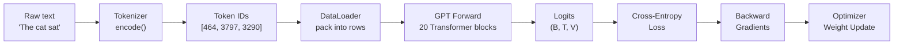
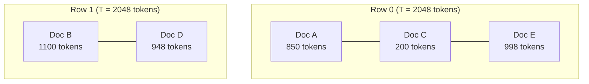
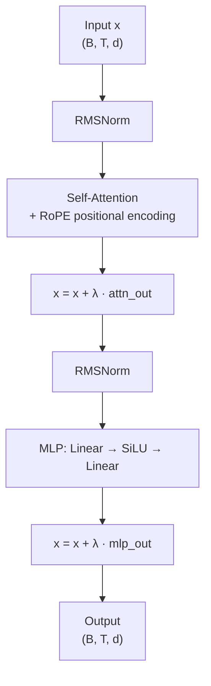
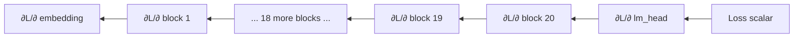
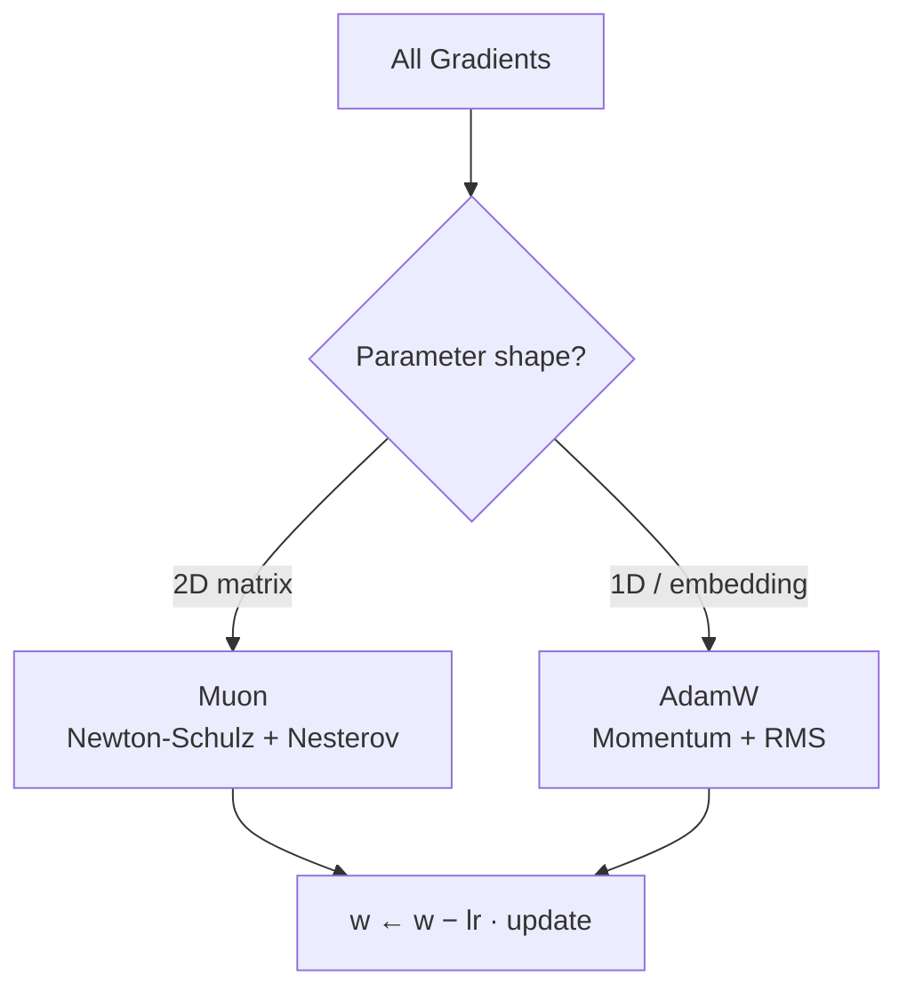
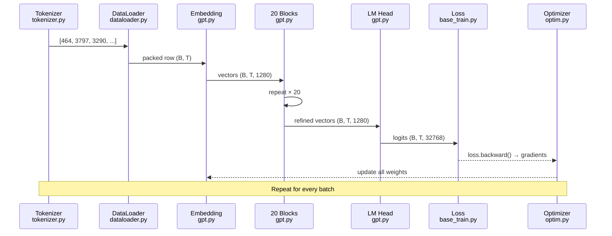

# Chapter 12 — End-to-End Walkthrough

> **Learning objective:** Trace the sentence "The cat sat" from raw characters through every stage of nanochat — tokenization, packing, embedding, attention, MLP, loss, backward pass, optimizer update — and point to the exact line of code responsible for each step.

---

## The journey of a sentence



We will follow "The cat sat" from raw text to a gradient update on the model's weights. Every stage maps to a specific file and function.

---

## Stage 1 — Tokenization: text to numbers

**File:** `nanochat/tokenizer.py` → `Tokenizer.encode()`

Raw text is meaningless to a neural network. The tokenizer converts characters into integer **token IDs** using Byte-Pair Encoding.

```
Input:   "The cat sat"
Split:   ["The", " cat", " sat"]           ← regex splits on boundaries
BPE:     ["The", " cat", " sat"]           ← each piece looked up in vocab
Output:  [464, 3797, 3290]                 ← integer token IDs
```

The vocabulary has $V = 32{,}768$ entries. Nine IDs are reserved for special control tokens (BOS, EOS, `<|user|>`, etc.). The rest are learned byte-pair merges.

```python
# Simplified from nanochat/tokenizer.py
class Tokenizer:
    def encode(self, text: str) -> list[int]:
        chunks = re.findall(self.compiled_pattern, text)
        ids = []
        for chunk in chunks:
            chunk_ids = self._encode_chunk(chunk.encode("utf-8"))
            ids.extend(chunk_ids)
        return ids
```

---

## Stage 2 — Data loading: packing tokens into rows

**File:** `nanochat/dataloader.py` → `PackedDataLoader`

Individual documents are much shorter or longer than the model's context length $T$. The dataloader **packs** multiple documents into fixed-length rows using best-fit bin packing, separated by BOS tokens.



**Key constraint:** every document in a row starts at a BOS-aligned position. No padding tokens are needed — space is filled with the next best-fitting document.

After packing, inputs and targets are created by shifting:

```python
inputs  = tokens[:, :-1]    # (B, T-1) — everything except last
targets = tokens[:, 1:]     # (B, T-1) — shifted right by one
```

The training objective at every position $t$: given `inputs[:, :t+1]`, predict `targets[:, t]`.

---

## Stage 3 — Embedding: numbers to vectors

**File:** `nanochat/gpt.py` → `GPT.forward()`

```python
self.embed = nn.Embedding(vocab_size, model_dim)

x = self.embed(input_ids)   # (B, T) → (B, T, d_model)
```

Each token ID indexes into a learned matrix of shape $(V, d_{\text{model}})$. For a depth-20 model, $d_{\text{model}} = 20 \times 64 = 1280$, so each token becomes a 1280-dimensional vector.

| Tensor | Shape | Example |
|--------|-------|---------|
| `input_ids` | $(B, T)$ | $(16, 2047)$ |
| `x` after embedding | $(B, T, d_{\text{model}})$ | $(16, 2047, 1280)$ |

---

## Stage 4 — Transformer blocks: where learning happens

**File:** `nanochat/gpt.py` → `TransformerBlock`

The embedded vectors pass through $L = 20$ Transformer blocks sequentially. Each block has two sub-layers:



### Self-attention

For each token position $t$, attention computes:

$$\text{Attention}(Q, K, V) = \text{softmax}\!\left(\frac{QK^\top}{\sqrt{d_k}}\right) V$$

A **causal mask** prevents token $t$ from attending to any future position:

```
Position:   0      1      2      3      4
Token:     "The"  "cat"  "sat"  "on"   "the"

            "The" "cat" "sat" "on" "the"
"The"        ✓     ✗     ✗    ✗    ✗
"cat"        ✓     ✓     ✗    ✗    ✗
"sat"        ✓     ✓     ✓    ✗    ✗
"on"         ✓     ✓     ✓    ✓    ✗
"the"        ✓     ✓     ✓    ✓    ✓
```

Grouped Query Attention (GQA) shares K/V heads across multiple Q heads. With 10 query heads and 2 KV groups, 5 query heads share each KV group — cutting KV memory by 5×.

### MLP

```python
h = F.relu(self.c_fc(x)).square()    # ReLU² gating
return self.c_proj(h)
```

The MLP hidden dimension is $4 \times d_{\text{model}} = 5120$. The ReLU² activation provides sharper nonlinearity than GELU.

### Residual connections

```python
x = x + self.lambdas[0] * self.attn(self.norm1(x))
x = x + self.lambdas[1] * self.mlp(self.norm2(x))
```

The learned $\lambda$ scalars control each block's contribution. The residual stream acts as a **gradient highway** — gradients flow directly from loss to early layers.

---

## Stage 5 — LM head: vectors back to probabilities

**File:** `nanochat/gpt.py` → `GPT.forward()`

```python
x = self.norm_f(x)            # final RMSNorm → (B, T, d_model)
logits = self.lm_head(x)      # linear projection → (B, T, V)
```

At position 2 (predicting what comes after "The cat"), `logits[0, 2, :]` is a vector of 32,768 scores. A higher score means the model thinks that token is more likely.

Convert to probabilities with softmax:

$$P(\text{token} = j \mid \text{context}) = \frac{\exp(z_j)}{\sum_{k=1}^{V} \exp(z_k)}$$

During training, we skip the softmax and go straight to the loss function.

---

## Stage 6 — Loss: how wrong was the prediction?

**File:** `scripts/base_train.py`

Cross-entropy loss measures the gap between predictions and actual next tokens:

$$\ell_t = -\log \frac{\exp(z_{t,\, y_t})}{\sum_{j=1}^{V} \exp(z_{t,\,j})}$$

### Concrete numbers

After "The cat" (position 2), suppose:
- Target: "sat" (ID 3290), logit = 5.3
- Sum of exps: $\sum_j \exp(z_{2,j}) = 2841.7$

$$\ell_2 = -\log \frac{\exp(5.3)}{2841.7} = -\log \frac{200.3}{2841.7} = -\log(0.0705) \approx 2.65 \text{ nats}$$

The loss is averaged over all non-masked positions in the batch. As training progresses, this number shrinks — from ~10.4 (random) toward ~3 (GPT-2-level).

Converting to BPB (bits per byte) for tokenizer-independent comparison:

$$\text{BPB} = \frac{\bar{\ell}}{\ln 2 \times \bar{b}}$$

where $\bar{b}$ is the average bytes per token (~3.6 for our tokenizer).

```python
loss = F.cross_entropy(
    logits.view(-1, V),       # flatten to (B×T, V)
    targets.view(-1),         # flatten to (B×T,)
    reduction='mean'
)
```

---

## Stage 7 — Backward pass: computing gradients

**File:** PyTorch autograd (automatic)

One call computes $\partial \text{loss} / \partial w$ for every weight $w$:

```python
loss.backward()
```



The chain rule propagates gradients backward through every layer. Residual connections provide a direct gradient path — without them, gradients would vanish across 20 layers.

After `loss.backward()`, every `param.grad` tensor is populated.

---

## Stage 8 — Optimizer: updating the weights

**File:** `nanochat/optim.py`



**AdamW** (for embeddings and 1D params):

$$m_t = \beta_1 m_{t-1} + (1 - \beta_1) g_t$$
$$v_t = \beta_2 v_{t-1} + (1 - \beta_2) g_t^2$$
$$w_t = w_{t-1} - \eta \left(\frac{m_t}{\sqrt{v_t} + \epsilon} + \lambda w_{t-1}\right)$$

**Muon** (for weight matrices): compute Nesterov momentum, orthogonalize via 5-iteration Newton-Schulz, scale per-neuron, apply cautious weight decay.

After the update, gradients are zeroed and the loop repeats with the next batch.

---

## Putting it all together



### One iteration by the numbers (depth-20)

| Stage | Shape | Values |
|-------|-------|--------|
| Input tokens | $(16, 2047)$ | 32,752 integers |
| Embeddings | $(16, 2047, 1280)$ | 41.9M floats |
| Per block (×20) | $(16, 2047, 1280)$ | attention + MLP |
| Logits | $(16, 2047, 32768)$ | 1.07B floats |
| Loss | scalar | one number |
| Parameters updated | — | ~380M weights |

---

## Code index

| Concept | File | Key symbol |
|---------|------|------------|
| Tokenization | `nanochat/tokenizer.py` | `Tokenizer.encode()` |
| Data packing | `nanochat/dataloader.py` | `PackedDataLoader` |
| Model | `nanochat/gpt.py` | `GPT`, `TransformerBlock` |
| Training loop | `scripts/base_train.py` | main `for step` loop |
| Optimizer | `nanochat/optim.py` | `Muon`, `DistMuonAdamW` |
| Inference | `nanochat/engine.py` | `Engine.generate()` |
| Evaluation | `nanochat/core_eval.py` | `evaluate_core()` |
| SFT | `scripts/chat_sft.py` | SFT training loop |
| RL | `scripts/chat_rl.py` | REINFORCE loop |

---

## Key takeaways

1. **Everything is differentiable.** From embedding lookup through attention and softmax — every operation supports gradient computation.

2. **The residual stream.** Vector `x` flows through all blocks, accumulating information. Each block *adds* its contribution via `x = x + λ · f(x)`.

3. **Next-token prediction is the only objective.** Billions of multiply-adds per batch serve one purpose: predict the next token slightly better.

4. **Scale is the recipe.** Deeper model, more data, longer training → better predictions. The scaling laws in Chapter 6 quantify this precisely.

5. **The code is the spec.** Every concept in this book maps to a function in the codebase. When in doubt, read the code.

---

Exercise: Open `nanochat/gpt.py` and `scripts/base_train.py` side-by-side. Starting from the training loop's `model(inputs)` call, trace the forward pass through `GPT.forward()` → each `TransformerBlock` → back to logits. Write down the exact tensor shapes at five key points: after embedding, after the first attention, after the first MLP, after the final norm, and at the logits output. Verify your shapes match the table above for a depth-20 model.
